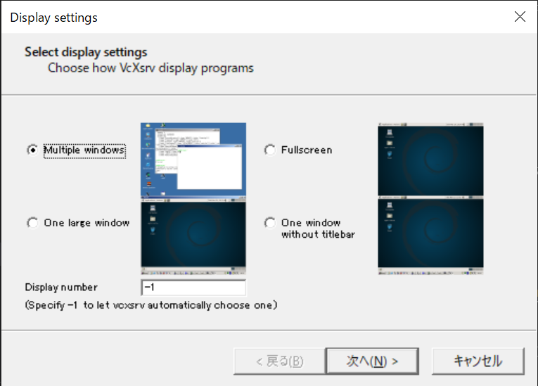
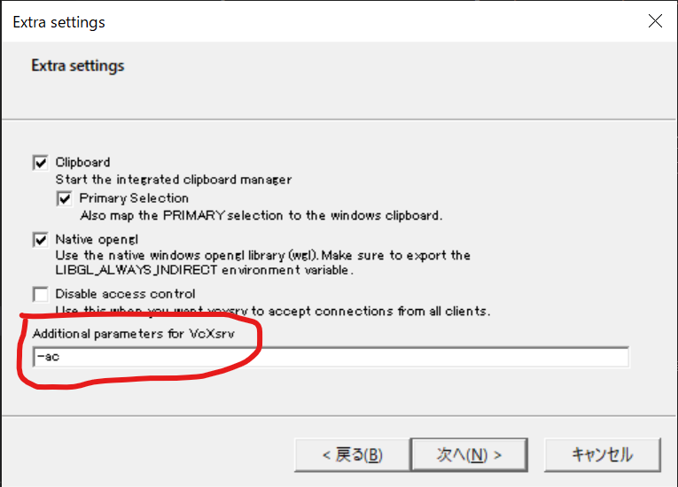
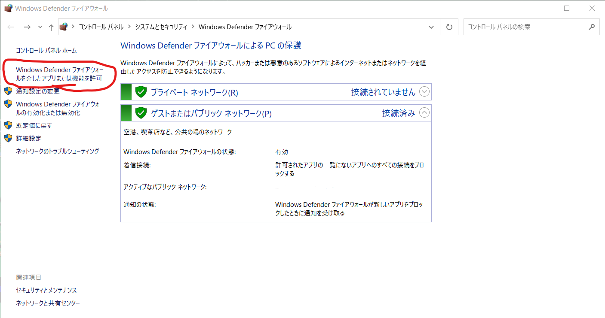

# X Window Systemのセットアップ

X Window System、通称「X11」は、Unix系のOS等でGUIを提供するためのシステムだ。MacやWindowsは独自のWindowシステムを持っているが、例えば研究室

ローカルにインストールして利用するのが良いが、とりあえずは研究室サーバに接続して利用することにしよう。そのためにはX Window Systemのインストールが必要だ。ローカルへのインストールが終わったら、[研究室サーバへの接続](#server)まで確認すること。

## X Window Systemのインストール

### Macの場合

まず、XQuartzをインストールする。[https://www.xquartz.org/](https://www.xquartz.org/)から、最新版のXQuartz(2022年10月18日時点では`XQuartz-2.8.2.dmg`)をダウンロードし、dmgファイルを開いてXQuartz.pkgを実行してインストールする。実行後にログアウトが要求された場合は、一度ログアウトすること。

XQuartzを起動する。Finderから「アプリケーション」→「ユーティリティ」で開くか、Cmd+SpaceのSpotlight検索から「XQuartz」を探して実行する。

にインストールされるので起動する。「xterm」というウィンドウが開けばインストールできてる。実行できなければ、一度ログアウトしてログインしなおし、再度XQuartzを実行すること。

XQuartzの実行中にターミナル(xtermでなくても良い)で

```sh
xeyes
```

を実行せよ。以下のような、マウスを追いかける目玉が表示されたら成功だ。


もし

```sh
$ xeyes
Error: Can't open display: 
```

などと言われたら、環境変数DISPLAYを設定して、もう一度試してみよ。

```sh
export DISPLAY=:0
```

それでもうまく行かなかった場合、以下を試せ。

XQuartzの「環境設定」の「セキュリティ」タブで、「接続を認証」と「ネットワーク・クライアントからの接続を許可」の両方にチェックを入れる(デフォルトで「接続を認証」にはチェックが入っているはず)。

さらに、ターミナルから

```sh
defaults write org.macosforge.xquartz.X11 enable_iglx -bool true
```

を実行しておく。以上の変更を適用するためにXQuartzを再起動すること。

### Windowsの準備

[https://sourceforge.net/projects/vcxsrv/](https://sourceforge.net/projects/vcxsrv/)から、VcXsrvをインストールする。

インストール後に、XLaunchを起動する。Windows 10なら「ここに入力して検索」と表示されている検索窓にXLaunchと入力すれば起動する。

起動後にいろいろ聞かれる。

「Display settings」は、デフォルトの「Multiple windows」のままで良い。



「Client startup」も、デフォルトの「Start no client」で良い。


**「Extra settings」において「Additional parameters for VcXsrv」に「-ac」と追加するのを忘れないこと**。これを設定しないと、おそらく動かない。



「Finish configuration」では何もしないで「完了」で良い。


その後、Ubuntuのターミナルを開いて、DISPLAY環境変数を設定する。まずは`xeyes`をインストールしておこう。

```sh
sudo apt install x11-apps
```

次に、IPアドレスを確認する。

```sh
hostname | xargs dig +short
```

環境によって異なるが、例えば

```txt
172.29.80.1
192.167.11.4
```

などと数字が現れたはずだ。このうち、192の方を使うなら、

```sh
export DISPLAY=192.167.11.4:0.0
```

を実行せよ。この状態で、

```sh
xeyes
```

を実行し、以下のような、マウスを追いかける目玉が表示されたら成功だ。


このIPアドレスは再起動ごとに異なるため、再設定は面倒だ。そこで、`.bashrc`に以下のような行を追加せよ。

```sh
export DISPLAY=`hostname | xargs dig +short | grep 192.168.11`:0.0
```

これは`hostname`を実行した結果を`dig +short`に食わせてIPアドレスを調べ、でてきたIPアドレスを使って`DISPLAY`環境変数を設定する、という意味だ。なお、IPアドレスが`192.168.0.?`だったり、`192.168.12.?`だったりした場合は、grepの項目を適切に設定しないといけない。

編集が終わったら以下で再読み込みをしよう。これは今回のみで、次回の起動からは不要だ。

```sh
source .bashrc
```

これで準備完了だ。

また、ファイアウォールの設定によっては表示がうまくいかない場合がある。その場合は以下の手順でファイアウォールの設定でVcXsrvへの接続を許可する必要がある。

「Windows Defender ファイアウォール」を起動し、「Windows Defender ファイアウォールを介したアプリまたは機能を許可」を選ぶ。



許可されたアプリの一覧からVcXsrvを見つけて「パブリック」にチェックが入っていなければチェックを入れる。


これでWSLからVcXsrvへの接続が許可されるはずだ。

<a id="server"></a>
## 研究室サーバへの接続

X Window Systemは、リモートのGUIをローカルで実行することができる(リモートデスクトップのようなもの)。X Window Systemが起動した状態で、研究室サーバにsshで接続せよ。

```ssh
ssh username@servername -AY
```

最後に大文字で`-AY`と付けるのを忘れないこと。ログインしたら`xeyes`を実行しよう。

```sh
xeyes
```

目玉が出てきたら成功だ。