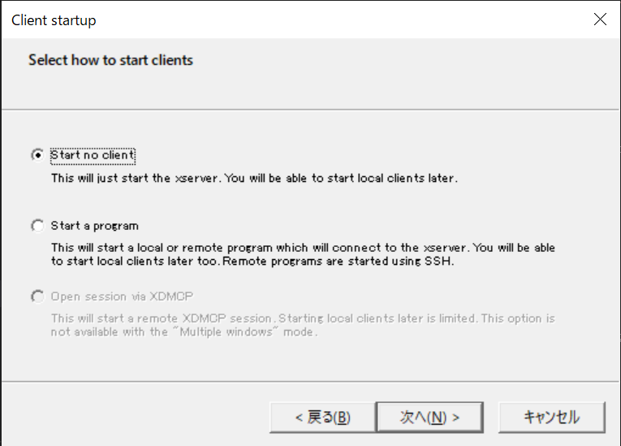

# X Window Systemのインストール

X Window System、通称「X11」は、Unix系のOS等でGUIを提供するためのシステムだ。MacやWindowsは独自のWindowシステムを持っているが、例えば研究室

ローカルにインストールして利用するのが良いが、とりあえずは研究室サーバに接続して利用することにしよう。そのためにはX Window Systemのインストールが必要だ。

## Macの場合

まず、XQuartzをインストールする。[https://www.xquartz.org/](https://www.xquartz.org/)から、`XQuartz-2.8.0_rc4.dmg`をダウンロードし、インストールする。

XQuartzは「アプリケーション」→「ユーティリティ」にインストールされるので起動する。「xterm」というウィンドウが開けばインストールできてる。

この状態で一度ログアウトし、ログインしなおして、XQuartzを実行してからターミナルで

```sh
xeyes
```

を実行せよ。以下のような、マウスを追いかける目玉が表示されたら成功だ。


もしうまく行かなかった場合、以下を試せ。

XQuartzの「環境設定」の「セキュリティ」タブで、「接続を認証」と「ネットワーク・クライアントからの接続を許可」の両方にチェックを入れる(デフォルトで「接続を認証」にはチェックが入っているはず)。

さらに、ターミナルから

```sh
defaults write org.macosforge.xquartz.X11 enable_iglx -bool true
```

を実行しておく。以上の変更を適用するためにXQuartzを再起動すること。

## Windowsの準備

[https://sourceforge.net/projects/vcxsrv/](https://sourceforge.net/projects/vcxsrv/)から、VcXsrvをインストールする。

インストール後に、XLaunchを起動する。Windows 10なら「ここに入力して検索」と表示されている検索窓にXLaunchと入力すれば起動する。

起動後にいろいろ聞かれる。

「Display settings」は、デフォルトの「Multiple windows」のままで良い。


「Client startup」も、デフォルトの「Start no client」で良い。



**「Extra settings」において「Additional parameters for VcXsrv」に「-ac」と追加するのを忘れないこと**。これを設定しないと、おそらく動かない。


「Finish configuration」では何もしないで「完了」で良い。


その後、Ubuntuのターミナルを開いて、`.bashrc`ファイルを開く。

```sh
vim .bashrc
```

そして、最後に以下の行を記入する。入力は面倒であろうから、以下をコピペして良い。

```sh
export DISPLAY=`hostname | xargs dig +short | grep 192.168.11`:0.0
```

編集が終わったら以下で再読み込みをしよう。これは今回のみで、次回の起動からは不要だ。

```sh
source .bashrc
```

これで準備完了だ。

## 接続とX Window Systemの確認

研究室のサーバにsshで接続せよ。ただし、その際に `-AY`オプションをつけること。

```sh
ssh username@servername.hogehoge.ac.jp -AY
```

接続出来たら、X Window Systemが使えることを確認しよう(俗に「Xを飛ばす」と言う)。以下を実行せよ。

```sh
xeyes
```

以下のような、マウスを追いかける目玉が表示されたら成功だ。


## 研究室サーバへの接続

X Window Systemは、リモートのGUIをローカルで実行することができる(リモートデスクトップのようなもの)。X Window Systemが起動した状態で、研究室サーバにsshで接続せよ。

```ssh
ssh username@servername -AY
```

最後に大文字で`-AY`と付けるのを忘れないこと。ログインしたら`xeyes`を実行しよう。

```sh
xeyes
```

目玉が出てきたら成功だ。