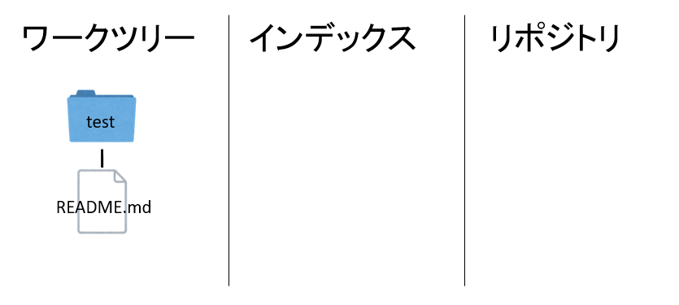
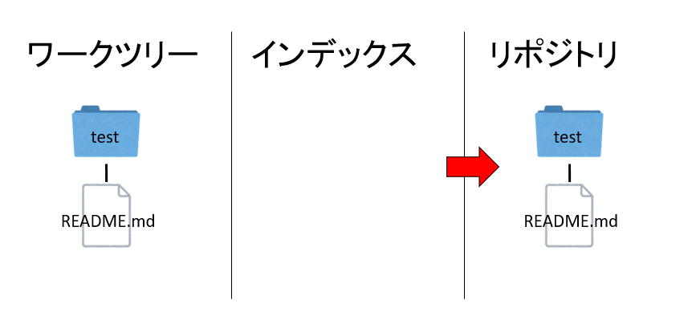
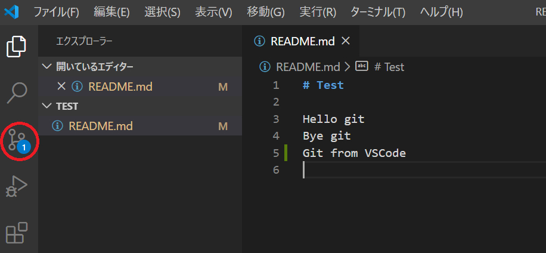
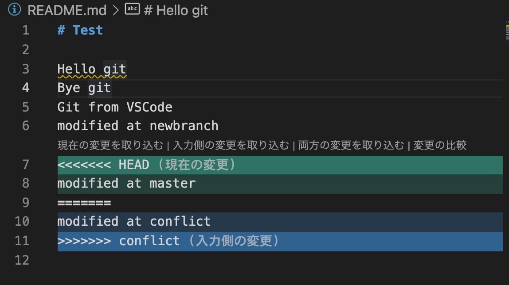

# Gitのインストールと動作確認

## Gitについて

まず、以下のスライドを見よ。

[数値計算屋のためのGit入門](https://speakerdeck.com/kaityo256/starting-git)

今後、「どのファイルがどんな状態にあるか」「歴史はどうなっているか」をイメージしながらGitを操作すると良い。

## Gitのインストール

### Windows

WSL2のUbuntuを使う。

```sh
sudo apt update
sudo apt install git
```

を実行せよ。インストールが完了したら、

```sh
git --version
```

を実行せよ。

```txt
git version 2.25.1
```

と表示されればインストール完了である。

### Mac

Macの場合は、Homebrewからインストールする。ターミナルから

```sh
brew update
brew install git
```

を実行せよ。インストールが完了したら、

```sh
git --version
```

を実行せよ。

```txt
git version 2.26.0
```

と表示されればインストール完了である。

### デフォルトブランチについて

Gitのデフォルトブランチは`master`という名前だが、これを`main`に変えようという動きがある。また、GitHubではすでにデフォルトブランチが`main`になっている。これをうけて、Git 2.28より、デフォルトブランチを指定できるようになった。デフォルトブランチを`main`に変更する場合は以下を実行する。

```sh
git config --global init.defaultBranch main
```

ただし、現時点(2020年3月31日)でUbuntuで入るGitが2.25.1なので、以下はデフォルトブランチが`master`のままで作業する。

## Gitの初期設定

Gitのインストールが完了したら、「ユーザ名」と「メールアドレス」の設定を行う。ユーザ名とメールアドレスは、GitHub等で公開リポジトリを作った場合には誰からも見られる状態となることに注意。

ターミナルで以下を実行する。

```sh
git config --global user.name "ユーザー名"
git config --global user.email "メールアドレス"
```

特にこだわりがなければ、ユーザ名は自分の英語名(私は "H. Watanabe"にしている)、メールアドレスは普段使うメールアドレスにしておけば良い(携帯のアドレスなどは避けること)。

上記の設定は`.gitconfig`に保存される。保存されたか見てみよう。以下を実行せよ。

```sh
cat .gitconfig
```

以下のように表示されれば設定されている。

```txt
[user]
        name = 先ほど設定したユーザー名
        email = 先ほど設定したメールアドレス
```

また、よく使うコマンドの省略形(エイリアス)も登録しておこう。とりあえず一つだけ設定してみよう。

```sh
git config --global alias.st "status -s"
```

これは、デフォルトの`git status`は情報過多のため、短い形式で表示させる`git status -s`を多用するので、それを`git st`として実行できるように登録したものだ。このあたりは完全に趣味なので、慣れてきたら自分好みに追加・削除・修正していくと良い。ここまでの設定で、`.gitconfig`は以下のようになったはずだ。

```txt
[user]
        name = 先ほど設定したユーザー名
        email = 先ほど設定したメールアドレス
[alias]
        st = status -s
```

また、UbuntuのデフォルトエディタはGNU Nanoになっており、正直使いづらいのでVimにしておこう。

```sh
git config --global core.editor vim
```

`.gitconfig`は以下のようになったはずだ。

```txt
[user]
        name = 先ほど設定したユーザー名
        email = 先ほど設定したメールアドレス
[alias]
        co = checkout
        st = status -s
        ci = commit -a
[core]
  editor = vim
```

これでGitの利用準備が整った。

## Gitの動作確認

それでは、実際にGitを使ってリポジトリを作成し、基本的な操作を学んでみよう。最初にコマンドラインから、次にVSCode上から操作する。今後、コマンドライン、VSCodeどちらでGitを利用しても良いが、コマンドラインから使えるようになることを推奨する。

途中、わけがわからなくなったら、ディレクトリごと消してやり直すこと。

### リポジトリの作成

まず、適当なテスト用ディレクトリを作り、その中で作業しよう。`git`というディレクトリを作り、さらにその中に`test`というディレクトリを作ろう。

```sh
cd
mkdir git
cd git
mkdir test
cd test
```

最初に`cd`とだけ入力しているのは、ホームディレクトリに戻るためだ。

ディレクトリ`test`の中に、`README.md`というファイルを作成しよう。まず、このディレクトリでVSCodeを起動する。

```sh
code .
```

VSCodeが開いたら、左のエクスプローラーの「TEST」の右にある「新しいファイル」ボタンを押して、`README.md`と入力しよう。


`README.md`ファイルが開かれたら、

```md
# Test
```

とだけ入力し、保存しよう。これで、以下のようなディレクトリ構成になったはずだ。

```txt
git
└── test
    └── README.md
```

この状態でターミナルに戻り、リポジトリとして初期化しよう。

```sh
git init
```

すると、`.git`というディレクトリが作成され、`test`ディレクトリがリポジトリとして初期化される。以下を実行してみよ。

```sh
ls -la
```

`README.md`に加え、`.git`というディレクトリが作成されたことがわかるはずだ。

`git init`した直後は、「現在のディレクトリ`test`をGitで管理することは決まったが、まだGitはどのファイルも管理していない」という状態になる。



この状態を確認してみよう。ターミナルで以下を実行せよ。

```sh
git status
```

以下のような表示が得られるはずである。なお、環境変数`LANG`が日本語になっていると、日本語のメッセージが表示される。

```txt
On branch master

No commits yet

Untracked files:
  (use "git add <file>..." to include in what will be committed)
        README.md

nothing added to commit but untracked files present (use "git add" to track)
```

これは、まだ何もコミットがされておらず、`README.md`というファイルが`Untracked`、つまりGitの管理下に置かれていないことを表している。

状態を見るのにいちいちこんな長いメッセージを見せられても困るので、`-s`オプションをつけて見よう。

```sh
git status -s
```

こんな表示が出力されたはずだ。

```sh
?? README.md
```

`??`というのは、`Untracked`、つまりGitの管理下に無いよ、という意味だ。いちいち`git status -s`と入力するのは面倒なので、最初に`status -s`に`st`という別名をつけておいた。

```sh
git st
```

と入力すると、`git status -s`と入力したのと同じことになる。以後、こっちを使うことにしよう。

### インデックスへの追加

さて、`Untracked`な状態のファイルを、Gitの管理下に置こう。そのためには、`git add`を実行する。

```sh
git add README.md
```

現在の状態を見てみよう。

```sh
git st
```

こんな表示になるはずだ。

```txt
A  README.md
```

これは「`README.md`が追加されることが予約されたよ」という意味で、インデックスに`README.md`が追加された状態になっている。


では、記念すべき最初のコミットをしよう。Gitはコミットをする時に、コミットメッセージが必要となる。最初のメッセージは慣例により`initial commit`とすることが多い。

```sh
git commit -m "initial commit"
```

これによりコミットが作成され、`README.md`はGitの管理下に入った。



状態を見てみよう。

```sh
git st
```

何も表示されないはずである。ロングバージョンのステータスも見てみよう。

```sh
$ git status
On branch master
nothing to commit, working tree clean
```

なお、このように`$ コマンド名`の表記がある場合は、`$`以後だけを入力して実行したら、行頭に`$`がついていないような表記が出力された、という意味である。今後、`$`がついている場所のコマンドを`$`抜きで入力すること。

自分がいま`master`ブランチにいて、何もコミットをする必要がなく、ワーキングツリーがきれい(clean)、つまりリポジトリが記憶している最新のコミットと一致していることを意味している。

### ファイルの修正

では、ファイルを修正してみよう。VSCodeで`README.md`に行を付け加えて保存しよう。

```txt
# Test

Hello git

```

`Hello git`の最後の改行を忘れないように。

状態を見てみよう。

```sh
$ git st
 M README.md
```

ファイル名の前に`M`という文字がついた。これは`Modified`の頭文字で、「リポジトリが知っている状態から修正されているよ」という意味だ。


また、この状態で`git diff`を実行してみよう。

```txt
$ git diff
diff --git a/README.md b/README.md
index 8ae0569..58c814b 100644
--- a/README.md
+++ b/README.md
@@ -1 +1,3 @@
 # Test
+
+Hello git
```

`git diff`は、何もオプションをつけずに実行すると、

* 現在のブランチで
* リポジトリに記録されている最新の状態から
* 修正のあった全てのファイルについて

差分を表示する。

行頭に`+`がついた箇所が追加された行である。

この修正をリポジトリに教えるために、`git add`しよう。

```sh
git add README.md
```

また、状態を見てみよう。

```sh
$ git st
M  README.md
```

先ほどは赤字で二桁目に`M`が表示されていたのが、今回は緑字で一桁目に`M`が表示されているはずである。これは、修正されたファイルがインデックスに追加されたことを示す。


この状態でコミットしよう。

```sh
git commit -m "adds new line"
```

`-m`以後がコミットメッセージだ。日本語も使えるが、文字化けする可能性があるので、とりあえず英語で書いておいた方が良い。

修正がリポジトリに登録され、ワーキングツリーがきれい(clean)な状態となった。


### git addなしのコミット

Gitでは、原則として

* ファイルを修正する
* `git add`でコミットするファイルをインデックスに登録する
* `git commit`でリポジトリに反映する

という作業を繰り返す。実際、多人数で開発する場合はこうして「きれいな歴史」を作る方が良いのだが、当面は一人で開発するので、`git add`を省略して良い。

`git add`を省略するには、コミットする時に`git commit -a`オプションをつけて、「修正されたファイル全てをコミットする」ようにすれば良い。先ほど`commit -a`に`ci`という別名(エイリアス)をつけたので、今後はそれを使うことにしよう。

まず、VSCodeでさらにファイルを修正しよう。`README.md`に以下の行を付け加えよう。やはり最後の改行を忘れないように。

```txt
# Test

Hello git
Bye git

```

この状態で、`git add`せずに`git commit`しようとすると、「何をコミットするか指定が無いよ(インデックスに何も無いよ)」と怒られる。

```sh
$ git commit -m "modifies README.md"
On branch master
Changes not staged for commit:
  (use "git add <file>..." to update what will be committed)
  (use "git restore <file>..." to discard changes in working directory)
        modified:   README.md

no changes added to commit (use "git add" and/or "git commit -a")
```

上記メッセージには、まず`git add`するか、`git commit -a`しろとあるので、ここでは後者を実行しよう。先程`git commit -a`に`git ci`という別名をつけたので、`git ci`を使えば`git add`なしにいきなりコミットできる。

```sh
git ci -m "modifies README.md"
```

以後、慣れるまでは場合は`git ci`を使うことで`git add`を省略して良い。

### 歴史の確認

これまでの歴史を確認して見よう。上記の通りに作業して来たなら、3つのコミットが作成されたはずだ。`git log`で歴史を振り返ってみよう。

```sh
$ git log
commit e63355285c9fd1929925568522dbc321e9b3e8c7 (HEAD -> master)
Author: H. Watanabe <kaityo@users.sourceforge.jp>
Date:   Wed Mar 31 12:01:12 2021 +0900

    modifies README.md

commit 2eb03e9589b263f4d2ab61b09644da49134d8e21
Author: H. Watanabe <kaityo@users.sourceforge.jp>
Date:   Wed Mar 31 11:38:38 2021 +0900

    adds new line

commit 85f4e334b0094170d4382c7a86e4a185f12e3cd1
Author: H. Watanabe <kaityo@users.sourceforge.jp>
Date:   Wed Mar 31 11:35:44 2021 +0900

    initial commit
```

いつ、誰が、どのコミットを作ったかが表示される。最初に設定した名前とメールアドレスはここに表示される。GitHubなどでpublicなリポジトリを作った場合、全世界に公開されるので注意。

`commit`の後の英数字は「コミットハッシュ」と呼ばれ、コミットにつけられた識別子である。これは環境によって異なるため、同じ操作をしても異なるハッシュが作成される。

デフォルトの表示では見づらいので、一コミット一行で表示しても良い。

```sh
$ git log --oneline
e633552 (HEAD -> master) modifies README.md
2eb03e9 adds new line
85f4e33 initial commit
```

個人的にはこちらの方が見やすいので、`l`を`log --oneline`のエイリアスにしてしまっても良いと思う。もしそうしたい場合は、

```sh
git config --global alias.l "log --oneline"
```

を実行せよ。以後、

```sh
git l
```

で、コンパクトなログを見ることができる。

### VSCodeからの操作

Gitは、VSCodeからも操作することができる。今、`README.md`を開いているVSCodeで何か修正して、保存してみよう。例えば以下のように行を追加する。

```txt
# Test

Hello git
Bye git
Git from VSCode

```

修正を保存した状態で左を見ると、「ソース管理」アイコンに「1」という数字が表示されているはずだ。これは「Gitで管理されているファイルのうち、一つのファイルが修正されているよ」という意味だ。



この「ソース管理アイコン」をクリックしよう。


すると、ソース管理ウィンドウが開き、「変更」の下に「README.md」がある。そのファイル名の右にある「+」マークをクリックしよう。`README.md`が「変更」から「ステージング済みの変更」に移動したはずだ。


これは、

```sh
git add README.md
```

という操作をしたことと等価だ。

この状態で「メッセージ」のところにコミットメッセージを書いて、上の「チェックマーク」をクリックすると、コミットできる。例えばメッセージとして「commit from VSCode」と書いてコミットしてみよう。


これでコミットができた。ちゃんとコミットされたかどうか、ターミナルから確認してみよう。

```sh
$ git log --oneline
c67341b (HEAD -> master) commit from VSCode
e633552 modifies README.md
2eb03e9 adds new line
85f4e33 initial commit
```

VSCodeから作ったコミットが反映されていることがわかる。

基本的にVSCodeからGitの全ての操作を行うことができるが、当面の間はコマンドラインから実行した方が良い。慣れてきたらVSCodeその他のGUIツールを使うと良いだろう。

## マージと衝突の処理

Gitでは、原則としてmaster/mainブランチでは作業をしない。通常は、ブランチを切って、作業はブランチ上で行い、master/mainブランチにはマージするのみ、とする運用を採用することが多い。

以下では、ブランチの切り方、マージの仕方、またマージに失敗(衝突)したときの対処方法をかんたんに見ておこう。

### ブランチの作成と切り替え

ブランチを作成するには、`git branch ブランチ名`とする。

```sh
git branch newbranch
```

`git branch`を実行すると、ブランチ一覧を見ることができる。

```sh
$ git branch
* master
  newbranch
```

ここで、`*`がついているブランチが、今見ているブランチ、すなわちHEADがついているブランチである。`git branch`でブランチを作成しても、「今見ているブランチ」は変更されないので注意。

ブランチを切り替えるには、`git checkout ブランチ名`を使う。我々は省略形`co`を定義しているのでそれを使っても良い。

```sh
$ git checkout newbranch
Switched to branch 'newbranch'
```

ブランチ名はタブ補完も効くので適宜活用すること。

切り替わったかどうかを見てみよう。

```sh
$ git branch
  master
* newbranch
```

`newbranch`に`*`がついていることがわかる。

ブランチを削除するには、`git branch -d ブランチ名`とする。「今見ているブランチ」は削除できないので、一度`master`に戻ってから削除しよう。

```sh
git checkout master
git branch -d newbranch
```

消えたか見てみよう。

```sh
$ git branch
* master
```

先程作成したブランチが消えた。

さて、ブランチを作成するとき、すぐにその作成したブランチに移りたいことの方が良い。ブランチの作成と、そのブランチへの切り替えを同時に行うには`git checkout -b ブランチ名`とする。

```sh
$ git checkout -b newbranch
Switched to a new branch 'newbranch'
```

先程と異なり、「新しいブランチにスイッチしたよ」というメッセージが表示される。確認してみよう。

```sh
$ git branch
  master
* newbranch
```

新しいブランチが作成され、そのブランチにスイッチしていることがわかる。

### ブランチ上での作業

まず、現在の状況を確認してみよう。

```sh
$ git log --oneline
c67341b (HEAD -> newbranch, master) commit from VSCode
e633552 modifies README.md
2eb03e9 adds new line
85f4e33 initial commit
```

このログから、

* newbranchとmasterというブランチは、c67341bというコミットを指している
* HEADはnewbranchを指している

ということがわかる。ブランチはコミットの別名であり、新しいブランチを作っただけでまだ何も作業をしていないため、現在はブランチは二つとも同じコミットを指している。ただし、HEADが`newbranch`を指しているため、今後の変更は`newbranch`に対して行われる。

この状態で、また`README.md`を修正しよう。最後の一行を追記して保存せよ。

```txt
# Test

Hello git
Bye git
Git from VSCode
modified at newbranch

```

この状態でコミットしよう。

```sh
git ci -m "modified at newbranch"
```

またログを見てみる。

```sh
$ git log --oneline
8f4db0d (HEAD -> newbranch) modified at newbranch
c67341b (master) commit from VSCode
e633552 modifies README.md
2eb03e9 adds new line
85f4e33 initial commit
```

このログから

* 新しいコミット(8f4db0d)が作成された
* `newbranch`は新しいコミットを指している
* `master`は古いコミット(c67341b)を指したまま
* `HEAD`は`newbranch`を指している

ということがわかる。コミットすると歴史が増え、`HEAD`が指しているブランチが一緒に動く、と理解すると良い。

### マージ

次に、`newbranch`で行った修正を`master`に反映しよう。ブランチを移動する。

```sh
git checkout master
```

すると、VSCodeが表示する中身も古い状態に戻る。

```txt
# Test

Hello git
Bye git
Git from VSCode

```

この状態で`newbranch`の変更を`master`に反映させるには、`git merge`コマンドを使う。

```sh
$ git merge newbranch
Updating c67341b..8f4db0d
Fast-forward
 README.md | 1 +
 1 file changed, 1 insertion(+)
```

VS Codeの表示が、先程修正したものに変わっていることを確認せよ。

ここで「Fast-forward」とあるのは、「`master`ブランチを移動させただけで、コミットは作成されていないよ」ということを意味する。ログを見てみよう。

```sh
8f4db0d (HEAD -> master, newbranch) modified at newbranch
c67341b commit from VSCode
e633552 modifies README.md
2eb03e9 adds new line
85f4e33 initial commit
```

先程とコミットの連なり(歴史)は全く変わっておらず、`master`の指す先がc67341bから8f4db0dに変わっただけなのがわかる。また、`HEAD`が`master`を指していることにも注意。原則としてGitでは、`HEAD`が指しているブランチに対して作業を行う。

不要になったブランチは消しておこう。

```sh
$ git branch -d newbranch
Deleted branch newbranch (was 8f4db0d).
```

### 衝突

さて、Gitは複数名で編集作業を行うためのツールなので、自分がなにかを修正してる際に、他の人が同じファイルを修正してしまった、ということがあるだろう。両方の修正を取り込むことができれば問題ないが、同じファイルの同じ場所を修正してしまった場合、どちらの修正をどのように取り込むかを決めなくてはならない。

このように、二つのブランチをマージしようとして、自動でマージできない状態を「衝突(conflict)」と呼ぶ。以下では、意図的に衝突を起こし、その修正をしてみよう。

まず、新しいブランチ`conflict`を作り、そちらに移動する。

```sh
git checkout -b conflict
```

VSCodeで、最後にこんな行を付け加えよう。

```txt
# Test

Hello git
Bye git
Git from VSCode
modified at newbranch
modified at conflict
```

そしてコミットして、`master`に戻る。

```sh
$ git commit -a -m "modified at conflict"
[conflict ab8cbff] modified at conflict
 1 file changed, 1 insertion(+)

$ git checkout master
Switched to branch 'master'
```

ここでは、新たに`ab8cbff`というコミットが作られたことがわかる。

さて、`master`でも同じ箇所を修正しよう。

```txt
# Test

Hello git
Bye git
Git from VSCode
modified at newbranch
modified at master
```

そしてコミットする。

```sh
$ git commit -a -m "modified at master"
[master 2f3fb32] modified at master
 1 file changed, 1 insertion(+)
```

新たに`2f3fb32`というコミットが作られた。

さて、もともと`8f4db0d`というコミットがあったのだが、ここから`ab8cbff`というコミットと`2f3fb32`というコミットが作られ、歴史が分岐した。ここで`conflict`ブランチで作業をしていたのを思い出し、マージを試みる。

```sh
$ git merge conflict
Auto-merging README.md
CONFLICT (content): Merge conflict in README.md
Automatic merge failed; fix conflicts and then commit the result.
```

「自動でマージできず、衝突(conflict)したのでなんとかしてね」と言われている。この状態でstatusを見るとこうなる。

```sh
$ git status -s
UU README.md
```

`UU`とあるのが衝突しているファイルだ。エディタで見るとこのように表示されるはず。



ここで、どちらの修正を取り込むかを聞かれているので、適切なものを選ぶ。ここでは「両方の変更を取り込む」を選んでみよう。内容はこうなるはず。

```sh
# Test

Hello git
Bye git
Git from VSCode
modified at newbranch
modified at master
modified at conflict

```

一般に、コードなどが衝突した場合は、どちらか(もしくは両方)を取り込むといった単純な対応ではうまくいかず、意図する動作になるように修正が必要なことが多いが、ここではこれで修正が済んだことにして、コミットしよう。Gitに「衝突が解決したよ」と伝えるには、`git add`を使う。

```sh
git add README.md
```

この状態でコミットすると、分岐した歴史が一つに戻る。

```sh
git commit -m "merged"
[master 91a8668] merged
```

ログを見てみよう。

```sh
$ git log --oneline
91a8668 (HEAD -> master) merged
2f3fb32 modified at master
ab8cbff (conflict) modified at conflict
8f4db0d modified at newbranch
c67341b commit from VSCode
e633552 modifies README.md
2eb03e9 adds new line
85f4e33 initial commit
```

`master`で作ったコミット`2f3fb32`の後に、新たなコミット`91a8668`が作られていることがわかる。また、`conflict`ブランチが取り残されていることにも注意。`conflict`ブランチの世界線では、まだ`master`が新たにコミットを作っており、さらに自分の修正を取り込んだことを知らない。しかし、`master`ブランチの世界線では`conflict`ブランチの修正は取り込んであるため、もはや`conflict`ブランチは不要だ。消してしまおう。

```sh
$ git branch -d conflict
Deleted branch conflict (was ab8cbff).
```

マージ済みであることがわかっているブランチは、問題なく消すことができる。マージされていないブランチは「マージされていないよ」と警告が出て消すことができないので、マージするか、取り込まなくても良いことがわかっている場合は`git branch -D ブランチ名`で強制的に消すことができる。
