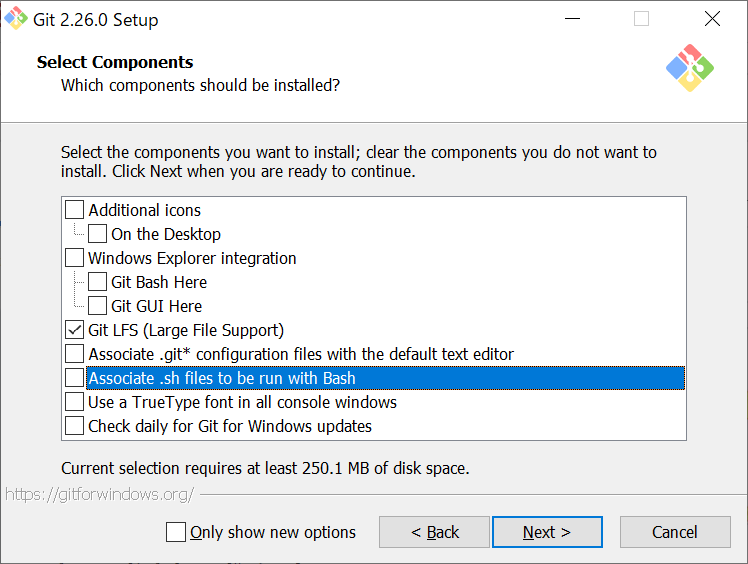
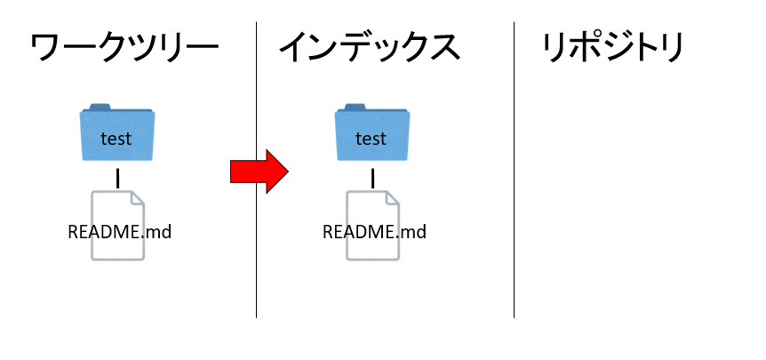
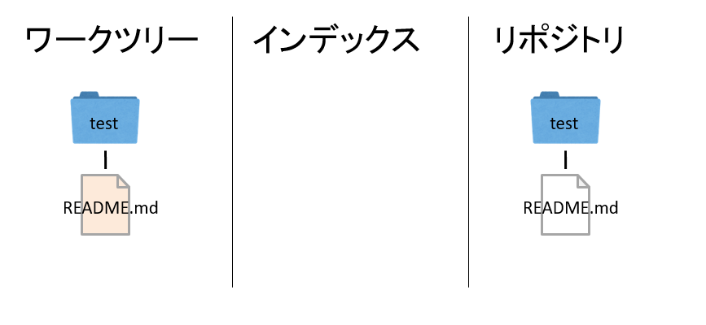
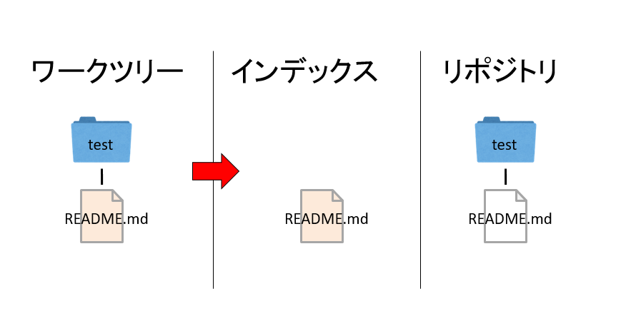
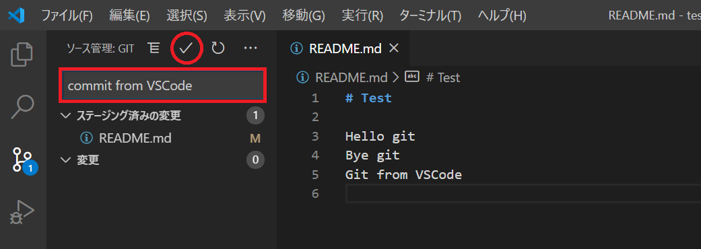

# Gitのインストールと動作確認

## Gitについて

まず、以下のスライドを見よ。

[数値計算屋のためのGit入門](https://speakerdeck.com/kaityo256/starting-git)

今後、「どのファイルがどんな状態にあるか」「歴史はどうなっているか」をイメージしながらGitを操作すると良い。

## Gitのインストール

### Windows

Windowsの場合、[https://git-scm.com/](https://git-scm.com/)からWindows用のインストーラをダウンロード、インストールする。右の方に「Download 2.26.0 for Windows」というボタンがあるはずなのでクリック。

* Information: そのままNext
* Select Components: 「Git LFS」以外のチェックを外す。
* 
* Choosing the default editor used by Git: デフォルトの「Use Vim」のまま
* Adjusting your PATH environment: デフォルトの「Git from the command line and also from 3rd-party software」のまま
* Choosing the SSH executable: デフォルトの「Use OpenSSH」のまま
* Choosing HTTPS transport backend: デフォルトの「Use the OpenSSL library」のまま
* Configuring the line ending conversions: 「Checkout as-is, commit Unix-style line endings」を選ぶ
* 
* Configuring the terminal emulator to use with Git Bash: デフォルトのUse MinTTYのまま
* Configuring extra options: デフォルトでは「Enable symbolic links」が外れているが、これも含めて全てにチェックを入れる。
* 

あとはインストールを待つ。インストール終了後、Git Bashというものがインストールされているので実行し、

```sh
git --version
```

と入力して、

```txt
git version 2.26.0.windows.1
```

と表示されれば成功である。また、Windowsのコマンドプロンプトからも実行できることを確認しておこう。「コマンドプロンプト」を実行し、同様にgitのバージョンを確認せよ。実行できたらインストール完了である。

### Mac

Macの場合は、Homebrewからインストールする。ターミナルから

```sh
brew update
brew install git
```

を実行せよ。インストールが完了したら、

```sh
git --version
```

を実行せよ。

```txt
git version 2.26.0
```

と表示されればインストール完了である。

## Gitの初期設定

Gitのインストールが完了したら、「ユーザ名」と「メールアドレス」の設定を行う。ユーザ名とメールアドレスは、GitHub等で公開リポジトリを作った場合には誰からも見られる状態となることに注意。

WindowsではGit Bashで、Macではターミナルを開き、以下を実行する。

```sh
git config --global user.name "ユーザー名"
git config --global user.email "メールアドレス"
```

特にこだわりがなければ、ユーザ名は自分の英語名(私は "H. Watanabe"にしている)、メールアドレスは普段使うメールアドレスにしておけば良い(携帯のアドレスなどは避けること)。

上記の設定は`.gitconfig`に保存される。保存されたか見てみよう。以下を実行せよ。

```sh
cat .gitconfig
```

以下のように表示されれば設定されている。

```txt
[user]
        name = 先ほど設定したユーザー名
        email = 先ほど設定したメールアドレス
```

また、よく使うコマンドの省略形(エイリアス)も登録しておこう。とりあえず以下を設定しておく。

```sh
git config --global alias.co "checkout"
git config --global alias.st "status -s"
git config --global alias.ci "commit -a"
```

それぞれの説明は以下の通り。

* co: `checkout`は良く使うコマンドで、いちいち打つのが面倒なので`co`で代替する
* st: デフォルトの`status`は情報過多のため、短い形式`-s`で状態を表示させる`st`コマンドを登録
* ci: 通常、`git add`してインデックスに登録してから`git commit`する必要があるが、`-a`オプションをつけることで修正があるファイル全てをコミットする(`git add`を省くことができる)

このあたりは完全に趣味なので、慣れてきたら自分好みに追加・削除・修正していくと良い。ここまでの設定で、`.gitconfig`は以下のようになったはずだ。

```txt
[user]
        name = 先ほど設定したユーザー名
        email = 先ほど設定したメールアドレス
[alias]
        co = checkout
        st = status -s
        ci = commit -a
```

これでGitの利用準備が整った。

## Gitの動作確認

それでは、実際にGitを使ってリポジトリを作成し、基本的な操作を学んでみよう。最初にコマンドラインから、次にVSCode上から操作する。今後、コマンドライン、VSCodeどちらでGitを利用しても良いが、コマンドラインから使えるようになることを推奨する。

以下、WindowsはGit Bashで、Macはターミナルで実行すること。どちらも「ターミナル」と呼ぶ。

途中、わけがわからなくなったら、ディレクトリごと消してやり直すこと。

### リポジトリの作成

まず、適当なテスト用ディレクトリを作り、その中で作業しよう。`git`というディレクトリを作り、さらにその中に`test`というディレクトリを作ろう。

```sh
cd
mkdir git
cd git
mkdir test
cd test
```

最初に`cd`とだけ入力しているのは、ホームディレクトリに戻るためだ。

ディレクトリ`test`の中に、`README.md`というファイルを作成しよう。まず、このディレクトリでVSCodeを起動する。

```sh
code .
```

VSCodeが開いたら、左のエクスプローラーの「TEST」の右にある「新しいファイル」ボタンを押して、`README.md`と入力しよう。


`README.md`ファイルが開かれたら、

```md
# Test
```

とだけ入力し、保存しよう。これで、以下のようなディレクトリ構成になったはずだ。

```txt
git
└── test
    └── README.md
```

この状態でターミナルに戻り、リポジトリとして初期化しよう。

```sh
git init
```

すると、`.git`というディレクトリが作成され、`test`ディレクトリがリポジトリとして初期化される。以下を実行してみよ。

```sh
ls -la
```

`README.md`に加え、`.git`というディレクトリが作成されたことがわかるはずだ。

`git init`した直後は、「現在のディレクトリ`test`をGitで管理することは決まったが、まだGitはどのファイルも管理していない」という状態になる。


この状態を確認してみよう。ターミナルで以下を実行せよ。

```sh
git status
```

以下のような表示が得られるはずである。

```txt
On branch master

No commits yet

Untracked files:
  (use "git add <file>..." to include in what will be committed)
        README.md

nothing added to commit but untracked files present (use "git add" to track)
```

これは、まだ何もコミットがされておらず、`README.md`というファイルが`Untracked`、つまりGitの管理下に置かれていないことを表している。

状態を見るのにいちいちこんな長いメッセージを見せられても困るので、`-s`オプションをつけて見よう。

```sh
git status -s
```

こんな表示が出力されたはずだ。

```sh
?? README.md
```

`??`というのは、`Untracked`、つまりGitの管理下に無いよ、という意味だ。いちいち`git status -s`と入力するのは面倒なので、最初に`status -s`に`st`という別名をつけておいた。

```sh
git st
```

と入力すると、`git status -s`と入力したのと同じことになる。以後、こっちを使うことにしよう。

### インデックスへの追加

さて、`Untracked`な状態のファイルを、Gitの管理下に置こう。そのためには、`git add`を実行する。

```sh
git add README.md
```

なお、Windowsでは

```txt
warning: CRLF will be replaced by LF in README.md.
The file will have its original line endings in your working directory
```

といった警告が出るが、これは「改行コードを変換するよ」という意味であり、とりあえず気にしなくて良い。

現在の状態を見てみよう。

```sh
git st
```

こんな表示になるはずだ。

```txt
A  README.md
```

これは「`README.md`が追加されることが予約されたよ」という意味で、インデックスに`README.md`が追加された状態になっている。



では、記念すべき最初のコミットをしよう。Gitはコミットをする時に、コミットメッセージが必要となる。最初のメッセージは慣例により`initial commit`とすることが多い。

```sh
git commit -m "initial commit"
```

これによりコミットが作成され、`README.md`はGitの管理下に入った。


状態を見てみよう。

```sh
git st
```

何も表示されないはずである。ロングバージョンのステータスも見てみよう。

```sh
$ git status
On branch master
nothing to commit, working tree clean
```

なお、このように`$ コマンド名`の表記がある場合は、`$`以後だけを入力して実行したら、行頭に`$`がついていないような表記が出力された、という意味である。今後、`$`がついている場所のコマンドを`$`抜きで入力すること。

自分がいま`master`ブランチにいて、何もコミットをする必要がなく、ワーキングツリーがきれい(clean)、つまりリポジトリが記憶している最新のコミットと一致していることを意味している。

### ファイルの修正

では、ファイルを修正してみよう。VSCodeで`README.md`に行を付け加えて保存しよう。

```txt
# Test

Hello git

```

`Hello git`の最後の改行を忘れないように。

状態を見てみよう。

```sh
$ git st
 M README.md
```

ファイル名の前に`M`という文字がついた。これは`Modified`の頭文字で、「リポジトリが知っている状態から修正されているよ」という意味だ。



また、この状態で`git diff`を実行してみよう。

```txt
$ git diff
diff --git a/README.md b/README.md
index 8ae0569..58c814b 100644
--- a/README.md
+++ b/README.md
@@ -1 +1,3 @@
 # Test
+
+Hello git
```

`git diff`は、何もオプションをつけずに実行すると、

* 現在のブランチで
* リポジトリに記録されている最新の状態から
* 修正のあった全てのファイルについて

差分を表示する。

行頭に`+`がついた箇所が追加された行である。

この修正をリポジトリに教えるために、`git add`しよう。

```sh
git add README.md
```

また、状態を見てみよう。

```sh
$ git st
M  README.md
```

先ほどは赤字で二桁目に`M`が表示されていたのが、今回は緑字で一桁目に`M`が表示されているはずである。これは、修正されたファイルがインデックスに追加されたことを示す。



この状態でコミットしよう。

```sh
git commit -m "adds new line"
```

`-m`以後がコミットメッセージだ。日本語も使えるが、文字化けする可能性があるので、とりあえず英語で書いておいた方が良い。

修正がリポジトリに登録され、ワーキングツリーがきれい(clean)な状態となった。


### git addなしのコミット

Gitでは、原則として

* ファイルを修正する
* `git add`でコミットするファイルをインデックスに登録する
* `git commit`でリポジトリに反映する

という作業を繰り返す。実際、多人数で開発する場合はこうして「きれいな歴史」を作る方が良いのだが、当面は一人で開発するので、`git add`を省略して良い。

`git add`を省略するには、コミットする時に`git commit -a`オプションをつけて、「修正されたファイル全てをコミットする」ようにすれば良い。先ほど`commit -a`に`ci`という別名(エイリアス)をつけたので、今後はそれを使うことにしよう。

まず、VSCodeでさらにファイルを修正しよう。`README.md`に以下の行を付け加えよう。

```txt
# Test

Hello git
Bye git

```

この状態で、`git add`せずに`git commit`しようとすると、「何をコミットするか指定が無いよ」と怒られる。

```sh
$ git commit -m "modifies README.md"
On branch master
Changes not staged for commit:
  (use "git add <file>..." to update what will be committed)
  (use "git restore <file>..." to discard changes in working directory)
        modified:   README.md

no changes added to commit (use "git add" and/or "git commit -a")
```

しかし、`git ci`を使うと、`git add`なしにコミットできる。

```sh
git ci -m "modifies README.md"
```

以後は`git ci`を使ってよい。

### 歴史の確認

これまでの歴史を確認して見よう。上記の通りに作業して来たなら、3つのコミットが作成されたはずだ。`git log`で歴史を振り返ってみよう。

```sh
$ git log
commit 6d3fcfa23562ce623d0fd6f7f37e79be42e0093d (HEAD -> master)
Author: H. Watanabe <kaityo@users.sourceforge.jp>
Date:   Sat Apr 11 19:48:28 2020 +0900

    modifies README.md

commit 301d9a7d00911bf70e86db11eea197471eed3f27
Author: H. Watanabe <kaityo@users.sourceforge.jp>
Date:   Sat Apr 11 19:41:41 2020 +0900

    adds new line

commit 06f9a1243e4b3c94a5fe9842196792278fb2ea64
Author: H. Watanabe <kaityo@users.sourceforge.jp>
Date:   Sat Apr 11 19:12:11 2020 +0900

    initial commit
```

いつ、誰が、どのコミットを作ったかが表示される。`commit`の後の英数字は「コミットハッシュ」と呼ばれ、コミットにつけられた識別子である。これは環境によって異なるため、同じ操作をしても異なるハッシュが作成される。

デフォルトの表示では見づらいので、一コミット一行で表示しても良い。

```sh
$ git log --oneline
6d3fcfa (HEAD -> master) modifies README.md
301d9a7 adds new line
06f9a12 initial commit
```

個人的にはこちらの方が見やすいので、`l`を`log --oneline`のエイリアスにしてしまっても良いと思う。もしそうしたい場合は、

```sh
git config --global alias.l "log --oneline"
```

を実行せよ。以後、

```sh
git l
```

で、コンパクトなログを見ることができる。

### VSCodeからの操作

Gitは、VSCodeからも操作することができる。今、`README.md`を開いているVSCodeで何か修正して、保存してみよう。例えば以下のように行を追加する。

```txt
# Test

Hello git
Bye git
Git from VSCode

```

修正を保存した状態で左を見ると、「ソース管理」アイコンに「1」という数字が表示されているはずだ。これは「Gitで管理されているファイルのうち、一つのファイルが修正されているよ」という意味だ。


この「ソース管理アイコン」をクリックしよう。


すると、ソース管理ウィンドウが開き、「変更」の下に「README.md」がある。そのファイル名の右にある「+」マークをクリックしよう。`README.md`が「変更」から「ステージング済みの変更」に移動したはずだ。


これは、

```sh
git add README.md
```

という操作をしたことと等価だ。

この状態で「メッセージ」のところにコミットメッセージを書いて、上の「チェックマーク」をクリックすると、コミットできる。例えばメッセージとして「commit from VSCode」と書いてコミットしてみよう。



これでコミットができた。ちゃんとコミットされたかどうか、ターミナルから確認してみよう。

```sh
$ git log --oneline
5203526 (HEAD -> master) commit from VSCode
6d3fcfa modifies README.md
301d9a7 adds new line
06f9a12 initial commit
```

VSCodeから作ったコミットが反映されていることがわかる。

基本的にVSCodeからGitの全ての操作を行うことができるが、当面の間はコマンドラインから実行した方が良い。慣れてきたらVSCodeその他のGUIツールを使うと良いだろう。
