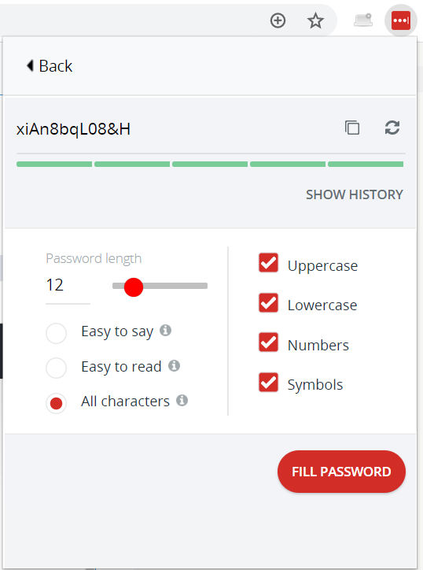
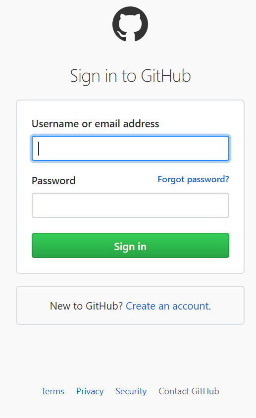

# GitHubのアカウント作成と基本的な操作

## GitHubとは

GitHubは、Gitのホスティングサービスの一つである。Gitはローカルだけでも利用可能だが、リモートリポジトリを用意することで、どこからでもアクセスできたり、他の人と共同で開発したりすることができる。このリモートリポジトリの「置き場所」を提供するのがGitHubだ。GitHubはリモートリポジトリの置き場所を提供するのみならず、開発に便利な様々な機能を備えている。また、通常利用の範囲内においては無料である。最初は無料利用ではプライベートリポジトリ(自分だけが見ることができるリポジトリ)を作ることができず、全て公開リポジトリとなっていたが、現在では無料枠でプライベートリポジトリも作ることがでｋりうようになった。

本研究室では、原則としてプログラムの開発やドキュメントの執筆をGitHub上で行う。以下では、GitHubのアカウントの作成と、簡単な操作方法の確認をしておこう。

## アカウントの作成

まず[https://github.com/](https://github.com/)でアカウントを作成しよう。ユーザー名、メールアドレス、パスワードを入力して「Signup for Githup」を選ぶ。

ユーザー名は、今後長く使う可能性があるのでよく考えておこう。場合によっては本名よりも有名になる可能性もある。メールアドレスは、普段使うアドレスを設定しておく。このアドレスは公開されない(公開することもできる)。

パスワードは使いまわしをせず、ここでGitHub専用に新しく作成すること。LastPassがインストール済みなら、アイコンをクリックし、「Generate Secure Password」を選ぶことでパスワードを生成できる。

パスワードマネージャを利用しているのならいちいちパスワードを覚える必要は無いので、なるべく長くて複雑なパスワードを使おう。最低でも12文字あると良い。

最初に「Verify Your Account」という画面でパズル認証があるので解く。

パズル認証を解いたら「Next: Select a plan」で次に進み、「Choose Free」をクリック。

最後にアンケートがあるので、適当に回答してから「Complete Setup」を押す。すると、先ほど登録したメールアドレスに確認メールが送られてくるので、メール中の「Verify email address」ボタンをクリックする。

すると「What do you want to do first?」と聞いてくるので「Skip this for now」をクリック。これでアカウントが作成され、次回からは、「Sign in」からユーザー名とパスワードでログインできるようになる。

## 多要素認証

多くのサービスが「GitHubでログイン」という方法を用意している。これは、「認証をGitHubに任せるよ」という意味だ。具体的にはOAuthという技術を使っている(興味のある人は調べてみよ)。逆に言えば、多くのサービスがGitHubアカウントに依存することになるので、GitHubアカウントが乗っ取られてしまうと、芋づる式に別のサービスのアカウントも乗っ取られてしまうことになる。したがって、GitHubアカウントはしっかり守る必要がある。そこで、GitHubも多要素認証で守ることにしよう。

GitHubにログインした状態で、右上のアイコンをクリックするとメニューが現れるので「Settings」を選ぶ。

左にある「Personal settings」メニューの「Settings」をクリックし、現れた画面の左の「Security」の画面の下の「Enable two-factor authentification」をクリックする。再度パスワードを聞かれるので入力すること。

多要素認証の方法として、アプリケーションを使った認証と、SMS(ショートメッセージ)を使った認証から選べる。ここではGoogle Autheticatorを使うため、アプリケーションを使った認証(Set up uusing an app)を選ぶ。

すると、次の画面で「1. Recovery codes」という画面が出てくる。これは、スマホをなくした、壊れた等の理由で二段階認証ができなくなった時の「緊急避難」用のコードである。ダウンロードして保存しておくのと同時に、LastPassの「Note」にも保存しておこう。LastPassのアイコンをクリックし、「Open My Vault」でLastPass管理画面を開く。そして、右下にある「+」マークをクリックすると「Add Item」画面が出てくるので「SECURE NOTE」を選ぶ。Nameは、例えば「GitHub Recovery Code」として、内容にリカバリコードをコピペして「Save」を押して保存しよう。

ローカルPCとLastPassにリカバリコードを保存したら、「Next」を押して次に進む。すると「2. Scan this barcode with your app.」という画面になり、二次元コードが出てくる。これをGoogle Authenticator (Google認証システム)で読み取ろう。スマホでGoogle Authenticatorを起動し、右下の赤い「+」をクリック、「バーコードをスキャン」を選んでカメラを起動、このコードを読み取ろう。もしスマホのカメラが壊れている場合は「提供されたキーを入力」することもできる。その場合は、「enter this text code」をクリックすると、「キー」が表示されるので、それをスマホに入力する。正しく入力すると、Google認証システムにGitHubの認証が追加される。いま追加されたアカウントに表示されている六桁の数字をGitHubに入力してEnableを押す。以下のような画面が表示されれば、二段階認証の設定完了である。

以後、GitHubにログインするとき、パスワードと数字を要求されるようになる。パスワードはLastPassが入力してくれるので、6桁の数字だけ入力するようにしよう。
