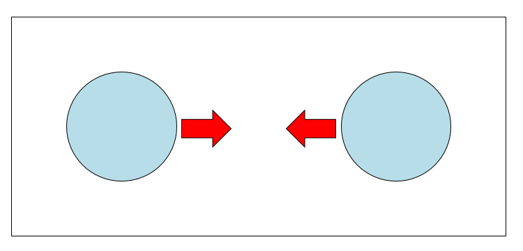
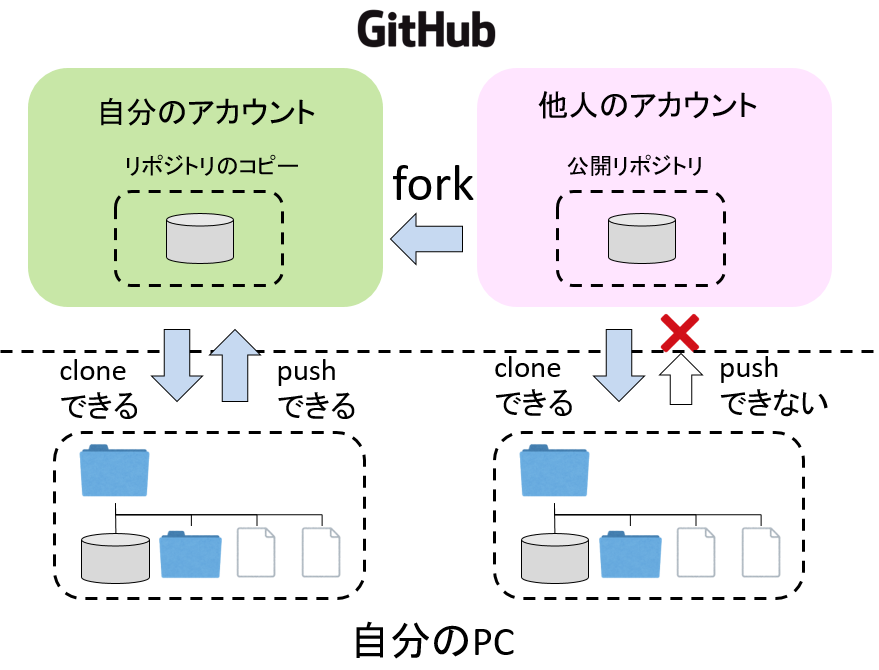
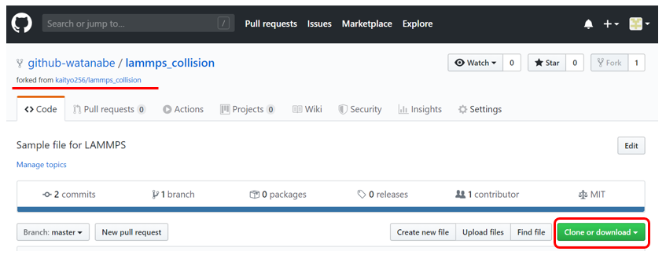
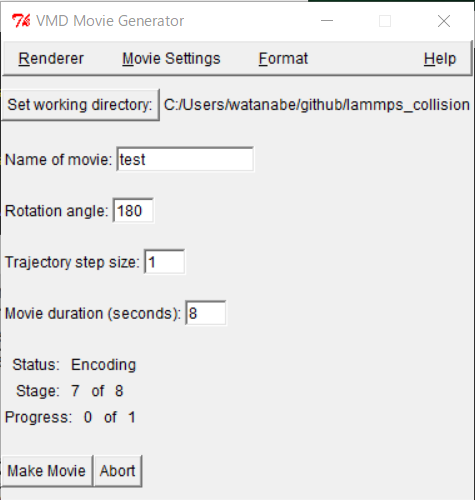
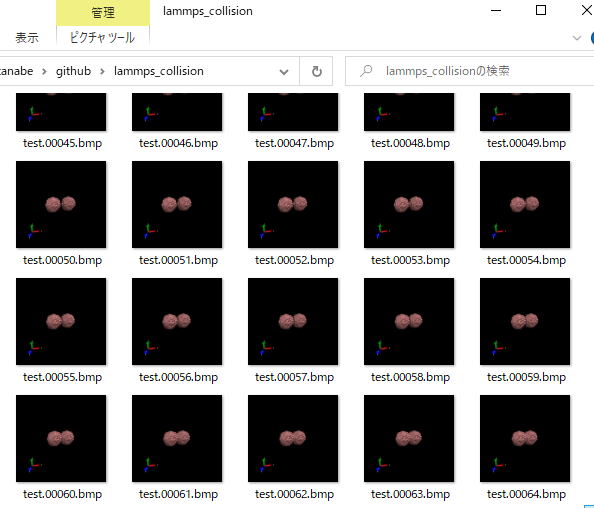

# GitHubのフォークとLAMMPS

これまで、Python、LAMMPS、Git、GitHubのセットアップを行って来た。これら全てを使った作業をしてみよう。

具体的には以下のような作業を行う。

1. GitHubにて既存のリポジトリをforkする
2. Gitでそのリポジトリをcloneする
3. PythonでLAMMPS用の原子状態を出力する
4. LAMMPSで実行、VMDで可視化する
5. シミュレーションの条件を変更し、その結果をgit commit & pushする。

## シミュレーションの内容

簡単な分子動力学シミュレーションとして、液滴衝突をしてみよう。二つの液滴を用意し、それらに初速を与えて正面衝突させる。



LAMMPSに与えるファイルは二つである。一つはLAMMPSのインプットファイルで、

* どのような相互作用をさせるか
* 時間刻みはどうするか
* 原子配置はどうするか
* 何ステップ計算するか
* 何ステップに一度ダンプファイルを出力するか

などを記述する。もう一つはインプットファイルから読み込まれるファイルで、シミュレーションボックスのサイズや、原子の種類、原子の位置、初速を記述する。

原子が10個程度なら手で書けなくもないが、千個、一万個となると手で書くのは不可能だ。そこで、Pythonスクリプトで原子配置を作成させよう。

## GitHubでのfolk

まず、既存のリポジトリをfork(フォーク)しよう。forkとは、他人の公開リポジトリを、自分のアカウントにコピーすることだ。他人の公開リポジトリは、cloneすることはできるが、修正後にpushすることはできない。しかし、forkにより、自分のリポジトリとしてコピーすると、それは自分のファイルになるので、自由にpushすることができるようになる。



では早速forkしてみよう。GitHubにログインした状態で、以下のリポジトリを見てみよ。

[https://github.com/kaityo256/lammps_collision](https://github.com/kaityo256/lammps_collision)

左上に「Fork」ボタンがあるので、押してみよう。


ボタンの隣の数字は「これまでに誰がForkしたか」なので、そこではなく「Fork」と書いてある方を押すこと。

すると、しばらくしてから「GitHubの自分のアカウント」の画面に遷移する。



通常の自分のリポジトリと違うところは、「forked from kaityo256/lammps_collision」とFork元が書いてあることである(また、リポジトリ名の左にあるアイコンも異なる)。しかし、後は自分のリポジトリと同じように、cloneやpushその他好きなことができる。

また、このように既存のリポジトリをForkするのはプルリクエストを作る目的もあるのだが、ここでは触れない。

Forkした後は、「Clone or download」ボタンからclone用のURLをコピーしよう。この時、SSH経由でcloneすること。もし「Clone with HTTPS」と書いてあったら、「Use SSH」をクリックし、SSH用のURLをコピーする。
URLをコピーしたら、ターミナル(WindowsならPowerShell、Macならターミナル)の、`github`ディレクトリの下でcloneしよう。

```sh
cd github
git clone git@github.com:アカウント名/lammps_collision.git
```

Cloneする時に秘密鍵のパスフレーズを聞かれるので入力すること。

```txt
Receiving objects: 100% (10/10), done.
```

などと表示されたら無事にcloneされている。

## Pythonスクリプトの実行

作成されたリポジトリに入り、VSCodeを起動しよう。

```sh
cd lammps_collision
code .
```

VSCodeが起動したら、左のウィンドウの`generate_config.py`をクリックして開く。これは、LAMMPSに入力するための原子配列を生成するPythonスクリプトである。スクリプトが開いたら、右上の「実行ボタン」をクリックして実行しよう。実行ウィンドウで

```txt
Generated collision.atoms
```

と表示され、かつVSCodeの左にあるファイル一覧(エクスプローラー)に`collision.atoms`が追加されれば正しく実行されてる。なお、`collision.atoms`は、「Gitで管理しないファイル」に登録されているため、VSCodeでは灰色で表示される。

この「Gitで管理しないファイル(無視されるファイル)」は、リポジトリの`.gitignore`ファイルに含まれている。中身を見てみよう。

```txt
log.lammps
*.atoms
*.dump
vmd.state
```

ここで`*.atoms`などと`*`マークがあるのは「ワイルドカード」と呼ばれる指定方法だ。この場合は「拡張子が`atoms`のファイル全て」を意味しており、`collision.atoms`はそれにマッチするために無視される。同様に今後作成される`collision.dump`や`log.lammps`などもGitから無視される。

## LAMMPSの実行

いま、リポジトリには`collision.input`と`collision.atoms`があるはずだ。前者がLAMMPSでシミュレーションをするためのインプットファイルで、後者がシステムサイズや原子の位置、初速を記述するファイルである。これらをLAMMPSにい入力して実行してみよう。

Windows PowerShellの場合は

```sh
cat collision.input | lmp_serial.exe
```

Macの場合は

```sh
lmp_serial < collision.input
```

として実行しよう。一分程度で実行が終わるはずである。同じディレクトリに`collision.dump`が生成されていれば正しく実行されている。

## VMDによる可視化

先ほど生成された`collision.dump`をVMDで読み込んでみよう。

VMDを実行し、「VMD Main」の「File」から「New Molecule」を選び、「Browse」を押して先ほどの`collision.dump`を選ぶ。次にVMD Mainの「Graphics」の「Representation」を選び、「Drawing Method」を「VDW」にすると、画面が玉に変わる。その状態で「Sphere Scale」を適切に設定しよう。おそらく0.5程度が適切と思われる。

設定終了したら、VMD Mainの右下にあるアニメーションボタンを押してみよう。二つの液滴が衝突し、合体する様子が見られるはずである。

## シミュレーションの修正

手元にGit管理されたシミュレーションファイルがあるので、これをいろいろ修正してみよう。特に衝突する液滴の速度をより高速にしてみたらどうなるか調べてみよう。

### インプットファイル

LAMMPSに直接入力するファイルは`collision.input`である。サンプルでは`in.melt`となっていたが、ここでは私の趣味で「プロジェクト名.拡張子」という形で統一する。

`collision.input`の内容は以下の通りである。

```txt
units lj
atom_style atomic
boundary p p p
timestep 0.001

read_data collision.atoms

mass 1 1.0

pair_style lj/cut 2.5
pair_coeff 1 1 1.0 1.0 2.5

neighbor 0.3 bin
neigh_modify every 20 delay 0 check no

fix 1 all nve

dump id all atom 100 collision.dump

run 20000
```

なお、調べたいコマンドを[LAMMPSのドキュメント](https://lammps.sandia.gov/doc/Manual.html)の検索窓に入力すれば説明が見つかるので適宜参照すること。

最初に、系の概要の定義がある。

```sh
units    lj       # LJ単位系をとる
atom_style atomic # 原子タイプはデフォルト
boundary p p p    # 三方向に周期境界条件を採用する
timestep 0.001    # 時間刻みを0.001とする
```

次に、原子配置の読み込みをする。

```sh
read_data collision.atoms
```

ここでは`collision.atom`というファイルを読み込んでいる。

次のセクションも系の定義の続きだ。

```sh
mass 1 1.0 # 質量の設定

pair_style lj/cut 2.5       # 原子間相互作用のタイプ
pair_coeff 1 1 1.0 1.0 2.5  # 原子間相互作用のパラメタ
```

次のセクションはシミュレーション実行のためのテクニカルなパラメータである。いまはあまり気にしなくて良い。

```sh
neighbor 0.3 bin # 相互作用ペア探索の距離
neigh_modify every 20 delay 0 check no # 相互作用ペアリストの更新方法

fix 1 all nve # タイプ1の原子全てをNVEアンサンブルとする
```

次が、ダンプファイル(スナップショット)を出力する設定だ。

```sh
dump id all atom 100 collision.dump
```

ここでは全ての原子について、`collision.dump`というファイルに、100ステップごとにスナップショットを出力している。

最後がシミュレーションの実行だ。

```sh
run 20000
```

20000ステップの計算をしている。

### 原子配置ファイル

`collision.input`から読み込まれる`collision.atoms`の内容も見ておこう。こんな感じである。

#### 全体

```txt
Position Data

4696 atoms
1 atom types

-40.00 40.00 xlo xhi
-20.00 20.00 ylo yhi
-20.00 20.00 zlo zhi

Atoms

1 1 -27.75 -1.55 0.0
2 1 -27.75 -0.775 0.775
(snip)
4695 1 28.525 1.55 0.775
4696 1 28.525 2.325 0.0


Velocities

1 2.0 0.0 0.0
2 2.0 0.0 0.0
(snip)
2439 -2.0 0.0 0.0
2440 -2.0 0.0 0.0

```

なお、ここで出てくる(snip)とは「中略」、つまり途中を省略したよ、という意味だ。

また上から順番に見ていこう。

#### タイトルと原子定義

```sh
Position Data

2440 atoms    # 原子数
1 atom types  # 原子の種類の数
```

最初の行はタイトルだ。どうも必須らしい。次に原子数と原子の種類の数を指定する。

#### シミュレーションボックス

```txt
-40.00 40.00 xlo xhi
-20.00 20.00 ylo yhi
-20.00 20.00 zlo zhi
```

次にシミュレーションボックスのサイズを指定する。X, Y, Z各軸の最小値と最大値を決めることで、X, Y, Z軸に辺が平行な直方体を指定する。

ここでは、

* -40 <  x <  40
* -20 <  y <  20
* -20 <  z <  20

を満たす直方体をシミュレーション領域としている。

#### 原子位置

```txt
Atoms

1 1 -27.75 -1.55 0.0
2 1 -27.75 -0.775 0.775
...
```

`Atoms`の後に、原子の数だけ原子の位置を並べる。フォーマットは

```txt
ID 原子種別 X座標 Y座標 Z座標
```

だ。今回は原子が一種類しかないため、二桁目は全て「1」である。また、IDが「1はじまり」なのに注意。多くのプログラム言語が「0はじまり」を採用しているため、調整が必要だ。

#### 原子速度

```txt
Velocities

1 2.0 0.0 0.0
2 2.0 0.0 0.0
```

`Velocities`の後に、原子の数だけ速度を並べる。フォーマットは

```txt
ID X成分 Y成分 Z成分
```

である。原子配置ファイルのフォーマットは以上だ。

### 原子配置ファイル生成スクリプト

先ほどの`collision.atoms`は、Pythonスクリプトにより生成されたものだ。このファイルを生成するPythonスクリプト`generate_config.py`を見てみよう。

#### スクリプト全体

スクリプトは50行ちょっとだ。

```py
class Atom:
    def __init__(self, x, y, z, xvel):
        self.x = x
        self.y = y
        self.z = z
        self.type = 1
        self.vx = xvel
        self.vy = 0.0
        self.vz = 0.0


def add_ball(atoms, xpos, xvel):
    r = 8
    s = 1.55
    h = 0.5 * s
    for ix in range(-r, r+1):
        for iy in range(-r, r+1):
            for iz in range(-r, r+1):
                x = ix * s
                y = iy * s
                z = iz * s
                if (x**2 + y**2 + z**2 > r**2):
                    continue
                x = x + xpos
                atoms.append(Atom(x, y, z, xvel))
                atoms.append(Atom(x, y+h, z+h, xvel))
                atoms.append(Atom(x+h, y, z+h, xvel))
                atoms.append(Atom(x+h, y+h, z, xvel))


def save_file(filename, atoms):
    with open(filename, "w") as f:
        f.write("Position Data\n\n")
        f.write("{} atoms\n".format(len(atoms)))
        f.write("1 atom types\n\n")
        f.write("-40.00 40.00 xlo xhi\n")
        f.write("-20.00 20.00 ylo yhi\n")
        f.write("-20.00 20.00 zlo zhi\n")
        f.write("\n")
        f.write("Atoms\n\n")
        for i, a in enumerate(atoms):
            f.write("{} {} {} {} {}\n".format(i+1, a.type, a.x, a.y, a.z))
        f.write("\n")
        f.write("Velocities\n\n")
        for i, a in enumerate(atoms):
            f.write("{} {} {} {}\n".format(i+1, a.vx, a.vy, a.vz))
    print("Generated {}".format(filename))


atoms = []

add_ball(atoms, -20, 2.0)
add_ball(atoms, 20, -2.0)

save_file("collision.atoms", atoms)
```

最初にクラス定義、関数定義があり、最後にプログラムの実行がある。少しずつ見ていこう。

#### プログラムの実行

まず「最後」を見てみよう。

```py
atoms = []

add_ball(atoms, -20, 2.0)
add_ball(atoms, 20, -2.0)

save_file("collision.atoms", atoms)
```

`atoms`は原子の情報をまとめるリストだ。これを`add_ball`という関数に渡して、原子を追加してもらっている。`add_ball`は、指定の位置に、指定の初速で原子を生成する関数だ。

* 左の方(x=-20)に、右向きの初速(vx = 2.0)の玉
* 右の方(x= 20)に、左向きの初速(vx =-2.0)の玉

の二つを生成し、`atoms`に追加している。

最後に、生成された原子情報を`save_file`でファイルに保存している。それだけのスクリプトだ。

#### 原子クラス

まず、原子の情報をまとめて扱うために、原子クラスを定義している。

```py
class Atom:
    def __init__(self, x, y, z, xvel):
        self.x = x
        self.y = y
        self.z = z
        self.type = 1
        self.vx = xvel
        self.vy = 0.0
        self.vz = 0.0
```

要するに原子とは座標(`x,y,z`)、速度(`vx, vy, vz`)、タイプ(`type`)を持つものである、と定義している。このうち、座標と速度のx成分のみ受け取って、後はデフォルトの値を設定している。

#### 液滴生成

次は指定の位置に液滴を置く関数`add_ball`だ。慣れないと読みづらいかもしれない。

```py
def add_ball(atoms, xpos, xvel):
    r = 8
    s = 1.55
    h = 0.5 * s
    for ix in range(-r, r+1):
        for iy in range(-r, r+1):
            for iz in range(-r, r+1):
                x = ix * s
                y = iy * s
                z = iz * s
                if (x**2 + y**2 + z**2 > r**2):
                    continue
                x = x + xpos
                atoms.append(Atom(x, y, z, xvel))
                atoms.append(Atom(x, y+h, z+h, xvel))
                atoms.append(Atom(x+h, y, z+h, xvel))
                atoms.append(Atom(x+h, y+h, z, xvel))
```

最初の`r`は液滴の半径、`s`は原子間距離、`h`はその半分の距離だ。原子間距離は、原子がちょうど結晶を組む距離(安定する距離)としている。そういう意味では液滴ではなく氷をぶつけていることになるのだが、あまり細かいことは気にしないこと。

そのあとのループでは、原子をFCC(面心立方格子)状に配置している。ただし、

```py
if (x**2 + y**2 + z**2 > r**2):
    continue
```

の行により、半径`r`以内に無い原子は追加しないことで液滴を作っている。逆に、この行をコメントアウトすれば、液滴ではなく立方体をぶつけることができる。

```py
atoms.append(Atom(x, y, z, xvel))
```

だが、これはもう少し丁寧に書くと

```py
a = Atom(x, y, z, xvel)
atoms.append(a)
```

という意味だ。まず`x, y, z`の位置と、`xvel`の初速を持つ原子を生成し`a`という名前をつける。そして`a`を`atoms`に追加している。この中間変数`a`を使わないで一行で書いてしまったのが先のプログラムである。

#### ファイル出力

最後に、生成した原子リストを使ってファイルに出力する関数である。

```py
def save_file(filename, atoms):
    with open(filename, "w") as f:
        f.write("Position Data\n\n")
        f.write("{} atoms\n".format(len(atoms)))
        f.write("1 atom types\n\n")
        f.write("-40.00 40.00 xlo xhi\n")
        f.write("-20.00 20.00 ylo yhi\n")
        f.write("-20.00 20.00 zlo zhi\n")
        f.write("\n")
        f.write("Atoms\n\n")
        for i, a in enumerate(atoms):
            f.write("{} {} {} {} {}\n".format(i+1, a.type, a.x, a.y, a.z))
        f.write("\n")
        f.write("Velocities\n\n")
        for i, a in enumerate(atoms):
            f.write("{} {} {} {}\n".format(i+1, a.vx, a.vy, a.vz))
    print("Generated {}".format(filename))
```

特に難しいことはやっていない。ファイル出力に関しては、例えば[プログラム基礎同演習の当該回](https://kaityo256.github.io/python_zero/file/index.html)を参照のこと。

### 自分のシミュレーション

以上の知識で、例えば

* 衝突速度をより早くする
* 液滴を大きく/小さくしてみる
* 液滴の密度を変えてみる(`add_ball`の`s`を変える)
* 球ではなく立方体をぶつけてみる (面ではなく角でぶつけると面白いかもしれない)

などを試してみて、ローカルで修正したらコミットし、自分のリポジトリにpushしてみよ。

## VMDによるアニメーション作成

VMDによりアニメーションを作成する。まずはターミナルから`ffmpeg`が存在することを確認せよ。

```sh
$ ffmpeg -L
ffmpeg version 4.0.2 Copyright (c) 2000-2018 the FFmpeg developers
(snip)
```

LAMMPSをインストールしていれば`ffmpeg`もインストールされているはずだが、もしインストールされていなければインストールすること。

以下、`lammps_collision`のtrajectoryが読み込まれていることを前提とする。

まず、VMDのOpenGL Displayで適当な角度を指定する。液滴衝突であれば、例えばこんな角度にする。


この状態で、VMD Mainの「Extensions」→「Visualization」→「Movie Maker」を選ぶ。すると「VMD Movie Generator」が起動する。



まずはWorking directoryを指定する。特に理由がなければ、`lammps_collision`をクローンしたディレクトリを指定すると良いだろう。このディレクトリにイメージが大量に生成されるので、デスクトップなどを指定しないように。

`Name of movie`は、連番ファイル名の基本の名前となる。なんでも良いが、ここでは`test`としておく。「Format」はなんでも良いが、例えばMPEG-1(VideoMach)としておく。

以上の設定をした上で「Make Movie」をクリックすると、Working Directoryに指定したディレクトリに`test.00012.bmp`といったファイルが大量に作成される。最後に「videomach.exeが見つからない」というエラーが表示されるが「いいえ」を押して、次に出るダイアログもOKを押して終了してかまわない。


この状態で、Working Directoryに指定したディレクトリに大量のBMPファイルがあるはずである。



このBMPファイルからアニメーションGIFを作るには、ターミナルからBMPファイルがあるディレクトリで以下を実行する。

```sh
ffmpeg -i test.%05d.bmp collision.gif
```

これは「test.(五桁の整数の連番).bmpというファイルから、collision.gifを作れ」という意味だ。

MPEGファイルを作りたければ、

```sh
ffmpeg -i test.%05d.bmp collision.mpg
```

とすればよい。同様に、連番のイメージファイルさえ作れば、FFMPEGを用いてアニメーションGIFでもMPEGでも作れるので使い方を覚えておきたい。