# gnuplotの使い方

これから、なんらかの数値計算を行うと、何かデータが出力される。それをグラフにしなければならない。エクセルを始めデータからグラフにするアプリケーションは多数あるが、ここではgnuplot(グニュプロット、グニュープロット)の使い方を覚えよう。

gnuplotは長い歴史を持つツールであり、非常に多機能なので、その全ての機能を覚えるのは難しい。以下では必要最低限の使い方だけを覚え、後は必要に応じて機能を調べていくと良い。

## 基本的な使い方

### 関数のプロット

まずはgnuplotを起動しよう。研究室サーバにログインし、`gnuplot`を実行せよ。

以下のような表示がされ、入力待ちとなる。

```sh
$ gnuplot

        G N U P L O T
        Version 4.6 patchlevel 2    last modified 2013-03-14
        Build System: Linux x86_64

        Copyright (C) 1986-1993, 1998, 2004, 2007-2013
        Thomas Williams, Colin Kelley and many others

        gnuplot home:     http://www.gnuplot.info
        faq, bugs, etc:   type "help FAQ"
        immediate help:   type "help"  (plot window: hit 'h')

Terminal type set to 'x11'
gnuplot>        
```

gnuplotは、様々な関数をプロットできる。例えばsin(x)を表示してみよう。

```sh
gnuplot> plot sin(x)
```


サインカーブが表示されたはずだ。何も指定しないと、x軸は-10から10、y軸の範囲は自動で設定される。軸の範囲を変えてみよう。

```sh
gnuplot> plot [-20:20] sin(x)
```

すると、x軸の範囲が-20から20に変更されたはずだ。

あらかじめ範囲を指定しておくこともできる。

```sh
gnuplot> set xrange [-1:1]
gnuplot> plot sin(x)
```

また、y軸の範囲を指定することもできる。プロット時に指定する場合は、x軸の次に書く。

```sh
gnuplot> plot [-3:3] [-0.5:0.5] sin(x)
```

もちろんx軸と同様に事前にy軸の範囲を指定することもできる。

なお、プロットを表示した状態でマウスやキーボードの入力により、表示範囲を変更できる。これは便利な機能であるが、たまにプロットを見失ってしまうことがある。とりあえずデータや関数を見える状態にするには、`set autoscale y`を実行すれば良い。

```sh
guplot> set autoscale y
gnuplot> replot
```

これで少なくともデータ等が見えるようになるので、そのあとでx軸などを調整すればよい。

また`exit`によりgnuplotを終了することができる。

### 命令の省略

gnuplotは、命令やオプションは「他の単語と区別ができるところまで」省略することができる。

例えば

```sh
gnuplot> plot sin(x)
```

は、以下のように書いても同じ意味になる。

```sh
gnuplot> plo sin(x)
gnuplot> pl sin(x)
gnuplot> p sin(x)
```

また、

```sh
gnuplot> set xrange [-1:1]
```

は、

```sh
gnuplot> se xr [-1:1]
```

と書いても正しく解釈される。

`plot`などは`p`と書いて良いと思うが、`set`を`se`、`xrange`を`xr`と書くのは可読性を損ねるため、省略はほどほどにしておいた方が良い。

また、`linespoints`を`lp`など、個別の省略系が用意されている命令もある。

### データのプロット

gnuplotは、データファイルのプロットができる。こんなデータを用意しよう(`test.dat`)。

```txt
1 1.1
2 1.9
3 3.2
4 4.1
5 4.8
```

ウェブからダウンロードしてもよい。

```sh
wget https://kaityo256.github.io/lab_startup/gnuplot/test.dat
```

これをgnuplotでプロットしてみよう。

```sh
gnuplot> p "test.dat"
```

以下のような表示がされたはずだ。


これでは見づらいので、データ点のタイプとサイズを変更しよう。

まず、データ点の形を変えよう。そのためには`pointtype`(省略形`pt`)を使う。

```sh
gnuplot> p "test.dat" pt 6
```

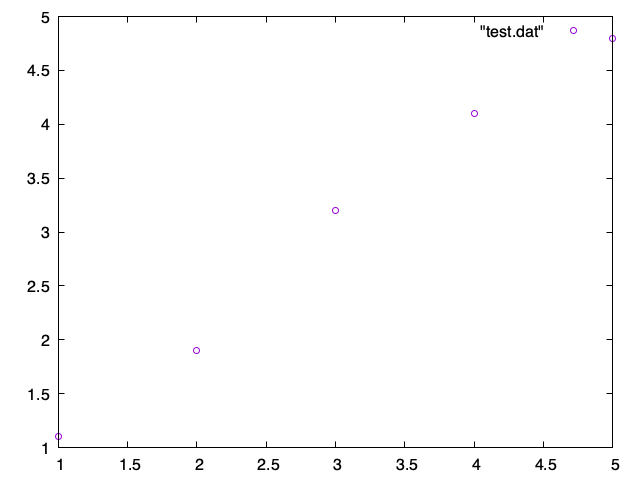

データ点が「+」から「〇」になった。しかし、まだ大きさが小さいので、こんどはデータ点のサイズを変えよう。`pointsize`(省略形`ps`)を使う。

```sh
gnuplot> p "test.dat" pt 6 ps 2
```

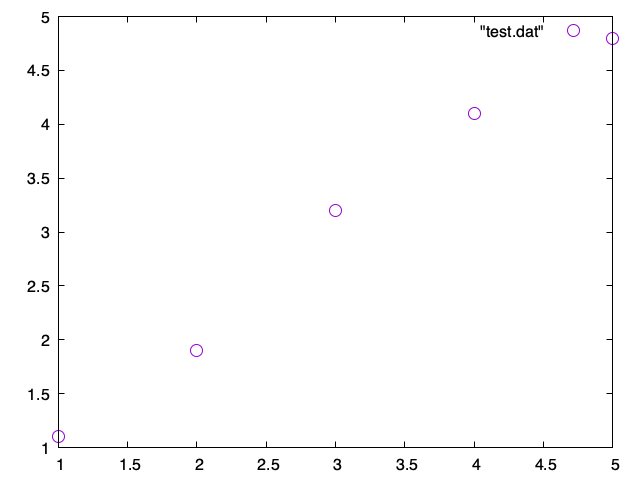

データを点ではなく、折れ線で結びたいこともあるだろう。その場合には`with lines`と指定する。面倒なので私は`w l`と略記する。

```sh
gnuplot> p "test.dat" w l
```

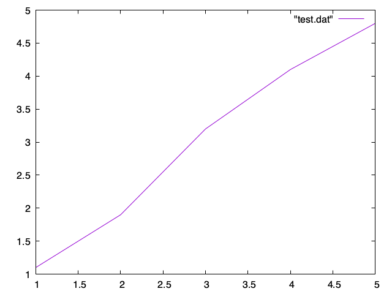

`with linespoints`を指定することで、データ点を表示しつつ線で結ぶこともできる(省略形`lp`)。

```sh
gnuplot> p "test.dat" w lp
```


`linespoints`を指定した状態で、かつ点のタイプやサイズを変更することもできる。

```sh
gnuplot> p "test.dat" w lp pt 6 ps 2
```


また、線やポイントの色を変えるには`linecolor(lc)`で指定できる。

```sh
gnuplot> p "test.dat" w lp pt 6 ps 2 lc 2
```

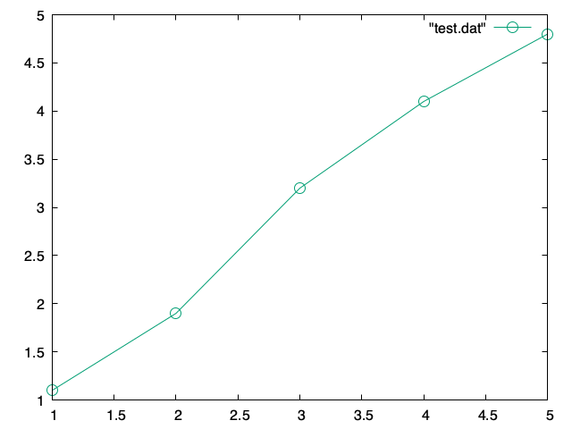

線色には数字の他、色名を直接指定することもできる。

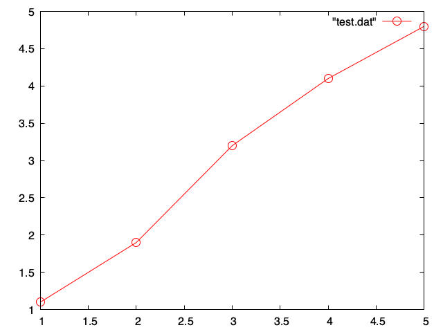

色の名前をダブルクォーテーションで囲むのを忘れないこと。

## フィッティング

gnuplotでは自由に関数を定義して、パラメータのフィッティングをすることができる。まずは比例するようなデータに対して傾きをフィッティングしてみよう。

### 簡単なフィッティング

まず、データと曲線は重ねて表示することができる。

```sh
gnuplot> p "test.dat", x
```

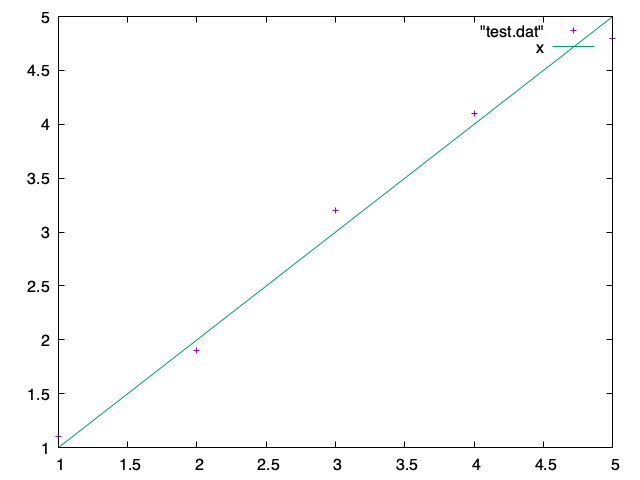

このようにカンマで区切ることで、複数のデータ、複数の曲線を重ねて表示できる。

次に、関数を定義しよう。`y = a x`の形でフィッティングしたいので、そのように定義する。

```sh
gnuplot> f(x) = a * x
```

係数`a`の初期値も与えておこう。

```sh
gnuplot> a = 1
```

このように、gnuplotでは変数も使える。この状態で、関数`f(x)`とデータを重ねてみよう。

```sh
gnuplot> p "test.dat", f(x)
```

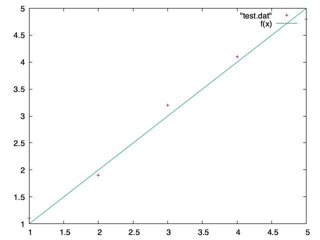

さて、このデータをフィッティングしてみよう。以下のように指定する。

```sh
gnuplot> fit f(x) "test.dat" via a
```

コマンドは `fit 関数 データ via パラメタリスト`である。複数のパラメタを含む場合は`via a,b`などとしてカンマで区切って与える。こんな表示がされるはずだ。

```txt
Final set of parameters            Asymptotic Standard Error
=======================            ==========================

a               = 0.998182         +/- 0.02234      (2.238%)


correlation matrix of the fit parameters:

               a
a               1.000
```

まず注目して欲しいのは、`Final set of parameters`で、これにより`a = 1.00 +/- 0.02`であることがわかる。

また、複数のパラメタをフィッティングした時には、`correlation matrix`も気にした方が良いが、ここでは触れない。

この状態で`a`にはフィッティングした値が代入されている。`print`文により、変数の値を表示できる。

```sh
gnuplot> print a
0.998181818193914
```

また、もう一度`f(x)`と一緒にデータを表示すれば、フィッティング後の値が使われる。

```sh
gnuplot> p "test.dat", f(x)
```

### 誤差を考慮したフィッティング

gnuplotは、誤差を考慮したフィッティングもできる。以下のデータを考えよう(`test2.dat`)。

```txt
1 1.01 0.1
2 1.99 0.1
3 3.02 0.1
4 5.10 1.1
5 4.98 0.1
```

上記のファイルのウェブからダウンロードできる。

```sh
wget https://kaityo256.github.io/lab_startup/gnuplot/test2.dat
```

それぞれ「x, y, 誤差」である。これを表示しよう。データをエラーバー付きで表示するには`with errorbars` を指定する。見づらいので、少しプロット範囲を広げよう。

```sh
gnuplot> p [0.9: 5.1] "test2.dat" w e
```

![p [0.9: 5.1] "test2.dat" w e](fig/test2.png)

一つだけエラーバーが大きな(つまり不正確な)データが含まれていることがわかる。

まずはこの状態で y=axの形でフィッティングをかけてみよう。

```sh
gnuplot> f(x) = a * x
gnuplot> fit f(x) "test2.dat" via a  
```

デフォルトでは、gnuplotは誤差を考慮しない。その結果、`a = 1.08 +/-0.06`と、1より大き目の値が得られる。プロットしてみよう。

```sh
gnuplot> p [0.9: 5.1] "test2.dat" w e, f(x)
```

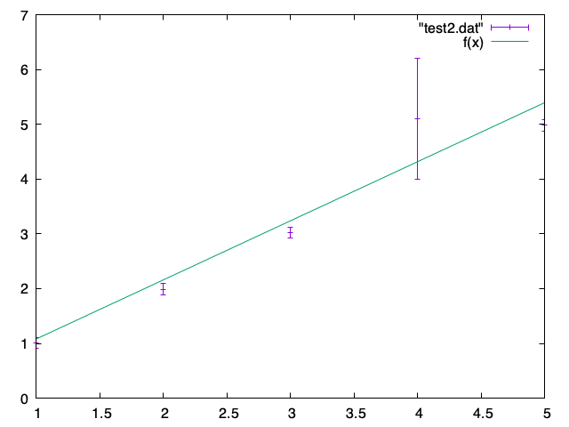

上に外れたデータに引っ張られて、全体的に線が上にずれたことがわかるだろう。

次に、誤差を考慮したフィッティングをしてみよう。そのためには`using`を使う。

```sh
gnuplot> fit f(x) "test2.dat" using 1:2:3 via a
```

その結果`a = 1.000 +/- 0.008`と、非常に1に近くなったことがわかるだろう。プロットしてみよう。

```sh
gnuplot> p [0.9: 5.1] "test2.dat" w e, f(x)
```

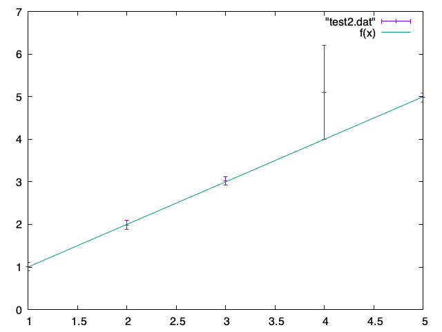

信頼性の低いデータの重みが小さくなり、直線が他の信頼性の高いデータを貫いたことがわかる。

## ファイルからの実行

gnuplotは、コマンドを入力して実行していくタイプのプロッターだが、このコマンドをあらかじめファイルに保存しておき、gnuplotに食わせることでプロットすることができる。

gnuplotは、プロットを画面に表示するだけでなく、PNGやPostScript、PDFなどの形式でも出力可能だが、このようなファイルに出力する場合は、コマンドを手で入力するのではなく、ファイルに保存して、gnuplotに食わせて出力したほうが良い。これにより、 **生データからグラフまで一発で作成する** 環境が整うからだ。科学において、論文の不正の多くはグラフの捏造や修正により行われる。不正を疑われた時、生データと、そのデータから論文に使われたグラフと同じものが「後から」作れることは非常に大事である。また、論文を執筆する際、例えば精度の低いデータで仮の図を作って論文を書いておき、後から精度の高いものに更新することがよくある。その時に、コマンド一発で更新されたデータから図を作ることができると作業効率が良い。

さて、出力先を画面ではなくPNGなどにする場合は`set terminal`を用いる。また、出力ファイル名は`set output ファイル名`で指定する。その他は全く同じである。

プロットファイル`test.plt`を用意しよう。(まだgnuplotを実行中ならそれを終了してから)`vi test.plt`を実行し、以下の内容を記述して保存、終了せよ。

```txt
set terminal pngcairo
set output "test.png"

p sin(x)
```

その後、このファイルをgnuplotに食わせよう。

```sh
gnuplot test.plt
```

正しく記述されていれば、同じディレクトリに`test.png`が作成されたはずだ。表示してみよう。Linux (CentOS)でPNGを表示するには`eog`、Macなら`open`、WindowsのWSLでは`explorer.exe`で開くことができる。

```sh
eog test.png # CentOS
open test.png # Mac
explorer.exe test.png # Windows
```

Windowsでいちいち`explorer.exe`とうつのは面倒なので、以下のようなaliasを作っておくと良い。

```sh
alias open=explorer.exe 
```

論文用に図を作る場合は、PDFにするのが良いだろう。`test.plt`を以下のように修正せよ。

```txt
set terminal pdfcairo
set output "test.pdf"

p sin(x)
```

実行したディレクトリに`test.pdf`が作成されたはずなので確認せよ。

論文に使う図でなくても、普段から図は必ずプロットファイル経由で作成する癖をつけておいた方がよい。コマンドから図を作った場合、一か月もすれば間違いなくどういう操作をしたか忘れてしまう。生データとプロットファイルをペアで保存して、プロットファイルと図のファイル名を揃えておけば、「このプロットファイルをgnuplotに食わせればこのファイルができる」と思い出すことができるし、いつでも生データから同じ図を作ることができる。

## その他便利な機能

gnuplotは非常に多機能であり、図の作成に必要なことはほぼなんでもできる。そのすべての機能を紹介することは不可能だが、ここでいくつか便利な機能を紹介しておく。

### ラベルの設定

`set xlabel`でx軸のラベルを設定できる。まずはサインカーブをプロットしよう。

```sh
gnuplot> p sin(x)
```

この状態でx軸のラベルを設定する。

```sh
gnuplot> set xlabel "Temperature"
```

設定しただけでは反映されない。`replot`により再描画しよう。

```sh
gnuplot> rep
```


軸の名前が設定されたはずだ。

#### フォントの設定

軸のフォントサイズが小さいので、もう少し大きくしたい場合は、`font`コマンドを追加する。

```sh
gnuplot> set xlabel "Time" font "Helvetica,40"
```

このように`font`の後で「フォント名、フォントサイズ」と指定するとフォントやサイズを変更できる。

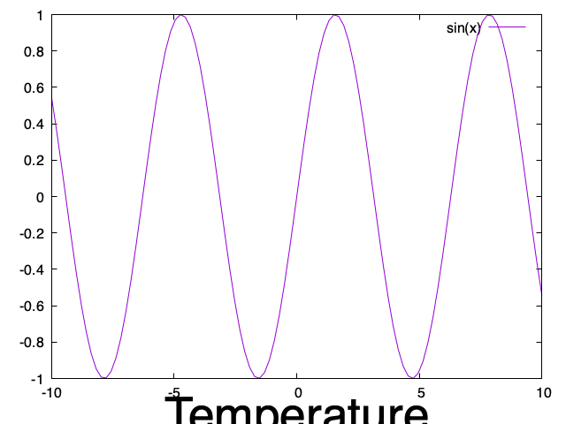

#### ギリシャ文字

gnuplotはラベルなどにギリシャ文字を表示できる。例えばx軸に「β」を表示したい場合は以下のようにする。

```sh
gnuplot> set xlabel "{/Symbol b}"
```

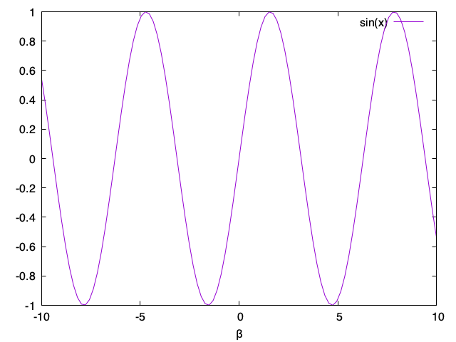

中括弧で囲まれた中に`/Symbol 対応する文字`を書く。βに対応するのはbだ。

#### 上付き、下付き文字

上付き、下付き文字も設定できる。ギリシャ文字と組み合わせることもできる。上付き文字はハット「^」で、下付き文字はアンダースコア「_」で書く。

```sh
gnuplot> set xlabel "{/Symbol b}^c"
gnuplot> set xlabel "{/Symbol b}_c"
```

なお、二文字以上の言葉を上付き、下付きにしたい場合は中括弧で囲む。そうでないと、最初の文字だけが上付き、下付きになる。

```sh
gnuplot> set xlabel "{/Symbol b}_{temp}"
```

### サンプリング数の変更

gnuplotは、関数を折れ線グラフで表示している。一般には十分な解像度で表示されるが、場合によってはデフォルトの設定では解像度が不足するかもしれない。その場合は`set samples`で適切な値を設定してやる。

例えば、-30 < x < 30の範囲でサインカーブを表示すると、デフォルトでは解像度が不足し、ガタガタになる。

```sh
gnuplot> p [-30:30] sin(x)
```

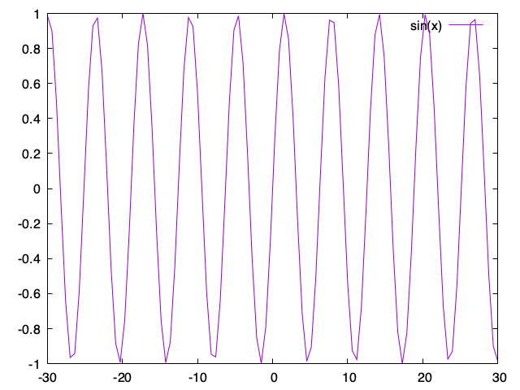

サンプル数を1000などにしてやればなめらかな線になる。

```sh
gnuplot> set samples 1000
gnuplot> rep
```


ただし、点の数が増えるため、PDFなどで出力する場合はファイルサイズも大きくなるので注意。
