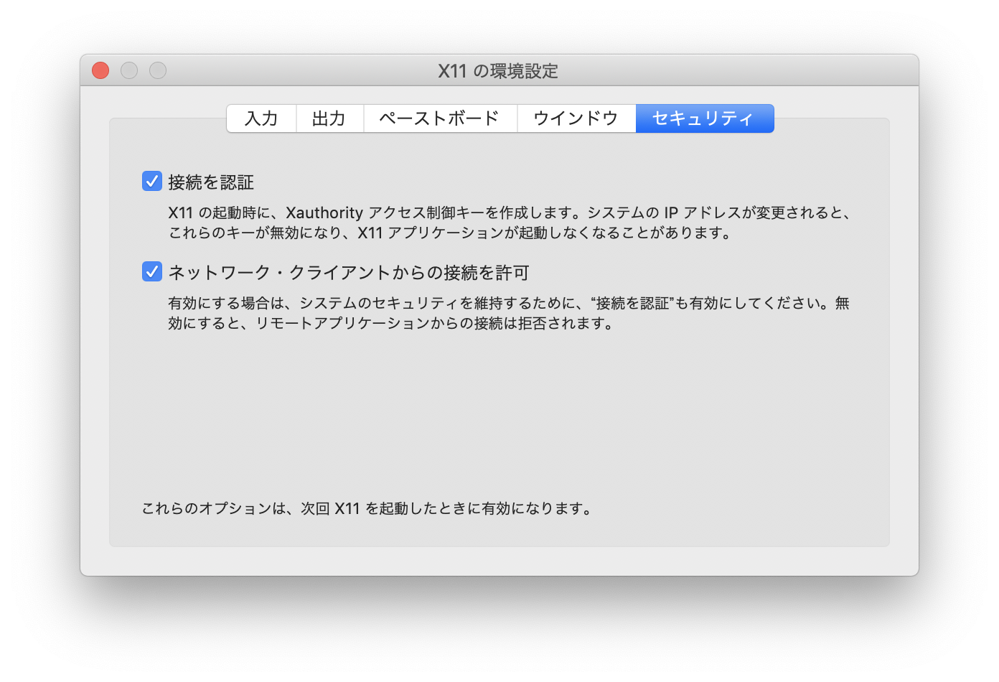
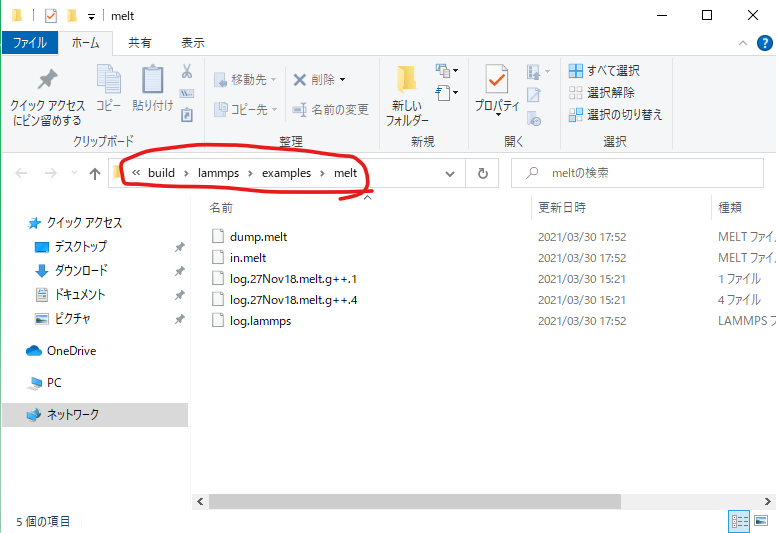

# LammpsとVMDのインストール

Lammps (Large-scale Atomic/Molecular Massively Parallel Simulator)は、サンディア国立研究所の古典分子動力学プログラムだ。性能が良く、比較的容易に使えて、並列化もなされているため、広く使われている。

## Lammpsのインストール

### Windows

WSLで以下を実行する([参考](https://qiita.com/tkmtSo/items/34a0098cb967f2a9fdfe))。

まずは必要なパッケージをインストールしよう。MPI版はとりあえず作らないが、後のために念の為にMPIライブラリも入れておく。

```sh
sudo apt install -y build-essential libopenmpi-dev
```

次に、Lammpsをダウンロード、インストールする。どのディレクトリでも良いが、例えばbuildというディレクトリを作って、そこにクローンする。

```sh
mkdir build
cd build
git clone git://github.com/lammps/lammps.git
```

クローンしたら、その中に入ってビルドしよう。とりあえずはシリアル版(非並列版)を作る。

```sh
cd lammps
cd src
make serial
```

ビルドが成功したら、`lmp_serial`というプログラムができているはずだ。実行してみよう。

```sh
$ echo info | ./lmp_serial  
LAMMPS (30 Oct 2021)

Info-Info-Info-Info-Info-Info-Info-Info-Info-Info-Info
Printed on Tue Mar 30 16:27:23 2021


Info-Info-Info-Info-Info-Info-Info-Info-Info-Info-Info

Total wall time: 0:00:00
```

上記のようなバージョン情報が表示されれば問題なくインストールされている。正しくビルドできていたら、`lmp_serial`をパスの通った場所にコピーしておこう。

```sh
sudo cp lmp_serial /usr/local/bin
```

上記を実行するとパスワードが求められるので入力すること。

### Mac

「ターミナル」で以下を実行しよう。

```sh
brew install lammps
```

インストールが完了したら以下を実行せよ。

```sh
$ echo info | lmp_serial  
LAMMPS (29 Oct 2020)

Info-Info-Info-Info-Info-Info-Info-Info-Info-Info-Info
Printed on Tue Mar 30 16:29:46 2021


Info-Info-Info-Info-Info-Info-Info-Info-Info-Info-Info

Total wall time: 0:00:00
```

上記のようなバージョン情報が表示されれば問題なくインストールされている。

## サンプルコードの実行

インストールが完了したら、サンプルコードを実行してみよう。

### Windows

Windowsの場合は、先程ビルドのためにcloneしたファイルの中にサンプルコードがある。上記の指示に従っていれば

```sh
cd ~/build/lammps/example/melt
```

で目的の場所にいけるはず。異なるディレクトリにクローンした場合は適宜読み替えること。

この状態で、以下を実行しよう。

```sh
lmp_serial < in.melt
```

いろいろ表示されて、最後に

```txt
Total # of neighbors = 151513
Ave neighs/atom = 37.8783
Neighbor list builds = 12
Dangerous builds not checked
Total wall time: 0:00:00
```

といった表示が出れば実行は成功だ。

### Mac

ターミナルで以下を実行せよ。

```sh
cd
mkdir lammps
cd lammps
cp -r /usr/local/Cellar/lammps/2020-10-29/share/lammps/examples/melt .
cd melt
```

この状態で、以下を実行しよう。

```sh
lmp_serial < in.melt 
```

最後に

```txt
Total # of neighbors = 151513
Ave neighs/atom = 37.8783
Neighbor list builds = 12
Dangerous builds not checked
Total wall time: 0:00:00
```

と表示されれば成功である。

## in.meltの修正

次に、`in.melt`を修正しよう。

```sh
code in.melt
```

と入力すれば、VSCodeで直接`in.melt`が開かれるはず。

VSCodeでin.meltを開いたら、以下の行を探す。

```sh
#dump		id all atom 50 dump.melt
```

この行頭の`#`を削除して保存しよう。

```sh
dump		id all atom 50 dump.melt
```

この状態で、またlammpsを実行しよう。

```sh
lmp_serial < in.melt
```

すると、今度は同じフォルダに`dump.melt`が作成されたはずだ。`ls`で確認せよ。これは原子の起動を保存したファイルで、これを後からVMDで読み込んで可視化する。

## VMDのインストール

### Windows

次にVMDをダウンロード、インストールしよう。

[ここ](https://www.ks.uiuc.edu/Research/vmd/)に行って、「Download (all versions)」をクリックする。

次に「Version 1.9.3 (2016-11-30) Platforms:」の、「Windows OpenGL (Microsoft Windows XP/Vista/7/8/10 (32-bit) using OpenGL)」を選ぶ。

すると、「Registration/Login」画面が現れるので、メールアドレスと、適当なパスワードを入力する。初回登録時には「New User Registration」画面となるので、必要事項を入力の上で「Register」を押す。

ライセンスに同意することを示すと、ダウンロードが始まる。ダウンロードが完了したら、インストールする。特に設定項目はない。

### Mac

最新版のMacではVMDが実行できないため、やや手間だがDocker経由で実行する。

#### XQuartzのインストール

まず、XQuartzをインストールしよう。[ここ](https://www.xquartz.org/)から、`XQuartz-2.7.11.dmg`をダウンロード、インストールする。

XQuartzは「アプリケーション」→「ユーティリティ」にインストールされるので起動する。「xterm」というウィンドウが開けばインストールできてる。

その後、XQuartzの「環境設定」の「セキュリティ」タブで、「接続を認証」と「ネットワーク・クライアントからの接続を許可」の両方にチェックを入れる(デフォルトで「接続を認証」にはチェックが入っているはず)。



さらに、ターミナルから

```sh
defaults write org.macosforge.xquartz.X11 enable_iglx -bool true
```

を実行しておく。以上の変更を適用するためにXQuartzを再起動すること。

#### Dockerのインストール

次に、Dockerをインストールする。[ここ](https://www.docker.com/products/docker-desktop)から「Download for Mac」→「Get Docker」でダウンロードできるのでインストールする。

インストール後、Dockerを起動する。最初にDocker IDの入力を求められるウィンドウが出るが、無視して消して良い。右上にクジラのような小さいアイコンが表示されたらDockerが起動している。

Dockerの動作を確認しよう。ターミナルで、

```sh
docker ps
```

を実行し、

```txt
CONTAINER ID        IMAGE               COMMAND             CREATED             STATUS              PORTS               NAMES
```

と表示されたらDockerが起動している。

```txt
Error response from daemon: dial unix docker.raw.sock: connect: connection refused
```

と表示されたらDockerが起動していないので起動すること。

#### Dockerイメージの作成

まず、Dockerイメージ作成用のディレクトリを作成し、そこにDockerfileをダウンロードしよう。

```sh
cd
mkdir docker-vmd
cd docker-vmd
wget https://kaityo256.github.io/lab_startup/lammps/Dockerfile
```

次に、Linux版のVMDをダウンロードする。[ここ](https://www.ks.uiuc.edu/Research/vmd/)に行って、「Download (all versions)」をクリックする。

次に「Version 1.9.4 LATEST ALPHA (2019-10-17) Platforms:」の「LINUX_64 OpenGL, CUDA, OptiX, OSPRay」を選ぶ。すると、「Registration/Login」画面が現れるので、メールアドレスと、適当なパスワードを入力する。初回登録時には「New User Registration」画面となるので、必要事項を入力の上で「Register」を押す。

ライセンスに同意することを示すと、ダウンロードが始まる。ダイアログが出たら「Save File」を選ぶこと。ダウンロードが完了したら、ダウンロードしたファイルを、先程作成したディレクトリ`docker-vmd`にコピーする。例えば、「ダウンロード」フォルダにダウンロードされたなら、

```sh
cp ~/Downloads/vmd*.tar.gz .
```

で現在のディレクトリにコピーされるはずである。

現在、`~/docker-vmd`ディレクトリには、以下のDockerファイルとtar.gzファイルの2つのファイルがあるはず。

```sh
$ ls
Dockerfile  vmd-1.9.4a38.bin.LINUXAMD64-CUDA10-OptiX600-RTX-OSPRay170.opengl.tar.gz
```

この状態でDockerイメージをビルドする。

```sh
docker build -t vmd .
```

最後に

```txt
Successfully tagged vmd:latest
```

と表示されたら正しくビルドされている。

次に、先程の`melt`ディレクトリに移動して、以下のコマンドを実行する。

```sh
cd
cd lammps
cd melt
docker run -e DISPLAY=$(hostname):0 -v ~/.Xauthority:/root/.Xauthority -v $(pwd):/lammps -it vmd
```

ここまで正しく実行されていればVMDが起動したはずである。

```txt
Can't open display: watanabe-mbp.local:0
```

などと言われたらXQuartzが起動していないので起動せよ。

## VMDによる可視化

### Windowsの場合

WSLにおいて、まず`dump.melt`が存在するディレクトリで

```sh
open .
```

と入力し、そのフォルダを開く。まだopenをエイリアス設定していない場合は

```sh
alias open=explorer.exe
```

としておくこと。`.bashrc`に記載しておくことが望ましい。フォルダが開いたら、パスが表示されている場所(以下の赤で囲った部分)に「vmd」と入力すると、このディレクトリをカレントディレクトリとしてVMDが起動する。



VMDが起動したら、「VMD Main」の「File」から「New Molecule」を選び、「Browse」を押して先ほどの`dump.melt`を選ぶ。

file typeとして「LAMMPS Trajectory」を選んでから「Load」を押す。


すると、直線が多数重なったような画面が出たはずだ。この状態で、「VMD Main」の画面で「dump.melt」の行を選び、「Graphics」の「Representation」を選ぶ。

ここで、「Drawing Method」を「VDW」にすると、画面が玉に変わるはず。その状態で「Sphere Scale」を小さくしよう。0.3くらいがちょうどよいと思う。


この状態で、VMD Mainの右下にある再生ボタン「Play Forward」を押せば、原子が凍った状態から解けていくアニメーション(6フレームしかないが)が表示されるはずである。マウスでドラッグすると角度を変えられるので試してみよ。

### Macの場合

VMDが起動したら、「VMD Main」の「File」から「New Molecule」を選び、「Browse」を押して先ほどの`dump.melt`を選ぶ。`/lammps`の中にあるはず。

file typeとして「LAMMPS Trajectory」を選んでから「Load」を押す。


すると、直線が多数重なったような画面が出たはずだ。この状態で、「VMD Main」の画面で「dump.melt」の行を選び、「Graphics」の「Representation」を選ぶ。

ここで、「Drawing Method」を「VDW」にすると、画面が玉に変わるはず。その状態で「Sphere Scale」を小さくしよう。0.3くらいがちょうどよいと思う。


この状態で、VMD Mainの右下にある再生ボタン「Play Forward」を押せば、原子が凍った状態から解けていくアニメーション(6フレームしかないが)が表示されるはずである。マウスでドラッグすると角度を変えられるので試してみよ。
