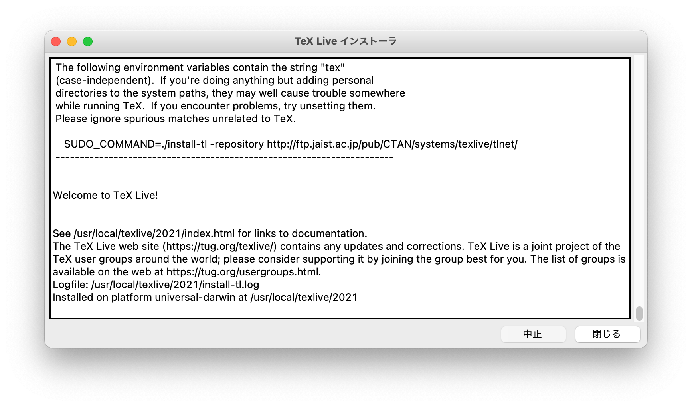

# LaTeXのインストール

PCにLaTeX(ラテック・レイテック)の処理系をインストールし、実行できるようにする。かんたんな使い方を覚え、卒業論文用のリポジトリを作成し、指導教員をコラボレータとして招待する。

## インストール

### Windowsの場合

[Installing TeX Live over the Internet](https://www.tug.org/texlive/acquire-netinstall.html)から、 install-tl-windows.exeをダウンロードし、実行する。セキュリティの問題から、単にクリックしただけでは保存が実行されない場合がある。その場合は右クリックから「名前をつけて保存」を選び、ブラウザが文句を言った場合は「継続」を押すなどしてダウンロードすることができる(Chromeの場合）。また、実行時にWindowsが「WindowsによってPCが保護されました」などと言って実行させてくれない場合がある。この時には「詳細情報」をクリックして「実行」を押せば実行できる。

最初に「Install」「Unpack」のどちらかが選べるが、デフォルトの「Install」のままNextを押す。そして「Install」をクリックする。しばらくすると「TeX Live 2020インストーラ」というダイアログが出てくるので、何も変更しないまま「インストール」をクリック。フルインストールに **1〜2時間ほど** かかるので、時間に余裕がある時に行うこと。

以下のような画面になったら「閉じる」を押して終了して良い。


### Macの場合

[ミラーサイト](https://texwiki.texjp.org/?TeX%20Live#tlnet)から`install-tl-unx.tar.gz`をダウンロードする。どこでも良いが、例えばJ[JAISTのサイト](http://ftp.jaist.ac.jp/pub/CTAN/systems/texlive/tlnet/)からダウンロードすると良いだろう。

ターミナルを開き、以下を実行せよ(コピペで良い)。以下では「ダウンロード」にダウンロードしたと仮定しているが、もしデスクトップに落としたなら`mv ~/Desktop/install-tl-unx.tar.gz .`に変更せよ。

```sh
mkdir temp
cd temp
mv ~/Downloads/install-tl-unx.tar.gz .
tar xvf install-tl-unx.tar.gz
cd install-tl-20201108
sudo ./install-tl -repository http://ftp.jaist.ac.jp/pub/CTAN/systems/texlive/tlnet/
```

すると、以下のような画面が表示されるので、「高度な設定」を選ぶ。


以下の画面で「シンボリックリンクを標準ディレクトリに作成」にチェックを入れてから「インストール」をクリックする。


フルインストールに **30分ほど** かかるので、時間に余裕がある時に行うこと。

以下の画面が出てきたら「閉じる」をクリックして終了して良い(PATHに追加せよなどと書いてあるが、今回はシンボリックリンクを指定しているため設定不要)。



### インストールの確認

無事にLaTeXがインストールされたか確認するためにターミナルで以下を実行してみよ。

```sh
latex -v
platex -v
```

```txt
pdfTeX 3.14159265-2.6-1.40.21 (TeX Live 2020)
...
```

とか

```txt
e-pTeX 3.14159265-p3.8.3-191112-2.6 (utf8.euc) (TeX Live 2020)
...
```

などと表示されれば成功している。なお、Windowsの場合は「TeX Live 2020」が「Tex Live 2020/W32TeX」になっている。

### コンパイルの確認

適当なディレクトリ(例えば`~/temp`)を作り、そこに移動せよ。

```sh
cd
mkdir temp
cd temp
```

そこで、以下の内容の`test.tex`を作成せよ。PowerShellもしくはターミナルで`code test.tex`と入力すればVS Codeが開くので、そこで以下をコピペ、保存する。

```tex
\documentclass{article}
\begin{document}

Hello \LaTeX.

\[
E = mc^2
\]

\end{document}
```

この状態で、コンパイルする。

```sh
latex test.tex
```

すると、同じディレクトリに`test.dvi`というファイルができたはずである。このDVIファイルをPDFに変換する。

```sh
dvipdfmx test.dvi
```

`dvipdfm`というコマンドもあるので注意。最後がxで終わる方を使うこと。これにより同じディレクトリに`test.pdf`が作成されたはずなので開く。以下のような内容になっていれば成功である。


次に、日本語のLaTeXファイルのコンパイルを確認する。

以下の内容の`testj.tex`を作成せよ。

```tex4
\documentclass{jarticle}
\begin{document}

こんにちは \LaTeX.

\[
E = mc^2
\]

\end{document}
```

`documentclass`の中身が`article`から`jarticle`になっていることに注意。これをコンパイルし、PDFに変換する。

```sh
platex testj.tex
dvipdfmx testj.dvi
```

コンパイルコマンドが`latex`ではなく`platex`になっていることに注意。正しく処理されていれば以下のようなPDFファイルが作成されたはずである。


### latexmkのセットアップ

さて、LaTeXは、リファレンスの解決、目次の作成などで何度かコンパイルする必要がある。また、PDFにするのにいちいち`dvipdfmx`を呼び出すのも面倒だ。そこで`latexmk`というツールを使ってコンパイルとPDF作成を自動化する。そのための設定ファイルを作ろう。

ホームディレクトリに、以下の内容の`.latexmkrc`ファイルを作成する。端末を開き、ホームディレクトリで

```sh
code .latexmkrc
```

を実行してVS Codeを開いて、以下をコピペして保存せよ。

```perl
#!/usr/bin/env perl

$latex = 'platex -synctex=1 %O %S';
$bibtex = 'pbibtex %O %B';
$makeindex = 'memindex %O -o %D %S';
$pdf_mode = 3;
$dvipdf = 'dvipdfmx %O -o %D %S';
```

この状態で、先程作った　`testj.tex`のあるディレクトリに移動し、`testj.dvi`と`testj.pdf`を削除してから`latexmk`を実行してみよう。

```sh
rm -f testj.dvi testj.pdf
latexmk testj
```

一気にPDFまで作成されるはずだ。

## VS Codeの設定

次にVS CodeからTeXをコンパイル、プレビューできるようにしよう。まず、拡張機能「LaTeX Workshop」をインストールせよ。拡張機能のメニューを開き、「latex」で検索するとLaTeX Workshopが表示されるはずなので、「インストール」をクリックする。

「Code」メニューの「基本設定」→「設定」から設定メニューを開く。そこで「latex.tools」と検索すると「Latex-workshop › Latex: Tools」が見つかるので、その下にある「setting.jsonで編集」をクリック。


すると、以下のような設定が見つかる。

```json
    "latex-workshop.latex.tools": [
        {
            "name": "latexmk",
            "command": "latexmk",
            "args": [
                "-synctex=1",
                "-interaction=nonstopmode",
                "-file-line-error",
                "-pdf",
                "-outdir=%OUTDIR%",
                "%DOC%"
            ],
            "env": {}
        },
```

このうち、"args"の項目を全て削除して保存する。

```json
    "latex-workshop.latex.tools": [
        {
            "name": "latexmk",
            "command": "latexmk",
            "env": {}
        },
```

この状態で、この状態で、先程作った`testj.tex`をVS Codeで開こう。TeXファイルを開いた状態で「保存」をするとビルドが走る。なお、Macでは保存時に「Formatting failed. Please refer to LaTeX Workshop Output for details.」というエラーが出ることがある。その場合はターミナルで

```sh
cpan install Log::Log4perl YAML/Tiny.pm File/HomeDir.pm
```

を実行すると直る場合がある。

無事にビルドが走ったら、PDFをプレビューをしよう。コマンドパレットから「LaTeX Workshop: View LaTeX PDF file」を選ぶか、WindowsならCtrl+Alt+V，MacならCmd+alt+Vで、右側にPDFが表示される。

以後、TeXソースファイルを修正し、保存するたびにプレビューが更新される。

もし保存時にビルドが走らなければ、「設定」で「autobuild.run」で検索して出てくる「Latex-workshop › Latex › Auto Build: Run」のドロップダウンリストを「never」から「onFileChange」に変更せよ。

