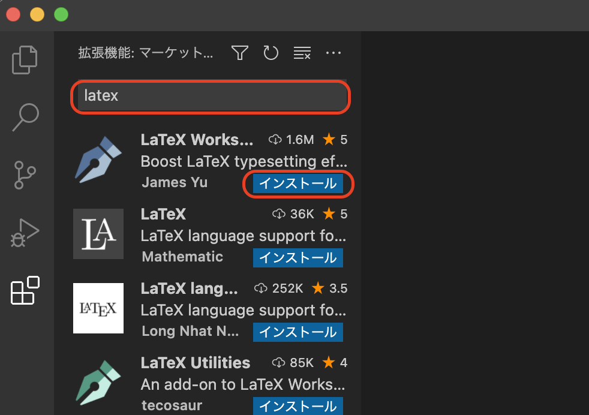
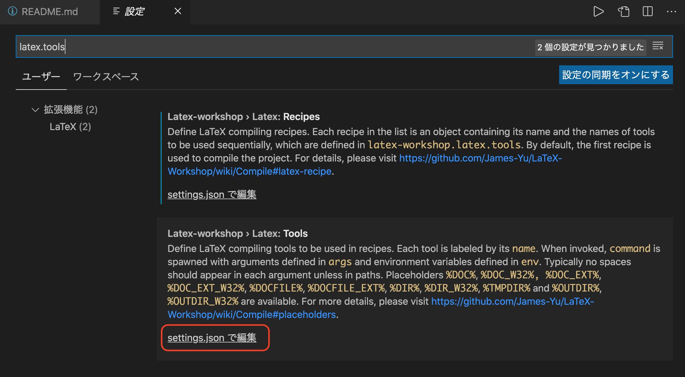
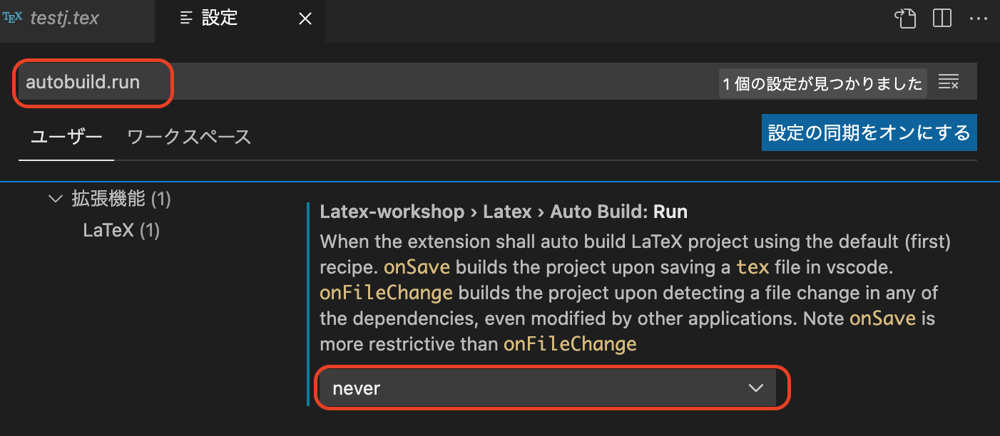
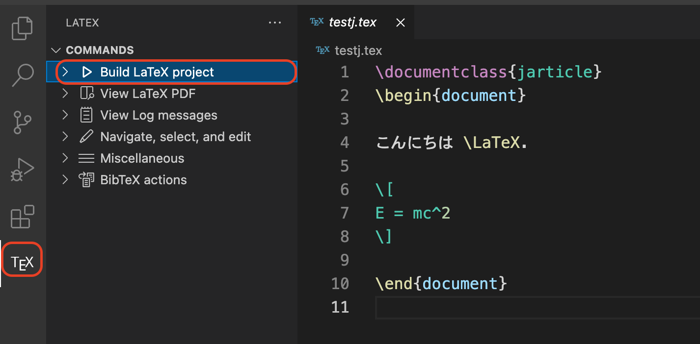
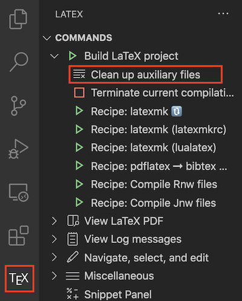
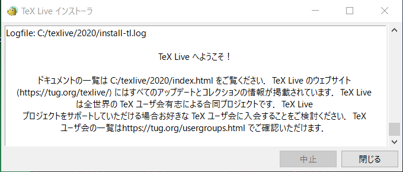

# LaTeXのインストール

PCにLaTeX(ラテック・レイテック)の処理系をインストールし、実行できるようにする。

## インストールとVS Codeの設定

### Windowsの場合

WSL2のUbuntu上で実行することを前提とする。ターミナルで以下を実行する。

```sh
sudo hwclock -s
sudo apt update
sudo apt upgrade
sudo apt install -y texlive-full latexmk
```

最初に実行する`sudo hwclock -s`は、WSL2の時計を直す処理だ。WSL2はよく時計がずれるのでたまに実行すると良い。その後のインストールにはかなり時間がかかる(30分〜1時間?)ので、時間に余裕があるときに実行すること。インストール完了後、`latex -v`と`platex -v`を実行し、それぞれ以下のような表示がされれば正しくインストールされている。

```sh
$ latex -v
pdfTex 3.14159265-2.6-1.40.20 (Tex Live 2019/Debian)
(snip)

$ platex -v
e-pTeX 3.14159265-p3.8.2-190908-2.6 (utf8.euc) (TeX Live 2019/Debian)
(snip)
```

また、修士論文執筆時に使うので、pdftkも入れておこう。

```sh
sudo apt install -y pdftk-java
```

以下を実行し、バージョンが表示されれば正しくインストールされている。

```sh
$ pdftk --version
pdftk port to java 3.0.9 a Handy Tool for Manipulating PDF Documents
Copyright (c) 2017-2018 Marc Vinyals - https://gitlab.com/pdftk-java/pdftk
Copyright (c) 2003-2013 Steward and Lee, LLC.
pdftk includes a modified version of the iText library.
Copyright (c) 1999-2009 Bruno Lowagie, Paulo Soares, et al.
This is free software; see the source code for copying conditions. There is
NO warranty, not even for MERCHANTABILITY or FITNESS FOR A PARTICULAR PURPOSE.
```

### Macの場合

ターミナルを開き、以下を実行せよ。実行ディレクトリを趣味で`~/build`としているが、どこでも良い。

```sh
cd
mkdir build
cd build
curl -O http://ftp.jaist.ac.jp/pub/CTAN/systems/texlive/tlnet/install-tl-unx.tar.gz
tar xvzf install-tl-unx.tar.gz
cd install-tl-20*  
sudo ./install-tl -no-gui  -repository https://ftp.jaist.ac.jp/pub/CTAN/systems/texlive/tlnet/

```

すると、以下のような画面で入力待ちとなる。

```txt
 <O> options:
   [ ] use letter size instead of A4 by default
   [X] allow execution of restricted list of programs via \write18
   [X] create all format files
   [X] install macro/font doc tree
   [X] install macro/font source tree
   [ ] create symlinks to standard directories

 <V> set up for portable installation

Actions:
 <I> start installation to hard disk
 <P> save installation profile to 'texlive.profile' and exit
 <Q> quit

Enter command: 
```

ここでは`O`(大文字のオー)を入力してエンターを押す。するとオプションのカスタマイズ画面になる。

```txt
===============================================================================
Options customization:

 <P> use letter size instead of A4 by default: [ ]
 <E> execution of restricted list of programs: [X]
 <F> create all format files:                  [X]
 <D> install font/macro doc tree:              [X]
 <S> install font/macro source tree:           [X]
 <L> create symlinks in standard directories:  [ ]
            binaries to: 
            manpages to: 
                info to: 

Actions: (disk space required: 7416 MB)
 <R> return to main menu
 <Q> quit

Enter command: 
```

ここで、`L`を入力すると、シンボリックリンクを作成する場所を聞かれるので、全てデフォルトのままエンターを押す。

```txt
New value for binary directory [/usr/local/bin]:  #エンターを入力
New value for man directory    [/usr/local/man]:  #エンターを入力
New value for info directory   [/usr/local/info]: #エンターを入力
```

すると、オプションのカスタマイズ画面に戻るので、ここで`R`を入力してメイン画面に戻る。

```txt
 <O> options:
   [ ] use letter size instead of A4 by default
   [X] allow execution of restricted list of programs via \write18
   [X] create all format files
   [X] install macro/font doc tree
   [X] install macro/font source tree
   [X] create symlinks to standard directories

 <V> set up for portable installation

Actions:
 <I> start installation to hard disk
 <P> save installation profile to 'texlive.profile' and exit
 <Q> quit

Enter command: 
```

こんな画面になり、「create symlinks to standard directories」にチェックが入っていることを確認して、`I`を入力してインストールを開始する。

フルインストールに **30分ほど** かかるので、時間に余裕がある時に行うこと。

インストール完了後、`latex -v`と`platex -v`を実行し、それぞれ以下のような表示がされれば正しくインストールされている。

```sh
$ latex -v
pdfTeX 3.141592653-2.6-1.40.23 (TeX Live 2022/dev)
(snip)

$ platex -v
e-pTeX 3.141592653-p3.9.0-210218-2.6 (utf8.euc) (TeX Live 2021)
(snip)
```

また、修士論文執筆時に使うので、pdftkも入れておこう。

```sh
brew install pdftk-java
```

以下のコマンドを実行し、バージョンが表示されれば正しくインストールされている。

```sh
$ pdftk --version
pdftk port to java 3.3.3 a Handy Tool for Manipulating PDF Documents
Copyright (c) 2017-2018 Marc Vinyals - https://gitlab.com/pdftk-java/pdftk
Copyright (c) 2003-2013 Steward and Lee, LLC.
pdftk includes a modified version of the iText library.
Copyright (c) 1999-2009 Bruno Lowagie, Paulo Soares, et al.
This is free software; see the source code for copying conditions. There is
NO warranty, not even for MERCHANTABILITY or FITNESS FOR A PARTICULAR PURPOSE.
```

### コンパイルの確認

適当なディレクトリ(例えば`~/temp`)を作り、そこに移動せよ。

```sh
cd
mkdir temp
cd temp
```

そこで、以下の内容の`test.tex`を作成せよ。ターミナルで`code test.tex`と入力すればVS Codeが開くので、そこで以下をコピペ、保存する。

```tex
\documentclass{article}
\begin{document}

Hello \LaTeX.

\[
E = mc^2
\]

\end{document}
```

この状態で、コンパイルする。

```sh
pdflatex test.tex
```

すると、同じディレクトリに`test.pdf`というファイルができたはずなので開く。以下のような内容になっていれば成功である。


次に、日本語のLaTeXファイルのコンパイルを確認する。

以下の内容の`testj.tex`を作成せよ。

```tex
\documentclass{jarticle}
\begin{document}

こんにちは \LaTeX.

\[
E = mc^2
\]

\end{document}
```

`documentclass`の中身が`article`から`jarticle`になっていることに注意。これをコンパイルし、PDFに変換する。英語だけの文書の場合は`pdflatex`一発でできたが、日本語は諸事情によりいろいろ面倒くさい。まず、`platex`によりDVIファイルを作る。

```sh
platex testj.tex
```

これにより`testj.dvi`が作成されたはずなので、これをPDFに変換する。

```sh
dvipdfmx testj.dvi
```

正しく処理されていれば以下のようなPDFファイルが作成されたはずである。


### latexmkのセットアップ

さて、LaTeXは、リファレンスの解決、目次の作成などで何度かコンパイルする必要がある。また、PDFにするのにいちいち`dvipdfmx`を呼び出すのも面倒だ。そこで`latexmk`というツールを使ってコンパイルとPDF作成を自動化する。そのための設定ファイルを作ろう。

ホームディレクトリに、以下の内容の`.latexmkrc`ファイルを作成する。端末を開き、ホームディレクトリで

```sh
code .latexmkrc
```

を実行してVS Codeを開いて、以下をコピペして保存せよ。

```perl
#!/usr/bin/env perl

$latex = 'platex -synctex=1 %O %S';
$bibtex = 'pbibtex %O %B';
$makeindex = 'memindex %O -o %D %S';
$pdf_mode = 3;
$dvipdf = 'dvipdfmx %O -o %D %S';
```

この状態で、先程作った　`testj.tex`のあるディレクトリに移動し、`testj.dvi`と`testj.pdf`を削除してから`latexmk`を実行してみよう。

```sh
rm -f testj.dvi testj.pdf
latexmk testj
```

一気にPDFまで作成されるはずだ。

### VS Codeの設定

次にVS CodeからTeXをコンパイル、プレビューできるようにしよう。まず、拡張機能「LaTeX Workshop」をインストールせよ。拡張機能のメニューを開き、「latex」で検索するとLaTeX Workshopが表示されるはずなので、「インストール」をクリックする。




「Code」メニューの「基本設定」→「設定」から設定メニューを開く。そこで「latex.tools」と検索すると「Latex-workshop › Latex: Tools」が見つかる(見つからない場合はVSCodeを再起動せよ)ので、その下にある「setting.jsonで編集」をクリック。



すると、以下のような設定が見つかる。

```json
    "latex-workshop.latex.tools": [
        {
            "name": "latexmk",
            "command": "latexmk",
            "args": [
                "-synctex=1",
                "-interaction=nonstopmode",
                "-file-line-error",
                "-pdf",
                "-outdir=%OUTDIR%",
                "%DOC%"
            ],
            "env": {}
        },
```

このうち、"args"の項目を'-pdf'と'-interaction=nonstopmod'だけ残して削除する。

```json
    "latex-workshop.latex.tools": [
        {
            "name": "latexmk",
            "command": "latexmk",
            "args": [
                "-interaction=nonstopmode",
                "-pdf"
            ],
            "env": {}
        },
```

もし、`latex-workshop.latex.tools`の設定が見つからなかった場合は、以下を追加する。

```json
    "latex-workshop.latex.tools": [
        {
            "name": "latexmk",
            "command": "latexmk",
            "args": [
                "-interaction=nonstopmode",
                "-pdf"
            ],
            "env": {}
        },
```

JSONはカンマ区切りなので、他に項目がある場合はカンマを入れるのを忘れないこと。例えば、フォントサイズなどを指定していたら、`settings.json`は以下のようになる。

```json
{
    "security.workspace.trust.enabled": false,
    "editor.fontSize": 16,
    "latex-workshop.latex.tools": [
        {
            "name": "latexmk",
            "command": "latexmk",
            "env": {}
        }
    ]
}
```

この状態で、この状態で、先程作った`testj.tex`をVS Codeで開こう。TeXファイルを開いた状態で「保存」をするとビルドが走る。なお、Macでは保存時に「Formatting failed. Please refer to LaTeX Workshop Output for details.」というエラーが出ることがある。その場合はターミナルで

```sh
cpan install Log::Log4perl YAML/Tiny.pm File/HomeDir.pm
```

を実行すると直る場合がある。

無事にビルドが走ったら、PDFをプレビューをしよう。コマンドパレットから「LaTeX Workshop: View LaTeX PDF file」を選ぶか、WindowsならCtrl+Alt+V，MacならCmd+alt+Vで、右側にPDFが表示される。

以後、TeXソースファイルを修正し、保存するたびにプレビューが更新される。ただし、保存のたびにビルドが走る設定では、エラーが出た時に面倒なので、自動ビルドは外すことを推奨する。自動ビルドを外すには、「設定」で`autobuild.run`で検索して出てくる「Latex-workshop › Latex › Auto Build: Run」のドロップダウンリストを`onFileChange`から`never`に変更せよ。



以後、ビルドしたいタイミングで、ターミナルから`latexmk`を実行するか、VSCodeのLaTeX Workshop拡張機能の「Build LaTeX project」を実行すると良い。



## LaTeXの基本

適当なディレクトリ(例えば`~/temp/textest`)を作り、そこに移動して、ディレクトリをVS Codeで開く。

```sh
cd
mkdir -p temp
cd temp
mkdir textest
cd textest
code .
```

その状態でファイルを新規作成し、以下の内容を記述、`test.tex`という名前で保存して、コンパイルとプレビューができることを確認せよ。

```tex
\documentclass{jarticle}
\begin{document}
こんにちは。
\end{document}
```

以下、プレビュー画面を右に表示したままこの文章を修正していく。

LaTeXのコマンドは、大きく分けて二つにわかれる。一つは「\コマンド名{}」の形をとるものだ。Pythonで言えば関数のようなものであり、{}の中に引数を取る。

もう一つは`\begin{hoge}`と`\end{hoge}`で囲まれる領域を作るもので、「環境」と呼ばれる。例えば`\begin{document}`から`\end{document}`はdocument環境を作り、その中に本文を記述する。

なお、`\documentclass{jarticle}`と`\begin{document}`の間を「プリアンブル」と呼び、必要なパッケージの宣言をする(Pythonのimportにあたる)。

### 文章と修飾

LaTeXの文章はそのままかけば良い。ただし、一度の改行は同じパラグラフとみなされる。

```tex
こんにちは。
さようなら。
```

これをコンパイルすると、「こんにちは。さようなら。」と続けて表示される。別のパラグラフにしたい場合は、

```tex
こんにちは。

さようなら。
```

と二回の改行をいれる。なお、二回以上改行をいれても無視される。

強調のために太字にしたい場合は、その部分を`\textbf{}`で囲む。

```tex
こんにちは。

さようなら。次の部分を\textbf{強調}します。
```

### 数式と参照

LaTeXでは数式は`$`で囲まれたインライン数式と、`\[`と`\]`で囲まれた別行立ての数式がある。

```tex
文中の数式は$E=mc^2$のように書く。

別行立ての数式は
\[
 E = mc^2   
\]
と書く。
```

別行立ての数式は`equation`環境を使うと式番号がつく。

```tex
\begin{equation}
E=mc^2
\end{equation}
```

式番号を文中で参照するためには、式に`\label{ラベル名}`でラベルをつけ、文中で`\ref{ラベル名}`で参照する。ラベル名は自由に付けて良いが、慣習的に式の場合は`eq:ラベル`、図の場合は`fig:ラベル名`、テーブルの場合は`tbl:ラベル名`などと、名前空間を使うことが多い。今回は`eq:test`という名前のラベルをつけてみよう。

```tex
\begin{equation}
E=mc^2 \label{eq:test}
\end{equation}
```

この状態で、この式の後に以下の文章を挿入し、コンパイルせよ。

```tex
数式(\ref{eq:test})を参照のこと。
```

`\ref{ラベル名}`は、対応する数式の数字に変換されるため、括弧にいれたければ上記のように`(\ref{ラベル名})`とする必要があることに注意。

このように、LaTeXにはどの式をどこで参照するかを解決する仕組みが備わっている。ラベルを書くのが面倒だからといって「式(1)のように」などと式番号を直接書かないこと。絶対に後でごちゃごちゃになって後悔することになる。`\[ \]`によるラベル無し数式と、`equation`環境によるラベルあり数式の使い分けだが、とりあえずラベル無しで書いておいて、後で参照が必要になったら`equation`環境に書き直すのが良いだろう。

### 図の挿入

LaTeXでは図を挿入することができる。LaTeXでは様々なフォーマットの図を扱えるが、原則としてPDFで貼り付けるのが良いだろう。

適当なPythonコードを書いてPDFを作成しよう。TeXファイルと同じディレクトリに`test.py`を作成し、以下を入力せよ。

```py
import numpy as np
import matplotlib
matplotlib.use('Agg')
import matplotlib.pyplot as plt


x = np.arange(0, 2*np.pi, 2*np.pi*0.01)
y = np.sin(x)

plt.plot(x,y)
plt.savefig("sin.pdf")
```

これを

```sh
python test.py
```

として実行すると`sin.pdf`ができる。これをLaTeXに取り込むには、まずプリアンブルで`graphicx`パッケージを取り込む。

```tex
\documentclass{jarticle}
\usepackage[dvipdfmx]{graphicx}
\begin{document}
```

`graphics`ではなく`graphicx`(最後がx)であることに注意。この状態で、

```tex
\includegraphics{sin.pdf}
```

と入力し、ビルドしてみよ。おそらく警告が一つ出たはずだ。左下にある(i)マークをクリックすると

```txt
Overfull \hbox (145.3509pt too wide)
```

という表示が出ている。これは「表示領域から何かがはみ出ているよ」という警告で、LaTeXを使っていると良く見かけるものだ。今回のケースでは図が大きすぎるために表示領域からはみ出してしまっているので、小さくしよう。サイズを指定するためには、`\includegraphics`にオプションとして`width`を指定する。

```tex
\includegraphics[width=10cm]{sin.pdf}
```

これで警告は消えるはずだ。

さて、科学技術論文において、図を生で入れることはほとんどない。多くの場合「図番号」と「図の説明」を入れることだろう。そのためには`figure`環境を使う。先ほどの`includegraphics`命令を`figure`環境の中にいれよう。

```tex
\begin{figure}
\includegraphics[width=10cm]{sin.pdf}
\end{figure}
```

この状態でビルドすると、図が文中から別の場所(おそらく上部)に移動したはずだ。さて、この図に説明をつけよう。そのためには`figure`環境に`caption`命令を入れる。

```tex
\begin{figure}
\includegraphics[width=10cm]{sin.pdf}
\caption{正弦波のグラフ。}
\end{figure}
```

ビルドすると、図の説明(キャプション)とともに、図番号が自動で入ったはずだ。この図もラベルをつけて参照することができる。

```tex
\begin{figure}
\includegraphics[width=10cm]{sin.pdf}
\caption{正弦波のグラフ。}
\label{fig:sin}
\end{figure}

正弦波のグラフを図\ref{fig:sin}に示す。
```

上記をビルドして、「正弦波のグラフを図1に示す。」となれば成功だ。

繰り返しになるが、式番号や図番号については **必ず** ラベルによる参照を行うこと。数が少ないからといって直接書いていると後で泣きを見る。どうせVS Codeその他のLaTeXに対応したエディタには補完機能があるため、さほど手間ではない。

なお、`\includegraphics`だけの場合は、その位置に図が挿入されるが、`figure`環境を使うと図の挿入場所は自動で決められる。基本的にはLaTeXに任せておけば良いが、どうしても「ページの上が良い」「下が良い」「絶対ここが良い」といった希望がある場合は、オプションで希望をLaTeXに伝えることができる。例えば

```tex
\begin{figure}[htbp]
```

とすると、順番に「この場所(here, h)」「上(top, t)」「下(bottom, b)」「独立したページ (page, p)」を意味しており、記述した順番で挿入を試みる。試しに上記のオプション`[htbp]`をつけてビルドしなおしてみよ。おそらく`h`が優先され、`\includegraphics`の場所に図が移動すると思われる。

また、デフォルトでは、図はページの左側に寄せられてしまうため、図が小さいと見栄えが悪い。その場合は`\includegraphics`の直前に`\centering`を入れると良い。

```tex
\begin{figure}[htbp]
    \centering
    \includegraphics[width=10cm]{sin.pdf}
    \caption{正弦波のグラフ。}
    \label{fig:sin}
\end{figure}
```

図が中央寄せになったはずである。

### 参考文献の入れ方

科学技術論文では、何より「引用」が重要である。その研究分野においてどこまで何がわかっていて、これから使う手法は誰が開発、提案したもので、得られた結果は先行研究と比較してどうだったのかを、全て文献を引用しながら明らかにしなければならない。そのために論文の最後には「参考文献」として論文や書籍を並べ、本文中では番号を使って引用する。この際、本文中に出てこない論文を「参考文献」に入れてはならず、さらに「出現順」「年号順」「アルファベット順」など、適切な順序で並べる必要がある。これを手でやっていては必ず破綻するが、当然のことながらLaTeXに任せれば自動でやってくれる。

LaTeXで参考文献を入れるには、手で入れる方法とbibtexにより半自動で入れる方法がある。原則として論文はbibtexを使うことを推奨するが、まずは手で入れる方法を紹介する。

#### 手で入れる方法

まず、以下のような文献リストを文中の最後(`\end{document}`)に入れる。

```tex
\begin{thebibliography}{99}
\bibitem{okumura2020} 奥村 晴彦、黒木 裕介、LaTeX2ε美文書作成入門、技術評論社、2020.
\end{thebibliography}
```

ここで`{99}`とあるのは、文献番号が何桁になるかをLaTeXに教えるためのもので、この場合は「二桁ですよ」と教えている。十件以内の場合は`{9}`、百件以上引用する場合は`{999}`などと指定するが、通常は`{99}`で良いだろう。

この状態でビルドすると、「参考文献」という欄が作成されたはずだ。

文献を文中で引用するには、`\cite{ラベル}`コマンドを使う。文献のラベルは`\bibitem{ラベル} 内容`という形式で指定できる。`\ref{ラベル}`と異なり、慣習的にこちらは名前空間を使わないようだ(もちろん使っても良い)。個人的には「筆頭著者名+出版年」を使っているが、個人で分かりやすければどのような名前をつけても自由だ。この場合は`okumura2020`が文献ラベルである。早速、引用してみよう。`thebibliography`環境の直前あたりに以下を記述せよ。

```tex
本稿の執筆にはLaTeX\cite{okumura2020}を用いる。
```

これでコンパイルすると

```txt
本稿の執筆にはLaTeX[1]を用いる。
```

となるはずだ。

#### bibtexを使う方法

先ほど、本文中に言及がないにも関わらず、文献リストに「LaTeX2ε美文書作成入門」が表示されていた。原則として文中で言及していない文献は文献リストに掲載してはならない。しかし、引用文献を追加したり削除したりしているうちに、どれに言及してどれに言及していないかの管理が面倒になるだろう。そこで、bibtexというファイルを使って文献リストを管理する。

まずは文献ファイルを作ろう。TeXファイルと同じディレクトリに`reference.bib`というファイルを作成し、以下の内容を記述せよ。

```tex
@book{okumura2020,
  author    = {奥村 晴彦 and 黒木 裕介},
  title     = {LaTeX2ε美文書作成入門},
  publisher = {技術評論社},
  year      = {2020}
}
```

ここで`@book`とあるのはbibtexエントリと呼ばれ、種類ごとに必須となる項目が異なる。`book`の場合は著者(author)、タイトル(title)、出版社(publisher)、出版年(year)が必須項目だ。`@book`の直後に文献ラベルをつける。著者名は`and`で区切ること。

このBibTeXファイルを利用するには、先ほどの`thebibliography`の代わりに以下を指定する。手で書いた文献リストはコメントアウトしておこう。LaTeXは`%`から行末まではコメントと解釈されて無視される。

```tex
%\begin{thebibliography}{99}
%    \bibitem{okumura2020} 奥村 晴彦、黒木 裕介、LaTeX2ε美文書作成入門、技術評論社、2020.
%\end{thebibliography}

\bibliographystyle{junsrt}
\bibliography{reference}
```

`\bibliographystyle{junsrt}`は文献リストのスタイルをあらわす。`junsrt`は出現順にソートせよ、という意味だ。`\bibliography{reference}`はBibTeXファイルを指定する。拡張子を省くことに注意せよ。

この状態でビルドすると、参考文献が更新されるはずだ。

さて、BibTeXファイルを手で書くのは手間だ。多くの場合、出版社はbibtexエントリをエクスポートする機能を持っている。試してみよう。

適当な論文、例えば[J. Chem. Phys. 141, 234703 (2014)](https://aip.scitation.org/doi/10.1063/1.4903811)のページに行ってみよう。これはアメリカ物理学協会(AIP)のJ. Chem. Phys.というジャーナルに掲載された論文だ。このページの上部に「TOOLS」というタブがあるのでクリックすると「Download Citation」という項目があるので選ぶ。「Include」では「Citation for this article (この記事だけ)」、「Format」では「BibTex」を選んで「DOWNLOAD ARTICLE CITATION DATA」をクリックすると、以下のようなbibtexエントリがダウンロードできる。

```tex
@article{doi:10.1063/1.4903811,
author = {Watanabe,Hiroshi  and Suzuki,Masaru  and Inaoka,Hajime  and Ito,Nobuyasu },
title = {Ostwald ripening in multiple-bubble nuclei},
journal = {The Journal of Chemical Physics},
volume = {141},
number = {23},
pages = {234703},
year = {2014},
doi = {10.1063/1.4903811},

URL = { 
        https://doi.org/10.1063/1.4903811
    
},
eprint = { 
        https://doi.org/10.1063/1.4903811
    
}

}
```

これを先ほどの`reference.bib`ファイルに追加し、`test.tex`に以下のような文章を追加しよう。

```tex
渡辺らは気泡生成のシミュレーションを行った\cite{doi:10.1063/1.4903811}。
```

再度ビルドすると、

```tex
渡辺らは気泡生成のシミュレーションを行った[2].
```

などと表示されたはずだ。

せっかくなので別の出版社も試してみよう。今度は日本物理学会の論文、[J. Phys. Soc. Jpn. 88, 024004 (2019)](https://journals.jps.jp/doi/10.7566/JPSJ.88.024004)のサイトに行ってみる。右の欄に「Download Citation」とあるのでそこをクリックすると、Citation Managerのページに飛ぶので、Formatとして「BibTex」を選んで「Download citation data」をクリックする。すると以下のようなデータがダウンロードできる。

```tex
@article{doi:10.7566/JPSJ.88.024004,
author = {Watanabe ,Hiroshi and Morita ,Satoshi and Todo ,Synge and Kawashima ,Naoki},
title = {Fast Algorithm for Generating Random Bit Strings and Multispin Coding for Directed Percolation},
journal = {Journal of the Physical Society of Japan},
volume = {88},
number = {2},
pages = {024004},
year = {2019},
doi = {10.7566/JPSJ.88.024004},

URL = { 
        https://doi.org/10.7566/JPSJ.88.024004
    
},
eprint = { 
        https://doi.org/10.7566/JPSJ.88.024004
    
}

}
```

いま、文献ラベルとしてDOIである`doi:10.7566/JPSJ.88.024004`が指定されているが、これでは分かりづらいので、`watanabe2019`に変更しよう。

```tex
@article{watanabe2019,
```

この状態で`reference.bib`に追加し、texファイルに

```tex
渡辺らはランダムビット生成を行った\cite{watanabe2019}。
```

という文章を追加してコンパイルする。

```txt
渡辺らはランダムビット生成を行った[2]。
```

と、文献番号が解決されたはずだ。番号は出現順に振られるため、先ほどの文章と順序を入れ替えると番号も変わる。

まとめると、参考文献を管理する際は、

* BibTeXファイルを使う
* bibitemエントリはpublisherからダウンロードする
* 文献ラベルがDOIになっていることが多いので、自分でわかりやすい名前に変える
* BibTeXファイルに追加する

という手順を取ると良い。BibTeXファイルは手で管理しても良いが、[JabRef](http://www.jabref.org/)や[Mendeley](https://www.mendeley.com/)といった文献管理ソフトで管理したほうが効率的であろう。

いずれにせよ、文献ファイルはTeXファイルと一緒に必ずGitその他のVCSで管理すること。

### セクション

#### セクションの入れ方

論文には「イントロダクション」「背景」「手法」「結果」といった構造がある。その構造を表すのにセクション(節)を使う。いま、`test.tex`は以下のようになっているはず(多少違っていてもかまわないし、面倒なら以下をコピペしなおして良い)。

```tex
\documentclass{jarticle}
\usepackage[dvipdfmx]{graphicx}
\begin{document}
こんにちは。

さようなら。次の部分を\textbf{強調}します。

文中の数式は$E=mc^2$のように書く。

別行立ての数式は
\[
    E = mc^2
\]
と書く。

\begin{equation}
    E=mc^2 \label{eq:test}
\end{equation}

数式(\ref{eq:test})を参照のこと。

\begin{figure}[htbp]
    \centering
    \includegraphics[width=10cm]{sin.pdf}
    \caption{正弦波のグラフ。}
    \label{fig:sin}
\end{figure}

正弦波のグラフを図\ref{fig:sin}に示す。

本稿の執筆にはLaTeX\cite{okumura2020}を用いる。渡辺らは気泡生成のシミュレーションを行った\cite{watanabe2019}。

%\begin{thebibliography}{99}
%    \bibitem{okumura2020} 奥村 晴彦、黒木 裕介、LaTeX2ε美文書作成入門、技術評論社、2020.
%\end{thebibliography}

\bibliographystyle{junsrt}
\bibliography{reference}

\end{document}
```

ここに`\section`命令をいれよう。とりあえず「はじめに」「数式の入れ方」「図の入れ方」「参考文献の入れ方」の五つのセクションを以下のように入れてみよう。

```tex
\documentclass{jarticle}
\usepackage[dvipdfmx]{graphicx}
\begin{document}

\section{はじめに}
こんにちは。

さようなら。次の部分を\textbf{強調}します。

\section{数式の入れ方}

文中の数式は$E=mc^2$のように書く。
...

\section{図の入れ方}

\begin{figure}[htbp]
...

\section{参考文献の入れ方}

本稿の執筆にはLaTeX\cite{okumura2020}を用いた。
...
\end{document}
```

この状態でビルドし、正しく節が設定されることを確認せよ。

#### セクションの参照

セクションにもラベルをつけて参照できる。まずは先ほどのセクションに以下のようにラベルをつけよう。

```tex
\section{はじめに} \label{sec:introduction}
...
\section{数式の入れ方} \label{sec:equation}
...
\section{図の入れ方} \label{sec:figure}
...
\section{参考文献の入れ方} \label{sec:reference}
```

一般に、イントロダクションの一番最後に論文の構成を記述することが多い。「はじめに」の最後、「数式の入れ方」の直前に以下の文章を記述し、コンパイルせよ。コピペしても良いが、VS Codeから記述してラベルの補完を確認するとなお良い。

```tex
本論文の構成は以下の通り。まず第\ref{sec:equation}節にて数式の入れ方を述べる。次に第\ref{sec:figure}節にて図の入れ方を述べる。最後に第\ref{sec:reference}にて参考文献の入れ方を紹介した後、将来への展望について述べる。
````

#### 目次

セクションがあると、目次も自動で作ることができる。`\begin{document}`の直後に

```tex
\tableofcontents
```

と入力してビルドしてみよ。目次が表示されるはずである。

#### タイトルと著者

タイトルや著者を設定することもできる。どこでも良いが、プリアンブル(`\begin{document}`の直前あたり)に以下を入力せよ。

```tex
\title{LaTeXのテスト}
\author{自分の名前}
```

そして、`\begin{document}`の直後、`\tableofcontents`の直前に以下を入力せよ。

```tex
\maketitle
```

タイトル、著者、日付が表示されたはずである。

## トラブル対応

LaTeXは参照の解決のため、何度もコンパイルが必要な場合がある。原則として`latexmk`が依存関係を自動認識し、必要な回数だけコンパイルしてくれるはずだが、何かの原因でビルドが止まらなくなったり、正しくビルドされなくなったりすることがある。

### ビルドが止まらなくなった場合


VS Codeの左にある「TeX」をクリックする。するとLATEXのメニューが開くので、「Build LaTeX Project」のメニュー左の「>」をクリックして開き、「Terminate current compilation」をクリックするとビルドが止まる。

### プレビューが更新されなくなった場合



保存してビルドが走ってもプレビューが更新されない場合、中間ファイル(auxiliary)がおかしくなっている場合がある。その場合は「Clean up auxiliary files」をクリックして、中間ファイルを削除してから「Build LaTeX project」をクリックして再ビルドするとうまくいくことが多い。

## Windowsネイティブにインストール(古い情報)

Windowsでは原則としてWSL2上で作業することにしたので、以下は古い情報である。

[Installing TeX Live over the Internet](https://www.tug.org/texlive/acquire-netinstall.html)から、 install-tl-windows.exeをダウンロードし、実行する。セキュリティの問題から、単にクリックしただけでは保存が実行されない場合がある。その場合は右クリックから「名前をつけて保存」を選び、ブラウザが文句を言った場合は「継続」を押すなどしてダウンロードすることができる(Chromeの場合）。また、実行時にWindowsが「WindowsによってPCが保護されました」などと言って実行させてくれない場合がある。この時には「詳細情報」をクリックして「実行」を押せば実行できる。

最初に「Install」「Unpack」のどちらかが選べるが、デフォルトの「Install」のままNextを押す。そして「Install」をクリックする。しばらくすると「TeX Live 2020インストーラ」というダイアログが出てくるので、何も変更しないまま「インストール」をクリック。フルインストールに **1〜2時間ほど** かかるので、時間に余裕がある時に行うこと。

以下のような画面になったら「閉じる」を押して終了して良い。


