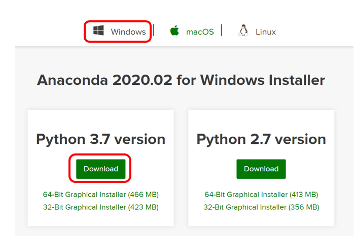

# Pytyhonのインストール

PCにPythonをインストールし、VSCodeから実行できるようにする。MacはデフォルトでPythonがインストールされているが、バージョンが古く、必要なライブラリが入っていないので、新たにインストールする。以下では全く環境をいじっていないpCにPythonのディストリビューションとしてAnacondaを、エディタとしてVSCodeをインストールして使うことを想定しているが、自分でインストールして使っているPythonがあったり、他に好きなエディタがあればそれを使ってかまわない。

なお、Windows/Macともにログイン名を英語にしておくことを推奨する。もし最初に日本語名でアカウントを作成してしまった場合、新たに英語名のログイン名のアカウントを作成し、そのアカウントに管理者権限を付与して、以降はそのアカウントをメインに使うのが良い。現在は日本語アカウント名のままでもなんとかなるかもしれないが、少なくとも昔はいろいろ不具合が起きたのでおすすめしない。

## Windows編

### Anacondaのインストールとテスト

#### Anacondaのインストール

最初に、Anacondaをインストールする。ブラウザでAnacondaと検索するか、[https://www.anaconda.com/](https://www.anaconda.com/)にアクセスし、右上にある「Download」ボタンを押す。


ページの下の方に「Windows | macOS | Linux」のタブが現れるので、「Windows」を選択してから「Python 3.7 version」の「Download」ボタンを押す。



ダウンロードが完了したら、管理者権限で実行してインストールを実行する。何度か設定について聞かれるが、全てデフォルトのままで良い。

途中で、インストール先を聞かれる。


これもデフォルトで良いが、アカウントを英語名にしておかないと、インストール先に日本語が含まれて、後で面倒なことになるかもしれない。インストールが完了したら、Finishを押す。

#### Jupyter Notebookのテスト

Windowsのスタートメニューから、Anaconda Navigatorを実行する。Windows 10だとメニューが折り畳まれている場合もあるので注意。


起動すると必要なパッケージを自動でインストールするため、環境によっては初回起動時に時間がかかるかもしれない。

Navigatorが起動したら、Jupyter Notebookを実行する。以下の画面の「Jupyter Notebook」の下の「Launch」をクリックする。


デフォルトのブラウザで、Jupyter Notebookが開かれるので、右上の「New」ボタンから「Python 3」を選ぶ。


新しいタブが開き、入力待ちになるので、そこで何かプログラムを入力する。例えば

```py
print("Hello Python")
```

と入力し「Shift+Return」もしくは上の「Run」ボタンをクリックする。


セルの真下に「Hello Python」と表示されて、次のセルが入力待ちになれば成功である。これでPythonを実行する環境は整った。

右上の「Quit」を押してサーバを終了する。「Logout」を押して終了しようとすると、Anaconda Navigatorを終了しようとする時に
「Jupyter Notebookが終了していない」と言われるの注意。その場合はそのまま終了して問題ない。

また、次回からはAnaconda Navigatorを経由せず、いきなりJupyter Notebookを実行して良い。「Jupyter Notebook」というタイトルの
コマンドライン画面経由でブラウザが起動されるが、「Quit」を押せば、コマンドライン画面は消える。この時も「Logout」を押すと
コマンドライン画面が残ってしまうが、その場合はCtrl+Cを何度か押せば消える。

#### Anacondaのトラブル

たまにAnaconda Navigatorを終了しようとすると「Anaconda Navigator is still busy. Do you want to quit?」と言われることがある。しばらくまって、再度終了しようとしてもまた出る場合はそのまま終了して良い。

## Mac編

### Home brewのインストール

もしインストールされていないのなら、まずHome Brewをインストールする。

まず「ターミナル」を開く。Command+Spaceでスポットライトを開き、Terminal.appを選べば起動する。実行したら、今後良く使うのでDockに追加しておこう。ターミナルが開いたら、以下を実行せよ。

```sh
brew
```

「Command not found」と言われたらインストールされていない。インストールするには[https://brew.sh/index_ja](https://brew.sh/index_ja)の指示に従い、ターミナルで以下のコマンドを実行する。

```sh
/bin/bash -c "$(curl -fsSL https://raw.githubusercontent.com/Homebrew/install/master/install.sh)"
```

ターミナルにコピペして実行せよ。途中、パスワードが要求されるので入力すること。Home brewのインストールが終わったら、再度以下を実行せよ。

```sh
brew
```

```txt
Example usage:
  brew search [TEXT|/REGEX/]
  brew info [FORMULA...]
(snip)
Further help:
  brew commands
  brew help [COMMAND]
  man brew
  https://docs.brew.sh
```

などと表示されればインストールできている。もし

```sh
Error: You have not agreed to the Xcode license. Please resolve this by running:
  sudo xcodebuild -license accept
```

というエラーが起きて実行できなかった場合、

```sh
sudo xcodebuild -license accept
```

を実行せよ(パスワードが必要)。

最後にHome Brewを最新版にする。以下を実行せよ(かなり時間がかかる)。

```sh
brew update --force && brew upgrade
```

### Anacondaのインストール

まず、pyenvをインストールする。ターミナルで以下を実行せよ。

```sh
brew install pyenv
```

次に、自分が使っているシェルを確認せよ。

```sh
echo $SHELL
```

おそらくデフォルトではbashだと思われる。bashの場合、以下を実行せよ。

```sh
echo 'eval "$(pyenv init -)"' >> ~/.bash_profile
exec $SHELL -l
```

もしzshを使っている場合は、以下を実行せよ。

```sh
echo 'eval "$(pyenv init -)"' >> ~/.zshrc
exec $SHELL -l
```

その後、pyenvを使ってanacondaをインストールする。まず、インストール可能なanacondaのバージョンを確認しよう。

```sh
pyenv install -l
```

pyenvでインストール可能なパッケージ一覧が表示されたはずだ。ここで`anaconda`の最新版を探す。2020年4月時点では、`anaconda3-2019.10`が最新である。インストールし、アクティベートしよう。

```sh
pyenv install anaconda3-2019.10
pyenv global anaconda3-2019.10
```

インストールできたか確認しよう。ターミナルで`python`を実行せよ。

```sh
$ python
Python 3.7.4 (default, Aug 13 2019, 15:17:50) 
[Clang 4.0.1 (tags/RELEASE_401/final)] :: Anaconda, Inc. on darwin
Type "help", "copyright", "credits" or "license" for more information.
>>> 
```

上のように「Anaconda, Inc.」などと表示されれば正しくインストールされている。Ctrl+Dで終了しよう。

#### Jupyter Notebookのテスト

ターミナルから以下を実行せよ。

```sh
jupyter notebook
```

デフォルトのブラウザで、Jupyter Notebookが開かれるので、右上の「New」ボタンから「Python 3」を選ぶ。


新しいタブが開き、入力待ちになるので、そこで何かプログラムを入力する。例えば

```py
print("Hello Python")
```

と入力し「Shift+Return」もしくは上の「Run」ボタンをクリックする。


セルの真下に「Hello Python」と表示されて、次のセルが入力待ちになれば成功である。これでPythonを実行する環境は整った。

最初に起動した画面の「Quit」を選ぶとJupyter Notebookは終了する。
