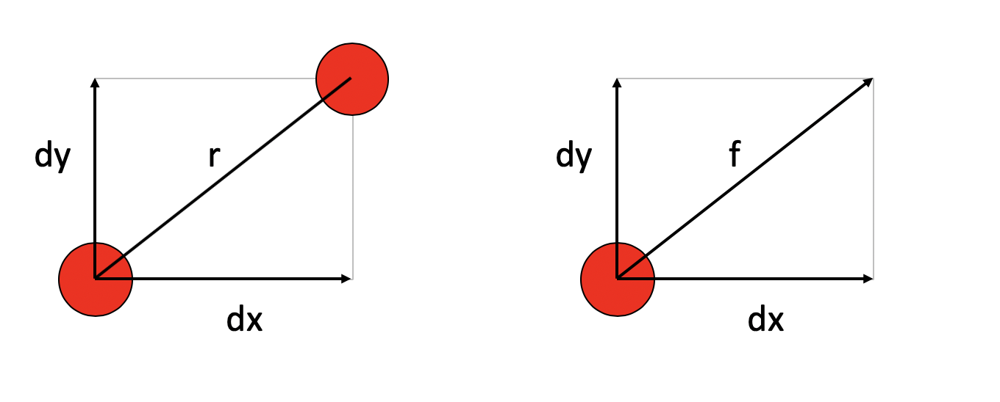

# 簡単なSIMD化

Lennard-Jonesポテンシャルの力の計算を題材に、Intel AVX2命令セットを用いたSIMD化を体験してみる。

## 参考文献

SIMD化については、以下を参考にすること。

* [LJの力計算のSIMD化ステップ・バイ・ステップ その0](https://qiita.com/kaityo256/items/5be3ce71a6ff9522a0e6)
* [一週間でなれる！スパコンプログラマ day7](https://kaityo256.github.io/sevendayshpc/day7/index.html)

## 分子動力学法の基礎

まず、SIMD化をする前に、全体のシミュレーションのどこを最適化しようとしているのかを理解しよう。

分子動力学法は、粒子間に働く力を計算し、その力にもとづいて運動量を変化させ、その運動量の変化を考慮してまた力を計算し・・・という処理を繰り返すことで粒子を動かすシミュレーション方法だ。シミュレーションは、以下のようなステップで実行される。

1. 初期条件を作る(粒子の初期位置と初期速度を与える)
2. 粒子間距離からお互いにかかる力を計算する
3. 力から力積を計算し、運動量を更新する
4. 運動量から座標を更新する
5. ステップ2へ戻る

その他、状況に応じて温度制御をしたり、物理量の測定をしたりするが、上記のステップのうちもっとも計算が重い場所(ホットスポットと呼ぶ)は力の計算で、計算時間の9割以上を占める場合が多い。したがって、そこを高速化すると全体の計算時間も高速化される。逆に、ホットスポットではない場所を高速化しても計算速度向上には貢献しない。

以下では、「力の計算(と、運動量の更新)」のみを切り出したコードについてSIMD化を試みる。

## Lennard-Jonesポテンシャルの力計算について

二体の等方ポテンシャルを考える。これは、二つの粒子間に働く力が、お互いの距離$r$だけで決まるモデルだ。まず、二つの粒子が距離$r$だけ離れた場所にいるときのポテンシャルエネルギー$V(r)$を考える。粒子間に働く力は、その$r$に関する微分に負符号をつけたもの、すなわち$f(r) = -V'(r)$だ。

シミュレーションでは三次元空間を考えるが、以下では簡単のために二次元を考えよう。二つの粒子の粒子番号をiとjとする。慣例により、それぞれi粒子、j粒子と呼ぼう。i粒子の座標を$(q^i_x, q^i_y)$、j粒子の座標を$(q^j_x, q^j_y)$とする。i粒子から見たj粒子の相対座標ベクトルは

$$
\vec{r} = (dx, dy) = (q^j_x - q^i_x, q^j_y - q^i_y)
$$

となる。相対距離$r$は

$$
r = |r| = \sqrt{dx^2 + dy^2}
$$

であるが、計算では$r^2$のまま扱うことが多い。

さて、Lennard-Jonesポテンシャルは以下のような関数だ。

$$
V(r) = 4 \left(r^{-12} - r^{-6} \right)
$$

ただし、簡単のためにエネルギースケール$\varepsilon$や粒子直径$\sigma$は1としている。

力は$f(r) = -V'(r)$であるから、

$$
f(r) = \frac{48}{r^{13}} - \frac{24}{r^7}
$$

さて、この力は「i粒子から見てj粒子から受ける力」を表しており、例えば引力なら$j$粒子の方向へ引っ張られており、斥力なら遠ざかる方向に押されれている。すなわちベクトル量である。x方向に受ける力を $f_x$とすると、

$$
f_x = f \times \frac{dx}{r}
$$

である。



この力が時間$dt$だけ継続した場合、x方向に受ける力積$I_x$は

$$
I_x = f_x dt
$$

である。以上から

$$
I_x = f \times \frac{dx}{r} \times dt
$$

となる。ここで、

$$
df \equiv f \times \frac{dt}{r}
$$

とすると、

$$
df = \left(\frac{48}{r^{14}} - \frac{24}{r^8} \right)
$$

となり、$r^2$だけで計算できる量となる(平方根の計算が不要になる)。時間$dt$の間に受ける力積$I_x$は

$$
I_x = df \times dx
$$

であり、i粒子の運動量 $p_x^i$は、時間刻み$dt$の間に

$$
p_x^i = p_x^i + df \times dx
$$

という変化を受ける。これが時間刻み$dt$の間に$i$粒子が$j$粒子より受ける力積である。作用反作用の法則から、$j$粒子の運動量は

$$
p_j^i = p_j^i - df \times dx
$$

と変化を受ける。この計算を$y$座標や$z$座標についても行えば、ある$i$粒子と$j$粒子のペアに対する力の計算と運動量の更新は完了である。これをすべてのペアについて行えば、運動量の更新の1ステップが完了する。

なお、

$$
df = \left(\frac{48}{r^{14}} - \frac{24}{r^8} \right)
$$

は、計算回数をへらすために項をまとめて

$$
df = \frac{48 - 24 r^6}{r^{14}}
$$

と変形しておく。

## SIMD化

### SIMD化練習用コードの使い方

それでは実際にSIMD化をしてみよう。SIMD化の練習のためのリポジトリを用意したので、適当なディレクトリ(例えばgithub)にてそれをcloneしよう。

```sh
cd github
git clone https://github.com/kaityo256/lj_simd_test.git
cd lj_simd_test
```

このリポジトリには`lj.cpp`がある。まずはコンパイルして実行してみよう。`make`すると実行バイナリ`a.out`ができる。

```sh
$ make
$ ./a.out
N=4000, simple   4313 [ms]
N=4000, simd     4329 [ms]
Check OK
```

このプログラムは全く同じ力の計算を、単純なループで計算する関数`calc_force_simple`と、これからSIMD化する関数`calc_force_simd`を100回ずつ実行し、その実行時間を計測しつつ、実行結果が一致することを確認するものだ。両者の実行結果が一致すれば「Check OK」、不一致なら「Check Failed」と表示される。関数calc_force_simdは、一部だけSIMD命令が使われている。この関数を「Check OK」の状態を保ちながらSIMD化していき、最終的に二倍以上の実行速度向上を目指す(つまり、simdの実行時間をsimpleの半分以下とする)のが目標である。

まずはそのまま挑戦してほしいが、慣れていなければかなり難しいと思われる。以下、少しずつヒントを出すので、適宜参照しながら行ってほしい。

## Step1：ループアンローリング

### ループアンローリングとは

SIMD化においてまず行うことは、ループのアンロール(Loop unrolling)である。AVX2の256ビットレジスタを使ったSIMD化では、倍精度浮動小数点数を4つ同時に計算できる。したがって、4つの独立な計算を作らなければならない。そのための方法がループアンローリングである。

以下のようなループを考えよう。

```cpp
for(int i=0;i<20;i++){
    printf("%d\n",i);
}
```

これは、0から19までの数字を表示するだけのプログラムだ。C言語の`for`文は、ループカウンタの初期化、ループの継続条件、ループカウンタのインクリメントの3つを指定する。ここでは、

* `int i=0` 0からスタートで
* `i<20` i=20になったら終了(つまりi=19まで実行される)
* `i++` ループ一回ごとに iに1を加える

という意味である。

このループを以下のように変形する。

```cpp
for (int i = 0; i < 20; i += 4) {
  printf("%d\n", i);
  printf("%d\n", i + 1);
  printf("%d\n", i + 2);
  printf("%d\n", i + 3);
}
```

実行結果は同じであるが、1ループごとに、ループカウンタが4つずつ増えている。その代わり、ループ内で行う仕事が4倍に増えた。これを4倍のループアンローリングと呼ぶ。アンロールする前と等価な処理をしているが、ループ内に独立な処理が4つ現れたことがわかる。これをまとめていっきにやろう、というのがSIMD化の第一歩である。

### ループの端数処理

さて、先程は20回のループであったので4で割り切れたが、4で割り切れない場合もある。その場合は「余りのループ」を処理してやらないといけない。例えば、もともと22回のループであったとしよう。

```cpp
for (int i = 0; i < 22; i++) {
  printf("%d\n", i);
}
```

これを4倍にアンロールするには、

```cpp
int i = 0;
for (; i + 4 < 22; i += 4) {
  printf("%d\n", i);
  printf("%d\n", i + 1);
  printf("%d\n", i + 2);
  printf("%d\n", i + 3);
}
for (; i < 22; i++) {
  printf("%d\n", i);
}
```

とする。まず、ループ内でのみ有効であったループカウンタ`i`をループの外に出した。そして、ループの継続条件を `i < 22`から `i + 4 < 22`にした。これで `i+3`が22を超えることはなくなった。

さて、4倍展開されたループが終わった時点で変数 `i`には20が入っている。それは、`i=16`までは `i+4 < 22`が満たされているが、次のループの `i=20`では満たされなくなったためだ。

あとは、そこから最後までもとのループを回せば良い。これをループの端数処理と呼ぶ。ループの端数はSIMD化できないので、SIMD化するのは前のループのみとなる。

### 多重ループのループアンローリング

しばしばループは多重ループとなる。特に分子動力学法においては、i粒子に関するループと、i粒子と相互作用するj粒子のループの二重ループとなることが多い。例えば以下は二重ループの例である。

```cpp
  const int N = 10;
  for (int i = 0; i < N - 1; i++) {
    for (int j = i + 1; j < N; j++) {
      printf("%d %d\n", i, j);
    }
  }
```

さて、多重ループをSIMD化する場合、外側と内側のループのどちらかをアンロールしてやる必要がある。どちらをアンロール(SIMD化)する方が良いかはコードに依存するが、とりあえず内側をアンロールしてやることにしよう。つまり、以下のようなループを4倍にアンロールする。

```cpp
for (int j = i + 1; j < N; j++) {
  printf("%d %d\n", i, j);
}
```

アンロールのやり方は先程と同様だ。

```cpp
int j = i + 1;
for (; j + 3 < N; j+=4) {
  printf("%d %d\n", i, j);
  printf("%d %d\n", i, j + 1);
  printf("%d %d\n", i, j + 2);
  printf("%d %d\n", i, j + 3);
}

for (; j < N; j++) {
  printf("%d %d\n", i, j);
}
```

### ステップ1：課題

関数`calc_force_simd`の内側のループを4倍にアンロールせよ。ただし、アンロール前と結果は一致しなければならない。

後のために、4倍展開した内側のループの冒頭で

```cpp
int j_0 = j;
int j_1 = j + 1;
int j_2 = j + 2;
int j_3 = j + 3;
```

というループカウンタを用意し、それまで `j`を使っていたものを4倍に増やしてからそれぞれ`j_0`,`j_1`, `j_2,`,`j_3`に置換すれば良い。

例えば先程の

```cpp
for (int j = i + 1; j < N; j++) {
  printf("%d %d\n", i, j);
}
```

を4倍展開する例なら、まずはループの端数処理とループカウンタのインクリメントを4倍にする処理を書く。

```cpp
int j = i + 1;
for (; j + 3 < N; j+=4) {
  printf("%d %d\n", i, j);
}

for (; j < N; j++) {
  printf("%d %d\n", i, j);
}
```

このままでは、4倍展開したループ内の処理が足りないので増やすのだが、まずループカウンタを4つに増やす。

```cpp
int j_0 = j;
int j_1 = j + 1;
int j_2 = j + 2;
int j_3 = j + 3;
```

次に、ループ内の処理を4倍に増やす。

```cpp
  printf("%d %d\n", i, j);
  printf("%d %d\n", i, j);
  printf("%d %d\n", i, j);
  printf("%d %d\n", i, j);
```

最後に、`j`を先程増やしたループカンタに変える。

```cpp
  printf("%d %d\n", i, j_0);
  printf("%d %d\n", i, j_1);
  printf("%d %d\n", i, j_2);
  printf("%d %d\n", i, j_3);
```

アンロールされたループ内では、生のループカウンタ`j`が残っていてはいけない。このように関数`calc_force_simd`をアンロールせよ。

アンロールしたら、

```sh
make
./a.out
```

として実行し、`Check OK`が出ることを確認せよ。