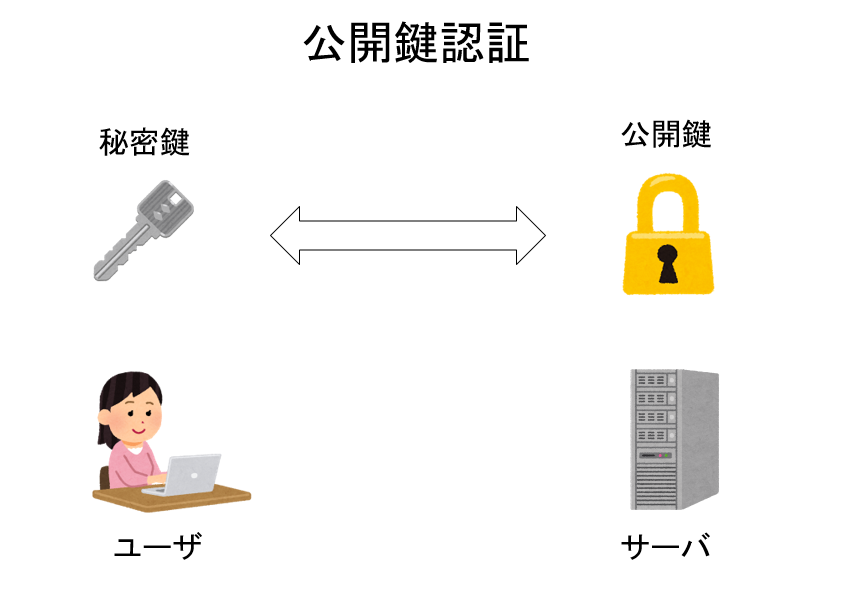
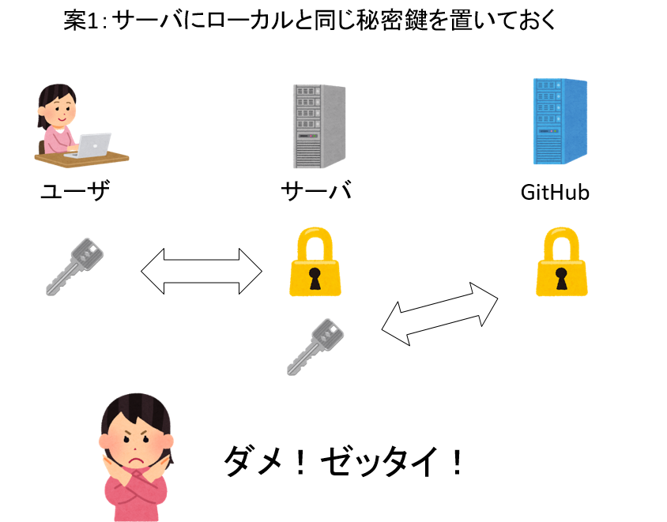

# SSHエージェント転送の設定

SSHでリモートサーバにアクセスする場合、一般的に公開鍵認証を用いる。これは、ローカルマシンにある秘密鍵と、ログインしたサーバに登録した公開鍵を突き合わせることで「確かにこの公開鍵を登録した人がアクセスしている」と認証する仕組みだ。SSH公開鍵認証は、GitHubへのアクセスにも用いられる。実際には公開鍵認証はわりと複雑なことをしているのだが、とりあえずは「公開鍵に対応する秘密鍵を持つ人が、正当なアクセス権を持つ人と認証している」と思えばよい。



秘密鍵は、認証したい人が持つ鍵で、文字通り秘密にしなければならない。一般には、秘密鍵を「パスフレーズ」と呼ばれる文字列を使って暗号化する。「パスワード認証」とは異なり、「パスフレーズ」は秘密鍵の暗号化を解くのに用いられ、ネットワークを流れることはない。パスフレーズをつけないこともできるのだが、個人的にはパスフレーズ無しの秘密鍵は推奨できないので、なるべく長いパスフレーズをつけるようにして欲しい。

さて、いま「リモートサーバに公開鍵でアクセスし、そのリモートサーバからGitHubにアクセスしたい」と思ったとしよう。いわゆる「多段SSH」もしくは「踏み台サーバ」という状態である。なお、既にローカルPCからGitHubには公開鍵認証でアクセスできる(公開鍵が登録してある)ものとする。


この時、最も単純には、リモートサーバに秘密鍵と公開鍵のペアを生成し、公開鍵をGitHubに登録することが考えられる。さらに手抜きをして、リモートサーバにローカルと同じ秘密鍵を置いてしまえばGitHubに登録する公開鍵はそのままで良い。いずれも、リモートサーバでもう一度パスフレーズを入力すれば、多段SSHできる。




しかし一般論として、リモートサーバに秘密鍵を置くことは避けた方が良い。IPアドレスが公開されているリモートサーバは、ローカルマシンに比べて外部からの攻撃を受けやすい。万が一、リモートサーバがハックされた際、そこに秘密鍵があると、リモートサーバからアクセスしていた別のサーバも攻撃されることがある。

実際にそのような事件が起きたことがある。あるユーザのスパコンアカウントが(おそらくキーロガーにより)クラックされた。クラックされたスパコンは被害が少なかったのだが、このスパコンに「パスフレーズ無しの秘密鍵」が置いてあり、攻撃者はそこを踏み台に別のスパコンにログインすることができた。そして別のスパコンのセキュリティホールをついて特権昇格に成功し、複数のスパコンが運用停止に追い込まれたことがある。パスフレーズにより暗号化されていても、原理的には時間をかければ解析できるため、リモートサーバには原則として秘密鍵を置かないようにしたい。

さて、リモートサーバには秘密鍵を置きたくないが、多段SSHを行うためには秘密鍵が必要だ。そこで、SSHにはエージェント転送という機能がある。これは、ローカルマシンの秘密鍵の情報を、リモートサーバに持っていき、リモートサーバから別のサーバに接続する際にそれを使う機能だ。以下、SSHエージェント転送を使ってGitHubにアクセスする。


## SSHエージェントの設定

MacとWindowsで設定方法が異なる。

### Macの場合

Macの場合は、デフォルトでSSHエージェントが起動している。ターミナルのホームディレクトリで

```sh
ssh-add
```

を実行せよ。秘密鍵のパスフレーズを聞かれるので、入力せよ。その後、研究室サーバにsshで接続してみよ。パスフレーズを聞かれずに接続できたら成功である。

パスフレーズは、Macのキーチェインに保存される。これはログアウトされると消えるため、必要な時に毎回`ssh-add`の実行が必要となる。

ターミナルを開いた時に自動でパスフレーズを聞かれるようにしたい場合は、`.bashrc`の最後に以下の記述を追加しておく。

```sh
ssh-add
```

こうするとターミナルを開くたびに(まだ入力していなければ)パスフレーズを聞かれるようになる。必要な時に`ssh-add`を実行するか、`.bashrc`に記述してしまうかはお好みで。

### Windowsの場合

まず、SSHエージェントを起動する必要がある。起動方法は

```ssh
eval `ssh-agent`
```

を実行することだが、毎回これを実行するのは面倒なので、自動的に起動するようにする。まずGit Bashを起動し、Vimで`~/.bashrc`を開く。

```sh
vim ~/.bashrc
```

そして、.bashrcのファイルの最後に以下の行を追加せよ。

```txt
eval `ssh-agent`
```

なお 「`` ` ``」は「バッククォート」と呼ばれ、通常であればシフトをおしながら@を押せば入力できるはず。

Vimを終了し、`.bashrc`を再読み込みしよう。

```sh
source .bashrc
```

`Agent pid 850`などと表示されれば成功である(pidの数字は毎回異なる)。

その後、

```sh
ssh-add
```

を実行して、パスフレーズ聞かれたら成功している。もし

```txt
Could not open a connection to your authentication agent.
```

というエラーが出たら、SSHエージェントの起動に失敗しているので、上記の手順を再度確認すること。

パスフレーズを入力後、研究室サーバにsshで接続してみよ。パスフレーズを聞かれずに接続できたら成功である。

なお、上記の設定でGit Bashを起動する度にssh-agentは自動起動するが、必要に応じてssh-addによりパスフレーズを覚えさせる必要がある。これをGit Bashの起動時に必ずやるようにしたければ、`.bashrc`の`ssh-agent`の起動の後に`ssh-add`を記入しておく。

```txt
eval `ssh-agent`
ssh-add
```

これにより、Git Bashを起動すると必ずパスフレーズの入力を求められるようになる。Git Bashの起動時に`ssh-agent`の起動だけにとどめるか、`ssh-add`まで実行してパスフレーズを入力するかはお好みで。

## 多段SSH

上記の手順では、SSHエージェントに秘密鍵の情報を覚えさせることで、一度`ssh-add`実行時にパスフレーズを入力したら、次回よりパスフレーズの入力を省略できるものである。それだけでも便利であるが、以下ではエージェント転送により、多段SSHを実行してみよう。

まず、研究室サーバに`-A`オプションをつけてSSHで接続せよ。

```sh
ssh username@place.of.server -A
```

その後、適当なディレクトリ(例えばgithub)にて、GitHubに自分が公開しているリポジトリをcloneしてみよ。

```sh
mkdir github
cd github
git clone git@github.com:yourname/yourrepository.git
```

パスフレーズの入力を求められずにcloneできれば成功である。なお、研究室サーバでgitのcommitやpushなどの操作をする前に、[Gitの設定](../git/README.md)を参考にユーザ名やメールアドレスの設定をしておくこと。
