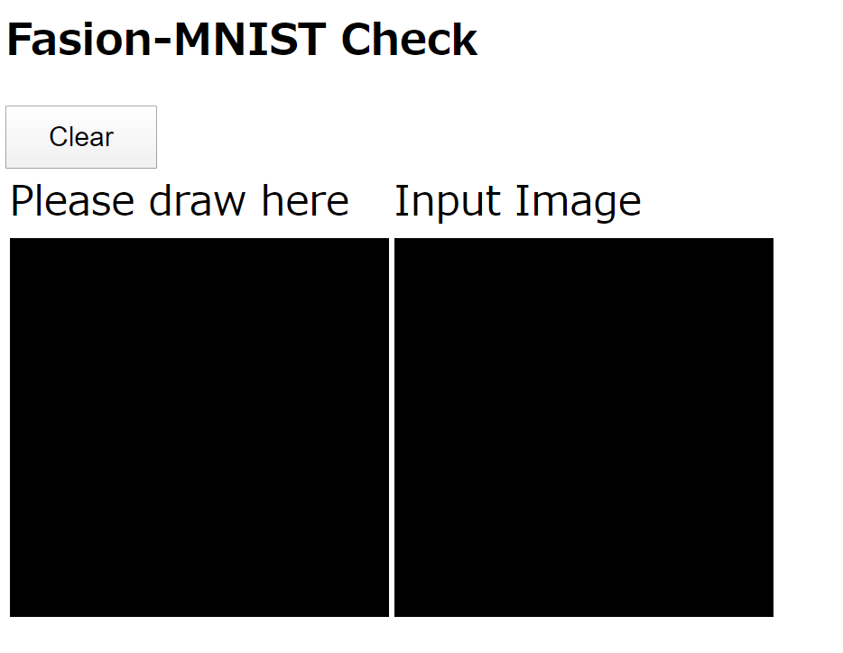

# TensorFlowでFashion-MNISTを学習させてウェブで読み込む

Fashion-MNISTというデータセットがある。MNISTは手書き数字だが、そのファッション版だ。このデータセットをTensorFlowを使ってニューラルネットに学習させ、そのデータをエクスポートし、ウェブで読み込んで、自分の描いた絵をニューラルネットに判定させてみよう。

## 環境設定

### ローカルマシンで実行する場合

#### パッケージのインストール

ターミナル(以下、WindowsならAnaconda Promptで、Macならターミナルを指すものとする)で、以下を実行せよ。

```sh
conda install pip
pip install -U pip
pip install tensorflow
pip install tensorflowjs
```

#### リポジトリのフォークとクローン

以下のリポジトリをフォークせよ。

[https://github.com/kaityo256/fashion_mnist_check](https://github.com/kaityo256/fashion_mnist_check)


フォークが完了したら、clone用のアドレスをコピーする。「Clone or download」ボタンをクリックし、「Clone with SSH」になっていることを確認して「クリップボードにコピーボタン」を押す。


この状態で、ターミナルで`github`ディレクトリに移動してからcloneする。

```sh
cd github
git clone git clone git@github.com:youraccount/fashion_mnist_check.git
```

cloneできたら、そこに移動しよう。

```sh
cd fashion_mnist_check
```

### 研究室サーバで実行する場合

[SSHエージェント転送の設定](../ssh)を参考に、まずはssh-agentを起動の上、`ssh-add`によりパスフレーズを覚えさせた状態で、研究室のサーバに`-A`オプションつきでログインせよ。以下の作業は`git push`まではサーバ上で行う。

#### リポジトリのフォークとクローン

まず、以下のリポジトリをフォークせよ。

[https://github.com/kaityo256/fashion_mnist_check](https://github.com/kaityo256/fashion_mnist_check)


フォークが完了したら、clone用のアドレスをコピーする。「Clone or download」ボタンをクリックし、「Clone with SSH」になっていることを確認して「クリップボードにコピーボタン」を押す。


この状態で、ターミナルで`github`ディレクトリに移動してからcloneする。

```sh
cd github
git clone git clone git@github.com:youraccount/fashion_mnist_check.git
```

cloneできたら、そこに移動しよう。

```sh
cd fashion_mnist_check
```

#### 仮想環境の構築

Pythonでは、複数のパッケージをインストールして利用するが、多くの場合、パッケージは別のパッケージに依存しており、さらにバージョンが異なるとうまく動作しないことがある。すると、あるプロジェクトではあるパッケージのVer 1.0じゃないと動作しないが、別のプロジェクトではVer 2.0以降でないと動作しない、ということが起きる。このため、Pythonでは「仮想環境」を構築して、環境を切り替えることで、異なるバージョンのパッケージを共存させられるようになっている。

Pythonの仮想環境構築自体もかなりの魔境なのだが、今回はPython標準のvenvを使うことにする。これは「プロジェクト毎」に異なる仮想環境を構築する。

先ほど、クローンした`fashion_mnist_check`のディレクトリにいるはずである。この状態で、「tf」という名前の仮想環境を構築する。

```sh
python3 -m venv tf
```

すると、カレントディレクトリに`tf`というディレクトリが作られる。この状態で仮想環境を有効にする(この仮想環境`tf`に入る)ためには、以下を実行する。

```sh
source tf/bin/activate
```

プロンプトの左側に`(tf)`という文字が現れたら仮想環境に入った印である。

この環境に必要なものを入れていこう。以下を実行せよ。

```sh
pip install --upgrade pip
pip install tensorflow tensorflowjs
```

途中でエラーが出るが、(多分)気にしなくて良い。

サーバからログアウトすれば仮想環境からも出るが、明示的に出たい場合は

```sh
deactivate
```

を実行する。プロンプトの左から`(tf)`が消えたはずだ。次回から、このディレクトリに入って、また

```sh
source tf/bin/activate
```

を実行すれば、TensorFlow, TensorFlowJSがインストールされた仮想環境に入ることができる。

## 学習とエクスポート

まず、データを学習させよう。機械学習の定番データといえば、手書き数字認識のMNIST(Modified National Institute of Standards and Technology)データセットだが、今回使うデータは「Fashion-MNIST」と呼ばれるもので、10種類の衣類を区別するものだ。


これは28ピクセル x 28ピクセルの白黒画像である。各ピクセルは0から255までの輝度を持っているが、これを0から1までの実数に変換し、784次元の一次元ベクトルにしてニューラルネットに食わせて学習させる。

このデータはウェブに公開されているため、ダウンロードから学習まで一発でできる。まずはニューラルネットを学習させ、その結果を保存しよう。以下を実行せよ。

```sh
python train.py
```

正しくTensorFlowがインストールされていれば学習が進み、最終的に以下のような出力がされるはずである。

```txt
Test accuracy: 0.8709999918937683

Predictions for zero input
[0.08157011 0.00318779 0.02768737 0.05093732 0.00741246 0.71254516
 0.07637644 0.02599602 0.01260033 0.00168701]

Model was saved.
```

最後の「Predictions for zero input」とは、全てがゼロ、すなわち「真っ黒な画像」が入力された時のニューラルネットの出力である。後でデバッグに用いる。

この結果、実行したディレクトリに以下のファイルが保存されている。

* `model.data-00000-of-00001`
* `model.index`

次に、このデータを読み込んで、TensorFlow.js用のデータをエクスポートする。以下を実行せよ。

```sh
python export.py
```

TensorFlow.jsが正しくインストールされていれば、以下のような出力になるはずだ。

```sh
Predictions for zero input
[0.08157011 0.00318779 0.02768737 0.05093732 0.00741246 0.71254516
 0.07637644 0.02599602 0.01260033 0.00168701]

Model was exported.
```

この結果、実行したディレクトリに`model`というディレクトリができており、その中に以下のようなファイルが作成されているはずである。

```txt
model
├── group1-shard1of1.bin
└── model.json
```

これをJavaScriptから読み込んで、自分で絵を書いて判定させてみよう。

ただし、JavaScriptはセキュリティのため、デフォルトではローカルに保存されたファイルにアクセスできない。回避する方法もあるのだが、ここではそのままGitHubにアップロードし、GitHub Pagesでウェブサイトとして公開することでアクセスしよう。

まず、作成されたディレクトリ`model`をリポジトリに追加する。

```sh
git add model
```

その後、commit、pushしよう。

```sh
git commit -m "adds model"
git push
```


## GitHub Pagesの公開

GitHubの、自分のリポジトリを見てみよう。ブラウザをリロードすると、`model`が追加されているはずである。この状態でSettingsをクリックする。


下の方に「GitHub Pages」という項目があるので、そこの「master branch」をクリックする。


すると、GitHub Pagesのところに「Your site is ready to be published at https://youraccount.github.io/fashion_mnist_check/.」という文章が表示されるので、「数分待ってから」アクセスする。

以下のような画面が出てきたら成功だ。



左に何か絵を描くと、それを28 x 28ピクセルに変換したデータが右に表示され、さらにそのデータを784次元のベクトルとして訓練済みニューラルネットに食わせた結果、その絵が何であるかを判定してくれる。


上記の例では、サンダルと判定された。
