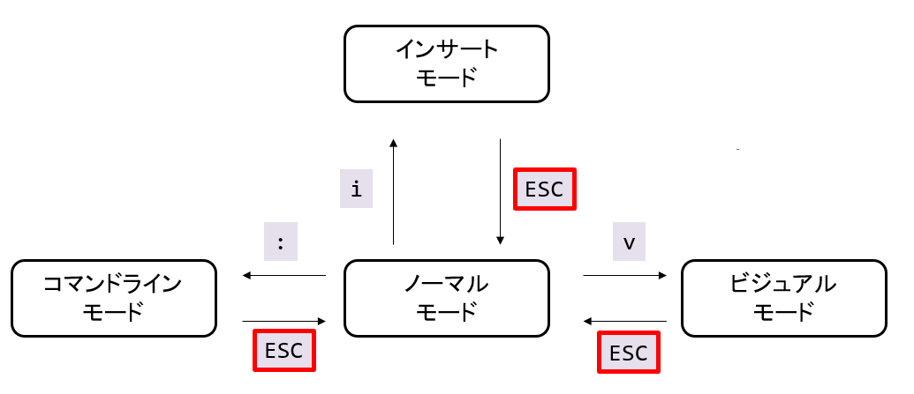

# Vimの使い方

## Vimとは

VimはVi IMprovedの略で、viというエディタを拡張したものだ。多くの環境で、単に`vi`とすると`vim`が起動する。以下、Vimのこともviと呼ぶことにする。viはUNIX-likeな環境において、Emacsと人気を二分するエディタである([エディタ戦争](https://ja.wikipedia.org/wiki/%E3%82%A8%E3%83%87%E3%82%A3%E3%82%BF%E6%88%A6%E4%BA%89)を参照)。本研究室ではリモートサーバにsshでログインして作業することが多くなる。この時、VSCodeなどをリモート接続してファイルを編集することも可能なのだが、せっかく数値計算の研究室に配属されたことだし、教養としてviとEmacsくらいは使えるようになっておこう。以下、私の趣味でviを使うが、簡単な操作くらいはどちらも使えるようになっておくのが望ましい。

Vimの使い方を解説したサイトは多数あるが、例えば

[はじめてのVim 〜 Vimはいいぞ！ゴリラと学ぶVim講座](https://knowledge.sakura.ad.jp/21687/)

等で学ぶと良いだろう。

## モードについて

Vimの最大の特徴はモードがあることだ。起動直後はノーマルモードとなっており、そのままでは入力ができない。`i`などを押すと入力モードとなり、文字が入力できるようになる。`ESC`を押すとノーマルモードに戻る。

また、`:`を押すことでコマンドラインモードになる。ここでは置換など様々なことができる。`v`などを押すことでビジュアルモードになり、テキストの一部分を選択したり、選択した範囲について操作ができる。以下にモード間の遷移図を示すが、とりあえず「エスケープキーを押せばノーマルモードに戻る」と覚えておけばよい。



## 終了の仕方

Vimで最初に躓きがちなのは「起動したは良いが終了の仕方がわからない」というものだ。何はともあれ終了方法を確認しよう。

まず、適当なディレクトリで、新しいファイル`test.txt`をvimで開いてみよう。

```sh
vim test.txt
```

Vimは起動時に「ノーマルモード」になっており、そのままでは文字入力ができない。まずはこのまま終了してみよう。シフトキーを押しながら`z`を二回、すなわち`ZZ`と入力してみよう。Vimが終了してターミナルに戻ったはずだ。「何もしていなければノーマルモードで`ZZ`で終了する」とおぼえておこう。

もう一度Vimを起動しよう。

```sh
vim test.txt
```

ここで「i」を押して編集モードに切り替えよう。

画面の下が`-- 挿入 --`という表示になったはずだ。この状態では、通常のエディタのように文字列を入力することができる。この状態で、`Hello Vim!`と入力し、改行してからESCを押そう。ESCを押したらノーマルモードになる。この状態でやはり`ZZ`を入力しよう。編集内容が保存されて終了する。ちゃんと保存されたかcatで確認してみよう。

```sh
$ cat test.txt
Hello Vim!
```

ちゃんと表示されたはずだ。

`ZZ`は、ノーマルモードにおいて「編集内容を保存して終了せよ」というコマンドだが、現在の編集内容を保存しないで終了したい場合もあるだろう。その場合はコマンドモードを使う。

もう一度Vimを起動しよう。

```sh
vim test.txt
```

`i`キーでインサートモードになり、適当な文字を入力してからESCを押してノーマルモードに戻ろう。この状態で`:`を押すとコマンドモードとなる。コマンドモードで`q`を入力してエンターを押すと終了するが、保存されていない編集内容があるとメッセージが出て終了できない。ここで、`q!`と、`!`をつけると、保存してない内容があっても終了する。逆に`wq`とすると、現在の編集内容をファイルに書き込んでから終了する(ノーマルモードでの`ZZ`と同じ)。

とりあえず

* 現在の編集内容を保存して終了したい → ノーマルモードで`ZZ`
* 現在の編集内容を破棄して終了したい → コマンドモードで`q!`

とだけ覚えておけば良い。

## カーソル移動の仕方

この状態で`h`や`l`キーでカーソルが移動することを確認してみよう。Vimには、以下のように多様な移動手段がある。

### カーソル移動：h,j,k,l

まずはhjklでカーソル移動ができる。それぞれ以下の通りだ。

* `h` 一文字左
* `l` 一文字右
* `j` 一行上
* `k` 一行下

### 画面移動:Ctrl+u,d,f,b,e,y

Ctrlキーとudfbeyの組み合わせて、画面移動ができる。

* `Ctrl+u` 画面半分上へ
* `Ctrl+d` 画面半分下へ
* `Ctrl+b` 一画面分上へ
* `Ctrl+f` 一画面分下へ
* `Ctrl+e` 一行上に移動(カーソルそのまま)
* `Ctrl+y` 一行下に移動(カーソルそのまま)

### 表示画面中の移動

表示している画面はそのままで、カーソルだけ移動するコマンドもある。

* `H` 画面の一番上
* `M` 画面中央
* `L` 画面の一番下

### 行頭、行末移動：^, $

Vimには他にも多くの移動方法がある。よく使うのが「`^`」と「`$`」だ。それぞれ

* `^` 行頭へ移動
* `$` 行末へ移動

である。

### ファイルの先頭、最後へ移動：gg, G

`gg`でファイルの先頭に、`G`でファイルの最後に移動できる。これも使用頻度が高いので覚えておきたい。

### 単語単位の移動：w,e,b

「w, e, b」で単語単位の移動ができる。それぞれ

* w 次の単語の先頭へ移動
* e 単語の最後へ移動
* b 前の単語の先頭へ移動

となる。これらは「ピリオド、コンマ、エクスクラメーションマーク」といったマークを区別して移動する(マークを単語として扱う)が、大文字の「W, E, B」とするとマークを単語として扱わない。

## 編集

### ヤンク、削除、貼り付け：y,d,p

Vimでは「yy」でカーソルのある行を一行コピーできる(ヤンクと呼ぶ)。コピーした行は「p」で貼り付けることができる。`Hello Vim!`の行で「yyp」と入力せよ。

```txt
Hello Vim!
Hello Vim!
```

と二行になったはずだ。

Vimは、操作の前に数字を入力すると、その数だけ操作を繰り返す。上記の状態で「5p」と入力せよ。

```txt
Hello Vim!
Hello Vim!
Hello Vim!
Hello Vim!
Hello Vim!
Hello Vim!
Hello Vim!
```

「5 行 追加しました」の表示とともに上記のように行が増えたはずだ。

「dd」により行を一行削除できる。適当な行で「dd」と入力せよ。一行消え、「Hello Vim!」が6行になったはずだ。この状態で`gg`で一番上に行って、`5dd`と入力せよ。5行消えて、一行だけになったはずだ。

### アンドゥ：u

`u`で直前の操作のアンドゥが出来る。`dd`で一行消して、`u`を押してみよう。操作が取り消されたはずだ。

### 表示画面中の移動：H, M, L

また「Hello Vim!」を増やそう。`yy`、`100p`で100行くらい追加した後、以下のカーソル、画面移動コマンドを試そう。

* `hjkl`によるカーソル移動
* `^`や`$`による行頭、行末への移動
* `w`,`b`,`e`による単語単位の移動
* `Ctrl+b`や`Ctrl+f`による画面移動
* `gg`や`G`によるファイルの先頭、末尾への移動
* `H`,`M`,`L`による画面内移動

### ビジュアル選択モード：v

`v`を押すことでビジュアル選択モードになる。適当なところで`v`を押して、`j`や`k`で選択範囲を指定できることを確認しよう。その後、`ESC`でノーマルモードに戻ってから、以下の操作でファイル全てを選択する。

* `gg`でファイルの先頭に移動
* `v` でビジュアル選択開始
* `G`でファイルの一番最後に移動
* `$`で行の最後に移動

その後`d`により全て消して良い。

### 対応する括弧へ飛ぶ：`%`

`%`を押すと、対応する括弧に飛んでくれる。

```txt
((()))
```

と入力し、適当な括弧で`%`を押してみよ。カーソルが対応する括弧に飛ぶ。これはC/C++など、ブロックを括弧で作るプログラムを組む時に便利だ。

### 矩形選択：Ctrl+v

`v`で行単位の選択ができたが、`Ctrl+v`で矩形選択ができる。

以下の文章を作成せよ。

```txt
* Hello Vim!
* Hello Vim!
* Hello Vim!
* Hello Vim!
* Hello Vim!
```

このうち、Helloだけ消したくなったとする。置換でもできるが、最初のHelloの冒頭にカーソルを移動し、`Ctrl+v`で矩形選択開始、その後、最後のHelloの単語末まで移動して`d`。これでHelloが消えた。

### カーソル位置にある数字の増減：Ctrl+a, Ctrl+x

カーソル位置にある数字を増減できる。

```py
print(a[1])
```

と入力し、1のところにカーソルを合わせてCtrl+aやCtrl+xを押してみよ。数字が増減するはずだ。

これを利用して面白いことができる。

まず

```txt
1
```

とだけ書いて、これを100行くらいコピーしよう。そのあと、「2行目」から最後までを`v`で選択してから`g` `Ctrl+a`と入力せよ。

```txt
1
2
3
(snip)
101
```

と連番になったはずだ。

### 行ジャンプ:数字

`:`を押すとコマンドモードになるが、そこで数字を入力すると行ジャンプができる。`:50`と入力してリターンを押してみよ。50行目に飛ぶはずだ。

### 行をまとめる：J, gJ

`J`で次の行をまとめることができる。

```txt
Hello
Vim!
```

と入力し、「Hello」の最後にカーソルを合わせて`J`を入力せよ。「Hello Vim!」になったはずだ。`J`では、改行が空白になる。空白を入れたくなければ`gJ`とする。`v`によるビジュアル選択を組み合わせるとたまに便利。

## 検索・置換

### 検索

`/`で検索ができる。`/`を入力するとカーソルが下に移動し、`/`の右で入力待ちになる。そこで何か入力する。


この状態でリターンを押すと、カーソルが単語の先頭に飛び、検索した単語がハイライトされる。


次に検索を行うまでハイライトされ続ける。ハイライトを消したければ、コマンドラインモードで`nohlsearch`と入力する。Vimはコマンドが判別できる最低限入力すれば実行できるため、`:noh`とだけ入力してもハイライトを消すことができる。

デフォルトでは、入力が終わってリターンキーを押すまで検索されないが、`:set incsearch`により検索がインクリメンタルサーチになり、入力した文字列に一致する単語を動的に探してくれる。`:set noincsearch`で元に戻せる。

### 置換

コマンドラインモードで`%s/置換前/置換後/g`を実行すると、「置換前」の文字列を「置換後」の文字列に置換できる。

例えば、以下のプログラムを見てみよう。

```cpp
p[X] = p[X] + q[X] * h;
```

これはx座標の運動量の更新のコードだが、Y座標に修正したい。この場合は`:%s/X/Y/g`を実行することで変更できる。

置換実行直前


置換実行直後


1行にわたって、3箇所置換した、という結果が表示されている。

最後のgを、gcにすると、置換を毎回確認するようになる。


検索がヒットするたびに、検索するかどうかの確認をする。この状態で入力できる文字`(y/n/a/q/l/^E/^Y)?`の意味は以下の通り。

* `y` 置換して次の候補へ (yes)
* `n` 置換せずに次の候補へ (no)
* `a` 以下、全て置換 (all)
* `q` 置換を終了 (quit)
* `l` 現在の候補を置換して終了 (last)

最後の`^E`と`^Y`は、Ctrl + Eと Ctrl + Yで画面をスクロールできるよ、という意味だ。

ビジュアル選択した状態で置換することができる。まず、`v`でビジュアルモードに入り、一部を選択しよう。


この状態で`:`を押すと、ビジュアル選択した状態でコマンドモードに入る。


すると、コマンドモードに`:'<,'>`が入力された状態で入力待ちになる。ここで`:'<,'>s/Hello/Hi!/g`などと入力して実行すれば、選択されたところのみ置換される。

置換実行前


置換実行後


3行に渡って3箇所置換されたことがわかる。

## ヘルプ

Vimはヘルプが充実している。`:help`と入力するとヘルプを見ることができる。また、例えば「G」というコマンドの意味を知りたければ`:help g`などとすれば良い。

## その他

Vimは慣れると楽しいのだが、慣れていないと独特なキーバインドに戸惑うだろう。

まずはVimのチュートリアルをすると、一通りの操作を覚えることができる。コマンドラインで`vimtutor`を実行してみよう。多くの場合、日本語版がインストールされているはずだ。


あとはこの文章の指示にしたがって修正していくと自然にキーバインドを覚えることができる。

また、Vimのキーバインドを覚えるためのゲームがある。

[Vim Adventures](https://vim-adventures.com/)


こちらは英語だが、ゲームをしながらキーバインドに慣れることができる。