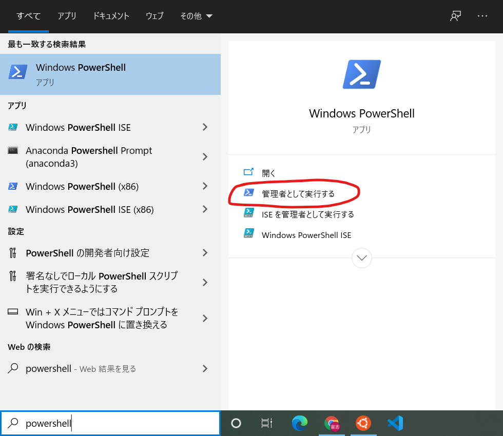
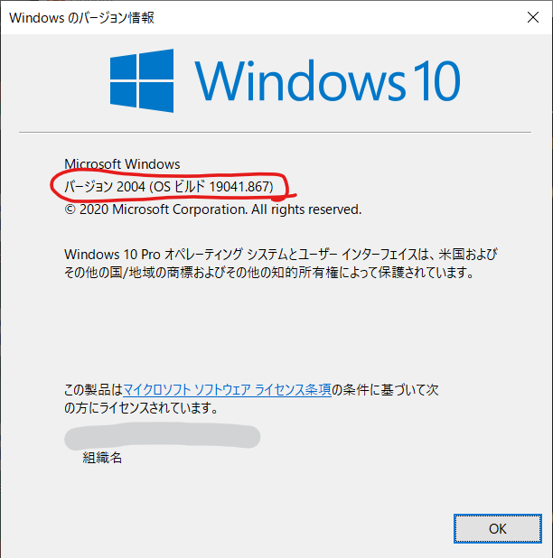

# WSL2のセットアップ(Windowsのみ)

Windowsマシンでは、原則としてWSL(Windows Subsystem for Linux)上で作業を行う。そのためにWSLをインストールする。Linuxディストリビューションとしては、Ubuntu 20.04を用いる。

基本的にはMicrosoftのドキュメントの[Windows 10 用 Windows Subsystem for Linux のインストール ガイド](https://docs.microsoft.com/ja-jp/windows/wsl/install-win10)に記載されている手順のうち「手動インストール」に従ってインストールをすすめる。

以下はIntelもしくはAMDのCPUが乗ったWindowsマシンを想定してるが、ARM64などの場合は別途対応が必要な場合がある。上記インストールガイドを参照のこと。

## WSLを有効にする

最初に「管理者」としてPowerShellを実行する。左下の「ここに入力して検索」とある場所(以下、検索窓)に「powershell」として表示された「WIndows PowerShell」の、右側のメニューの「管理者とて実行する」を選べば良い。



その後、開いたシェルで以下を実行する。

```sh
dism.exe /online /enable-feature /featurename:Microsoft-Windows-Subsystem-Linux /all /norestart
```

## Windowsのバージョン確認

検索窓に「winver」と入力して実行し、現れたダイアログのバージョンを確認する。



バージョンが

> x64 システムの場合:バージョン 1903 以降、ビルド 18362 以上。

を満たしていれば何もする必要は無いが、バージョンが低かったりビルド番号が小さかったりした場合はWindowsメニュー→設定→「更新とセキュリティー」から「更新プログラムのチェック」を選択してバージョンアップすること。

## 仮想マシンの機能を有効にする

管理者としてPowerShellを開き、以下を実行する

```sh
dism.exe /online /enable-feature /featurename:VirtualMachinePlatform /all /norestart
```

実行後は再起動すること。

## Linux カーネル更新プログラム パッケージをダウンロードする

以下のパッケージをダウンロード、インストールする。インストール時に管理者特権を求めるダイアログが出るため、許可する。

[x64 マシン用 WSL2 Linux カーネル更新プログラム パッケージ](https://wslstorestorage.blob.core.windows.net/wslblob/wsl_update_x64.msi)

## WSL2をデフォルトとする

PowerShellを開いて以下を実行する。

```sh
wsl --set-default-version 2
```

## Ubuntu 20.04のインストール

検索窓に「Microsoft Store」と入力してMicrosoft Storeを開く。右上の「検索」に「ubuntu」と入力し、現れた候補の中から「Ubuntu 20.04 LTS」を選択、インストールする。

インストール後の最初に起動でUNIX usernameとパスワードを聞かれるので、アカウント名とパスワードを入力する。

以上でWSL2のインストールは完了である。

## 環境設定

### デスクトップへのシンボリックリンク

WSL側からWindows側のデスクトップにシンボリックリンクを張っておくと後々便利だ。

```sh
ln -s /mnt/c/Users/username/Desktop
```

上記の「username」を自分のWindowsのアカウント名にすること。アカウント名がわからない場合はWSLで以下のコマンドを実行することで確認できる。

```sh
cmd.exe /c echo %USERNAME% 2> /dev/null
```

### explorer.exeへのエイリアス

WSLのディレクトリをエクスプローラで開くことができると便利だ。以下の一行を`.bashrc`の最後に記載しておくこと。

```sh
alias open=explorer.exe
```

保存したら、

```sh
source .bashrc
```

で読み込んだ後、

```sh
open .
```

により、現在のディレクトリがエクスプローラで開かれることを確認せよ。
